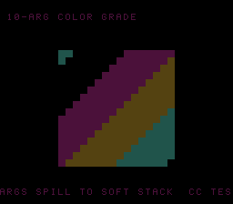

# #50 — SNES Many-Argument Color-Grade Kernel: >register-count argument spilling

<p align="center"></p>

**Status:** DONE — clean 5-way positive (no compiler bug). Demo **#50** of the **compiler stress-test demo battery**.

## Context

A per-cell color grade takes **ten `int16` parameters** (a base value + 9 coefficients: 3 lifts, 3
gammas, gain, mix, bias), which overflow the register-argument budget and force the extras **onto the soft
stack**. The coefficients sweep over time, re-grading a gradient. The codegen corner is
**>register-count argument spilling** in the calling convention — a call shape no prior demo exercises.

## Algorithm

```
color_grade(v, a, b, c, d, e, f, g, h, i):   // 10 int16 args (noinline -> real ABI)
    acc  = v * g                              // gain (int32)
    acc += a + b + c                          // lifts
    acc += d - e + f                          // gammas
    acc += h * i                              // mix * bias
    return (int16)(acc >> 3)
```

Params/results `int16_t`, accumulator `int32_t` (explicit casts on every product/sum), fold masked to
`uint16_t`. Every argument is used so none is eliminated — the extras genuinely spill.

## Screen layout

```
row 1   10-ARG COLOR GRADE                  (BG3 text, HUD top)
rows 6-21  16x16-tile BitmapCanvas — a gradient re-graded, sweeping through looks
row 25  ARGS SPILL TO SOFT STACK  CC TEST   (BG3 text, HUD bottom)
```

## Display architecture

- **BitmapCanvas** (BG3 2bpp), whole-tile `cell_fill`. Each frame re-grades a diagonal gradient with
  time-swept coefficients via the 10-arg `color_grade` (256 spilling calls/frame), mapping the result to
  a 4-colour palette. TitleLayer (BG2) intro card.

## Files

| File | Purpose |
|------|---------|
| `examples/65816/cgrade.h` | portable 10-arg `color_grade` + `cgrade_gate_crc()` |
| `examples/snes/cgrade.c` | the on-console color-grade ROM |
| `examples/snes/corpus/cgrade_sim.c` | HAL-free corpus slice (5-way differential) |
| `tools/cgrade-sim.c` | host oracle |
| `dev/cgrade.sh`, `dev/cgrade.lua` | gate script + MAME autoboot |
| `Taskfile.yml` | `cgrade`, `cgrade-play` entries |

## Differential gate

- `corpus_result = cgrade_gate_crc()` — folds `color_grade` over a `GATE_N=100` coefficient sweep.
- **EXPECT = `0x783F`** (host oracle; stable across host `-O0`/`-O2`, default/a16/xy16 on bsnes-jg).
- **5-way bar** — all data in bank-0 WRAM.
- Disasm probes: `color_grade` referenced ≥ 1, soft-stack argument spill `.noinit..Lstatic_stack` ≥ 1
  (40 present — the args past the register budget), `rep`/`sep` ≥ 1.

## Verification steps

1. Host oracle stable across -O0/-O2.

```
$ cc -O2 -I examples/65816 tools/cgrade-sim.c && ./a.out
cgrade gate_crc = 0x783F     # 0x783F at -O0 too
```
PASS.

2. ROM builds clean; disasm gate + bsnes-jg PASS (`dev/run.sh cgrade`).

```
==> built build/cgrade.sfc (+mos-a16); corpus_result @ WRAM 0x77
==> disasm gate (10-argument call, soft-stack argument spill, native-16)
    PASS  color_grade-refs=204  soft-stack-spill=40  rep/sep=18
SMOKE: PASS off=0x77 len=2 got=0x783F (ran 500 frames, bsnes-jg)
    SKIP MAME (no SPC700 IPL)
RESULT: PASS
```
PASS. (MAME leg SKIPs — no SPC700 IPL — non-blocking.)

3. Full 5-way check (`dev/run.sh _demo5 cgrade`): default==a16==xy16==host, -verify clean.

```
== -verify-machineinstrs ==
  +mos-a16: verify OK
  +mos-xy16: verify OK
  vmas: default=0x77 a16=0x77 xy16=0x77
SMOKE: PASS ... got=0x783F  [default/a16/xy16]
RESULT: PASS — host==default==a16==xy16==0x783F on bsnes-jg
```
PASS.

4. Title intro + running animation — `build/cgrade-jg.png` (frame 500) shows the re-graded gradient with
   both HUD rows. PASS.

5. Plan title card embedded (`docs/plans/screenshots/cgrade.png`). PASS.

6. `/snes-rom-page` publishes; live at [/snes/cgrade/](https://biohack.net/snes/cgrade/). (below)

## Outcome

**Clean 5-way positive — no compiler bug.** The >register-count argument-spill calling convention — a
10-argument call whose extras spill onto the soft stack (`.noinit..Lstatic_stack`) and are read back off
the callee frame — marshals arguments byte-identically under default, +mos-a16, and +mos-xy16, `-verify`
clean.
