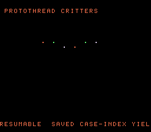

# #51 — SNES Protothread Critter Swarm: resumable functions (saved case-index re-entry)

<p align="center"></p>

**Status:** DONE — clean 5-way positive (no compiler bug). Demo **#51** of the **compiler stress-test demo battery**.

## Context

A swarm of critters, each a **resumable protothread** (coroutine) that yields each frame and resumes its
scripted box-patrol via a **saved continuation index** (`lc`) driving a `switch` whose case labels sit
**inside loops**. Local loop state (the per-leg step counter) lives in the struct so it survives
re-entry. The codegen corner is **resumable-function state preservation** — combining saved case-index
re-entry with mid-loop case labels (irreducible control flow, à la Duff's device #42) and cross-call
state kept in the struct.

## Algorithm

```
critter_step(c):                     // noinline -> real call + on-entry dispatch
    switch (c->lc) {                 // resume where we yielded
      case 0:
        for (;;) {
          for (c->timer=0; c->timer<WALK; c->timer++) {
            c->x += c->vx;  c->lc=1; return;  case 1:;   // yield inside the loop
          }
          for (c->timer=0; c->timer<WALK; c->timer++) {
            c->y += c->vy;  c->lc=2; return;  case 2:;
          }
          c->vx = -c->vx;  c->vy = -c->vy;   // reverse -> box patrol
        }
    }
```

Positions/velocities `int16_t`, counters `uint8_t`; the resume is deterministic → host and target produce
identical trajectories. On the 65816 the entry loads `c->lc` and branches (`beq`/`cmp #$2`) to the right
resume point.

## Screen layout

```
row 1   PROTOTHREAD CRITTERS                (BG3 text, HUD top)
rows 6-21  16x16-tile BitmapCanvas — a swarm of 24 critters patrolling boxes
row 25  RESUMABLE  SAVED CASE-INDEX YIELD   (BG3 text, HUD bottom)
```

## Display architecture

- **BitmapCanvas** (BG3 2bpp), `canvas_clear` + 2×2 dot per critter each frame. 24 critters, each
  resumed one protothread step/frame. TitleLayer (BG2) intro card.

## Files

| File | Purpose |
|------|---------|
| `examples/65816/critters.h` | portable `Critter` + protothread `critter_step` + `critters_gate_crc()` |
| `examples/snes/critters.c` | the on-console critter-swarm ROM |
| `examples/snes/corpus/critters_sim.c` | HAL-free corpus slice (5-way differential) |
| `tools/critters-sim.c` | host oracle |
| `dev/critters.sh`, `dev/critters.lua` | gate script + MAME autoboot |
| `Taskfile.yml` | `critters`, `critters-play` entries |

## Differential gate

- `corpus_result = critters_gate_crc()` — steps the 24-critter swarm `GATE_N=120` frames, folding every
  critter's position + `lc` each frame.
- **EXPECT = `0xAD9F`** (host oracle; stable across host `-O0`/`-O2`, default/a16/xy16 on bsnes-jg).
- **5-way bar** — all data in bank-0 WRAM.
- Disasm probes: `critter_step` referenced ≥ 1, `jmp` ≥ 4 (the lc-dispatch + mid-loop branch mesh), no
  *wide* arith libcalls (`__mulsi/__udivsi/__mulhi/…` == 0 — the protothread is pure branch/pointer arith;
  the only libcalls are 8-bit `__mulqi3/__udivqi3` from `critters_init`'s `i/6,i%6` layout math),
  `rep`/`sep` ≥ 1.

## Verification steps

1. Host oracle stable across -O0/-O2.

```
$ cc -O2 -I examples/65816 tools/critters-sim.c && ./a.out
critters gate_crc = 0xAD9F     # 0xAD9F at -O0 too
```
PASS.

2. ROM builds clean; disasm gate + bsnes-jg PASS (`dev/run.sh critters`).

```
==> built build/critters.sfc (+mos-a16); corpus_result @ WRAM 0x79
==> disasm gate (protothread: lc-dispatch resumable function, native-16, no libcall)
    PASS  critter_step-refs=62  jmp=7  wide-arith-libcalls=0  rep/sep=50
SMOKE: PASS off=0x79 len=2 got=0xAD9F (ran 500 frames, bsnes-jg)
    SKIP MAME (no SPC700 IPL)
RESULT: PASS
```
PASS. (MAME leg SKIPs — no SPC700 IPL — non-blocking.)

3. Full 5-way check (`dev/run.sh _demo5 critters`): default==a16==xy16==host, -verify clean.

```
== -verify-machineinstrs ==
  +mos-a16: verify OK
  +mos-xy16: verify OK
  vmas: default=0x79 a16=0x79 xy16=0x79
SMOKE: PASS ... got=0xAD9F  [default/a16/xy16]
RESULT: PASS — host==default==a16==xy16==0xAD9F on bsnes-jg
```
PASS.

4. Title intro + running animation — `build/critters-jg.png` (frame 500) shows the critter swarm
   (patrolling dots) with both HUD rows. PASS.

5. Plan title card embedded (`docs/plans/screenshots/critters.png`). PASS.

6. `/snes-rom-page` publishes; live at [/snes/critters/](https://biohack.net/snes/critters/). (below)

## Outcome

**Clean 5-way positive — no compiler bug.** The resumable-protothread pattern — an on-entry `switch`
dispatch on a saved case index, with case labels inside loops (mid-loop re-entry) and local state kept in
the struct — compiles and resumes byte-identically under default, +mos-a16, and +mos-xy16, `-verify`
clean. (This is the coroutine cousin of #42's Duff's device — the same irreducible-CFG lowering, now with
cross-call state preservation.)
