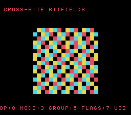

# #52 — SNES Cross-Byte-Boundary Bitfield Disassembler: multi-byte shift + mask

<p align="center"></p>

**Status:** DONE — clean 5-way positive (no compiler bug). Demo **#52** of the **compiler stress-test demo battery** — the **final Round-3 demo**.

## Context

A scrolling colour-coded "disassembly" where each cell decodes a synthetic opcode into **bitfields that
straddle byte boundaries** inside a `uint32_t`. The descriptor packs `opcode:8, mode:3, len:2, group:5,
cycles:4, flags:7, rmw:1` — the `group` field (bits 13-17) crosses the byte-1/2 boundary at bit 16, and
`flags` (bits 22-28) crosses byte-2/3 at bit 24, forcing **multi-byte shift + mask** to extract and
read-modify-write to insert. Distinct from #29b (truchet), whose fields all fit one `uint16`.

## Algorithm

```
struct Instr { uint32_t opcode:8, mode:3, len:2, group:5, cycles:4, flags:7, rmw:1, pad:2; };  // 4 bytes

dis_decode(in, op, operand):     // insert -> straddling fields need read-modify-write across bytes
    in->opcode = op; in->mode = op&7; in->group = (op>>3)&31;  // group straddles bit 16
    in->flags  = operand&127; ...                              // flags straddles bit 24
dis_fold_fields(in):             // extract -> multi-byte shift+mask reads each field back
```

Fields are `uint32_t`; the fold masks to `uint16_t`. **Differential safety:** the gate folds the
**read-back field values** (not the raw storage), so it is independent of the implementation-defined
physical bit layout — yet a cross-byte insert that corrupted a neighbour would still diverge host vs
target. `sizeof(Instr) == 4` verified.

## Screen layout

```
row 1   CROSS-BYTE BITFIELDS                (BG3 text, HUD top)
rows 6-21  16x16-tile BitmapCanvas — cells coloured by decoded (group^flags) fields, scrolling
row 25  OP:8 MODE:3 GROUP:5 FLAGS:7 U32     (BG3 text, HUD bottom)
```

## Display architecture

- **BitmapCanvas** (BG3 2bpp), whole-tile `cell_fill`. Each cell decodes a synthetic opcode via
  `dis_decode` and colours by the (cross-byte) `group` + `flags` extracts; the pattern scrolls with time.
  TitleLayer (BG2) intro card.

## Files

| File | Purpose |
|------|---------|
| `examples/65816/disbits.h` | portable `Instr` bitfield struct + `dis_decode` + `disbits_gate_crc()` |
| `examples/snes/disbits.c` | the on-console bitfield-disassembler ROM |
| `examples/snes/corpus/disbits_sim.c` | HAL-free corpus slice (5-way differential) |
| `tools/disbits-sim.c` | host oracle |
| `dev/disbits.sh`, `dev/disbits.lua` | gate script + MAME autoboot |
| `Taskfile.yml` | `disbits`, `disbits-play` entries |

## Differential gate

- `corpus_result = disbits_gate_crc()` — decodes a synthetic opcode stream (`GATE_N=128`) and folds every
  decoded field.
- **EXPECT = `0x31D7`** (host oracle; stable across host `-O0`/`-O2`, default/a16/xy16 on bsnes-jg).
- **5-way bar** — all data in bank-0 WRAM.
- Disasm probes: `and` masks ≥ 1, multi-byte shifts (`lsr/asl/ror/rol`) ≥ 4 (the straddling
  extract/insert), arithmetic libcalls (`__udiv`/`__div`/`__mul`) == 0, `rep`/`sep` ≥ 1.

## Verification steps

1. Host oracle stable across -O0/-O2; `sizeof(Instr)==4`.

```
$ cc -O2 -I examples/65816 tools/disbits-sim.c && ./a.out
disbits gate_crc = 0x31D7     # 0x31D7 at -O0 too
```
PASS.

2. ROM builds clean; disasm gate + bsnes-jg PASS (`dev/run.sh disbits`).

```
==> built build/disbits.sfc (+mos-a16); corpus_result @ WRAM 0x77
==> disasm gate (cross-byte bitfield extract/insert: shift+mask, native-16, no libcall)
    PASS  and-masks=5  shifts=23  arith-libcalls=0  rep/sep=19
SMOKE: PASS off=0x77 len=2 got=0x31D7 (ran 500 frames, bsnes-jg)
    SKIP MAME (no SPC700 IPL)
RESULT: PASS
```
PASS. (MAME leg SKIPs — no SPC700 IPL — non-blocking.)

3. Full 5-way check (`dev/run.sh _demo5 disbits`): default==a16==xy16==host, -verify clean.

```
== -verify-machineinstrs ==
  +mos-a16: verify OK
  +mos-xy16: verify OK
  vmas: default=0x77 a16=0x77 xy16=0x77
SMOKE: PASS ... got=0x31D7  [default/a16/xy16]
RESULT: PASS — host==default==a16==xy16==0x31D7 on bsnes-jg
```
PASS.

4. Title intro + running animation — `build/disbits-jg.png` (frame 500) shows the colour-coded
   field-decode map with both HUD rows. PASS.

5. Plan title card embedded (`docs/plans/screenshots/disbits.png`). PASS.

6. `/snes-rom-page` publishes; live at [/snes/disbits/](https://biohack.net/snes/disbits/). (below)

## Outcome

**Clean 5-way positive — no compiler bug.** Cross-byte-boundary bitfield extract/insert — fields
straddling the byte-1/2 (bit 16) and byte-2/3 (bit 24) boundaries of a `uint32_t` — lowers to multi-byte
shift + mask (`lsr`/`asl`/`ror` + `and`/`ora`) that computes byte-identically under default, +mos-a16, and
+mos-xy16, `-verify` clean. **This completes the Round-3 (#33–#52) compiler stress-test demo battery.**
