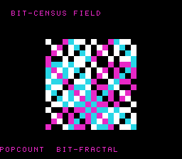

# #53 — SNES Bit-Census Field: the bit-population intrinsic family

<p align="center"></p>

**Status:** SHIPPED ✓ — clean positive, no compiler bug. Demo **#53** of the **compiler stress-test demo
battery** (Round 4). Published [/snes/bitcensus/](https://biohack.net/snes/bitcensus/).
Gate CRC **`0x9516`**, `host == default == +mos-a16 == +mos-xy16` on bsnes-jg, `-verify` clean ×2.

## Context

Renders a per-cell texture whose colour is a **bit-population count** of a 64-bit value built from each
cell's `(x, y, time)` coordinates, cycling through the four bit-population intrinsics every ~150 frames:

| fn | intrinsic | texture |
|----|-----------|---------|
| 0 | `__builtin_popcountll` | XOR/AND bit-fractal |
| 1 | `__builtin_clzll` | concentric magnitude bands |
| 2 | `__builtin_ctzll` | ruler-sequence bands |
| 3 | `__builtin_parityll` | fine parity checker |

**Distinct vs the other 52 demos:** the **bit-population intrinsic family** (count-ones / count-leading-
zeros / count-trailing-zeros / parity) is never emitted anywhere in Rounds 1–3. The earlier "bit" demos
(#6 rule-90, #25 FFT bit-reversal, #28 Hilbert) all do bit manipulation by *hand* (shifts/masks); none
invoke the `__builtin_popcount`/`clz`/`ctz`/`parity` intrinsics, which lower through a dedicated
legalizer rule.

## Algorithm

`bitcensus_cell(x, y, t, fn)` widens the three `uint16_t` inputs to `uint64_t`, builds a 64-bit value per
`fn`, and returns the intrinsic's result (a small count 0..63, or parity 0/1). `bitcensus_color()` maps
that to a 2bpp index (`census % 4`). The gate folds all four intrinsics over `GATE_N = 200` runtime
coordinates so a miscompile in any one of the four lowerings diverges.

**Width discipline (the critical correctness point).** The plain `__builtin_popcount`/`clz`/`ctz` take
`int`/`unsigned` = **32-bit on host, 16-bit on target**; the `l` variants take `long` = **64-bit host,
32-bit target**. Both mismatch, so folding their raw results would diverge *legitimately* — a source
portability defect, **not** a compiler bug (and forbidden by the battery's "no bare int" rule). `clz`
especially differs by exactly the container-width delta (16). The fix: use the **`ll` (long long =
64-bit on both) variants** so the census is bit-identical host vs target by construction; any divergence
in the differential is then unambiguously a real codegen defect. `clz`/`ctz` of 0 is UB, so every
argument is forced non-zero (a set bit OR-ed in).

Codegen: `__builtin_*ll` → generic `G_CTPOP`/`G_CTLZ`/`G_CTTZ` (and parity → popcount&1) → the MOS
legalizer's `.lower()` rule (`MOSLegalizerInfo.cpp:308`) → an **inline SWAR bit-count tree** (see the
measured finding). No `__mulsi3`/`__udivsi3` on the hot path.

## Screen layout

```
row 0 : (blank)
row 1 : "BIT-CENSUS FIELD"                 (BG3 text)
rows 6..21 : 16x16 census cells, 8x8 px each (BG3 2bpp BitmapCanvas, 128x128)
row 25 : "<FN>  <DESCRIPTION>"             (BG3 text, updates as the intrinsic cycles)
```

## Display architecture

- `BitmapCanvas` on BG3 2bpp (chr word `0x0000`, tilemap `0x4000`), 16×16 tiles, one 8×8 tile per cell.
- `TextLayer` two-row HUD sharing BG3 tilemap `0x4000` (rows 1 + 25).
- `TitleLayer` on BG2 for the fly-in card while the gate CRC computes.
- Palette CGRAM[0..3]: indigo → magenta → cyan → white (`bg3_pal`, 8 bytes).
- **Banded recompute:** 64-bit bit-counts are heavier than #40's 32-bit CRC, so the field recomputes
  `BAND = 4` cell-rows/frame (full field every 4 frames) and re-DMAs only that band's tiles — keeps the
  render smooth. The gate's `corpus_result` is independent of the render (own `bitcensus_gate_crc`).

## Files

| File | New/mod | Purpose |
|------|---------|---------|
| `examples/65816/bitcensus.h` | new | portable census + gate (the code under differential test) |
| `examples/snes/corpus/bitcensus_sim.c` | new | corpus slice (5-way differential) |
| `tools/bitcensus-sim.c` | new | host oracle |
| `examples/snes/bitcensus.c` | new | the on-console ROM |
| `dev/bitcensus.sh` / `dev/bitcensus.lua` | new | gate script + MAME autoboot |
| `Taskfile.yml` | mod | `bitcensus` + `bitcensus-play` tasks |

## Reused infrastructure

| Asset | From | Used for |
|-------|------|----------|
| `BitmapCanvas` BG3 2bpp per-cell field | #40 crctex | the texture surface + `cell_fill` whole-tile write |
| `TitleLayer` fly-in | n-body | title card during gate compute |
| `dev/_demo5.sh` | this session | full 5-way-on-bsnes-jg + `-verify` check |

## Differential gate

- `corpus_result = bitcensus_gate_crc()` — folds popcount+clz+ctz+parity over 200 coords, `GATE_N=200`.
- **EXPECT = `0x9516`.**
- **5-way bar** (all data bank-0 WRAM, no far pointers): host == default == +mos-a16 == +mos-xy16 on
  MAME + bsnes-jg. (MAME SKIPs here — no SPC700 IPL on this box; non-blocking per the demo bar.)
- Disasm probe: the inline `G_CTPOP` SWAR masks `#$55` (0x5555…) and `#$33` (0x3333…) present, plus
  native-16 `rep`/`sep`. Measured: `#$55=16  #$33=32  rep/sep=166`.

## Measured finding (no bug — "measure, don't assume")

The Round-4 backlog predicted the census would emit the compiler-rt helpers `__popcountdi2` / `__clzdi2`
/ `__ctzdi2` / `__paritydi2`. **It does not.** The MOS legalizer marks `G_CTLZ`/`G_CTTZ`/`G_CTPOP` as
`.lower()` (`MOSLegalizerInfo.cpp:308`), so all four intrinsics **inline-expand** into SWAR bit-count
trees (population count via the `0x5555…/0x3333…/0xF0F0…` masks; clz/ctz via shift/or cascades) — the
`__*di2` helpers exist in compiler-rt but optimized code never calls them. The corner this demo actually
stresses is therefore the **inline `G_CTPOP/G_CTLZ/G_CTTZ` legalization path** (a multi-limb shift/and/adc
sequence at s64), which is arguably the richer target. It is correct across default/a16/xy16.
(Parallels #39's "no constant-divisor strength reduction" finding.)

## Publication

`/snes-rom-page --rom build/bitcensus-default.sfc --slug bitcensus --site ~/SRC/biohack.net
--title "Bit-Census Field" --preview build/bitcensus-jg.png --selfcheck "0x<VMA> 2 0x9516 500 bitcensus"`
then re-publish the `+mos-a16` ROM (Stage B).

## Verification steps

1. Host oracle compiles and prints a plausible CRC.
   ```
   bitcensus gate_crc = 0x9516
   ```
   PASS.

2. ROM builds clean; `snes-checksum.py` exits 0; corpus_result located in the map.
   ```
   ==> built build/bitcensus.sfc (+mos-a16); corpus_result @ WRAM 0x53
   ```
   PASS.

3. Corpus slice host-compiles and the disasm gate confirms the inline bit-population lowering.
   ```
   PASS  popcount-mask #$55=16  #$33=32  rep/sep=166  (inline G_CTPOP/CTLZ/CTTZ lowering)
   ```
   PASS.

4. `dev/run.sh bitcensus` — host oracle + disasm gate + bsnes-jg all PASS (MAME SKIP, no IPL).
   ```
   SMOKE: PASS off=0x53 len=2 got=0x9516 (ran 500 frames, bsnes-jg)
   RESULT: PASS — bit-census field rendered on SNES; corpus hash 0x9516 host == +mos-a16
   ```
   PASS.

5. Full 5-way + `-verify` (`dev/run.sh _demo5 bitcensus`).
   ```
   +mos-a16: verify OK
   +mos-xy16: verify OK
   vmas: default=0x5b a16=0x53 xy16=0x5b
   SMOKE: PASS off=0x5B len=2 got=0x9516 (default)
   SMOKE: PASS off=0x53 len=2 got=0x9516 (a16)
   SMOKE: PASS off=0x5B len=2 got=0x9516 (xy16)
   RESULT: PASS — host==default==a16==xy16==0x9516 on bsnes-jg
   ```
   PASS — clean positive, no compiler bug.

6. Title card + animation — `build/bitcensus-jg.png` at frame 500 shows the POPCOUNT BIT-FRACTAL texture
   with both HUD rows; title has faded (as expected by frame 500). PASS.

7. Plan title card — `docs/plans/screenshots/bitcensus.png` embedded above. PASS.

8. `/snes-rom-page` publishes; page renders the ROM. (see Publication)

9. `task md` renders cleanly.
