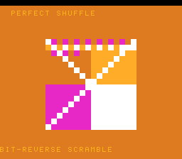

# #54 — SNES Perfect-Shuffle Transition: byte-swap / bit-reverse intrinsics

<p align="center"></p>

**Status:** SHIPPED ✓ — clean positive, no compiler bug. Demo **#54** (Round 4). Published
[/snes/bitshuffle/](https://biohack.net/snes/bitshuffle/). Gate CRC **`0x2A4A`**,
`host == default == +mos-a16 == +mos-xy16` on bsnes-jg, `-verify` clean ×2.

## Context

A source image (four coloured quadrants + white diagonals) is permuted by the **bit-reversal of each
cell's linear index** — the classic FFT butterfly / "perfect shuffle" order. Because bit-reversal is an
**involution** (`bitrev(bitrev(i)) == i`), the same operation scrambles *and* un-scrambles: the image
dissolves into bit-reversed order and reassembles. While held scrambled, colours byte-rotate via a
32-bit byte-swap.

**Distinct vs the other demos:** #25 (FFT) and #28 (Hilbert) reverse bits **by hand** in a shift loop;
this demo uses the **clang builtins** `__builtin_bitreverse32` and `__builtin_bswap32`, which take the
generic-opcode → legalizer path those hand-rolled loops never touch (`G_BITREVERSE.lower()` @186;
`__builtin_bswap32` → the byte-move lowering / `__bswapsi2`).

## Algorithm

- `bitshuffle_bitrev32(v)` — on the target, `__builtin_bitreverse32(v)`. **`__builtin_bitreverse` is a
  Clang builtin; gcc lacks it**, so the host oracle uses a portable SWAR reference (`#if !defined(__clang__)`)
  that computes the bit-identical value. The differential therefore tests the target's `G_BITREVERSE`
  lowering against a hand-verified reference (all three target legs use the builtin).
- `bitshuffle_perm(i) = bitrev32(i) >> (32 - SHUF_BITS)` — bit-reversal of the low 8 bits (256-cell
  space), an involution.
- `bitshuffle_bswap(t) = __builtin_bswap32(t)` (gcc + clang both have it → no fallback needed).
- Gate folds the **full 32-bit** reversed and byte-swapped values (both 16-bit halves) of a spread input
  built from constant shifts/XORs (**no 32-bit multiply → no incidental `__mulsi3`**), plus the
  permutation's involution round-trip so an asymmetric bit-reversal bug diverges.

**Width discipline:** both builtins operate on `uint32_t` = 32-bit on host and target alike → bit-exact
by construction (unlike #53's width-sensitive `int`/`long` bit-count builtins).

## Screen layout

```
row 1  : "PERFECT SHUFFLE"
rows 6..21 : 16x16 cells, 8x8 px each (BG3 2bpp BitmapCanvas, 128x128)
row 25 : "<PHASE>"  (BIT-REVERSE SCRAMBLE / BYTE-SWAP RECOLOUR / BIT-REVERSE UNSHUFFLE / SOURCE IMAGE)
```

## Display architecture

`BitmapCanvas` BG3 2bpp (16×16 tiles, one per cell) + two-row `TextLayer` + `TitleLayer`. Palette
CGRAM[0..3] teal/amber/magenta/white. The transition sweeps a threshold across the 256-cell index order:
cells below the threshold sit at their permuted (`bitshuffle_perm`) position, the rest at identity;
scramble raises it to 256, unscramble lowers it back to 0 (4-phase cycle). Full-canvas recompute +
re-DMA each frame (bit-reversal is cheap). `corpus_result` runs its own `bitshuffle_gate_crc`.

## Files

`examples/65816/bitshuffle.h`, `examples/snes/corpus/bitshuffle_sim.c`, `tools/bitshuffle-sim.c`,
`examples/snes/bitshuffle.c`, `dev/bitshuffle.sh`, `dev/bitshuffle.lua`, `Taskfile.yml` (new tasks).

## Differential gate

- `corpus_result = bitshuffle_gate_crc()`, `GATE_N = 256`. **EXPECT = `0x2A4A`.**
- 5-way bar (bank-0 WRAM, no far pointers). MAME SKIPs here (no SPC700 IPL; non-blocking).
- Disasm probe: the inline `G_BITREVERSE` mask-swap cascade uses the complementary bit-reversal masks
  `#$aa` (0xAAAA…) and `#$cc` (0xCCCC…), plus native-16. Measured: `#$aa=6  #$cc=8  rep/sep=58`.

## Measured note (no bug)

Like #53, neither builtin calls its compiler-rt helper: `__builtin_bswap32` lowers to inline byte moves
(no `__bswapsi2` symbol) and `__builtin_bitreverse32` inline-expands via `G_BITREVERSE.lower()` (@186) to
the mask-swap cascade. The corner is therefore the **inline reversal lowering**, correct across
default/a16/xy16.

## Verification steps

1. Host oracle prints a plausible CRC — `bitshuffle gate_crc = 0x2A4A`. PASS.
   (First cut folded two full permutations of 0..255 → collapsed to `0x0000`, a weak differential;
   strengthened to fold the full 32-bit reversed/swapped values so every bit matters.)
2. ROM builds; corpus_result @ WRAM 0x52. PASS.
3. Disasm gate — `PASS  bitrev-mask #$aa=6  #$cc=8  rep/sep=58`. PASS.
4. `dev/run.sh bitshuffle` — `SMOKE: PASS off=0x52 got=0x2A4A`; `RESULT: PASS`. PASS.
5. Full 5-way + `-verify` (`dev/run.sh _demo5 bitshuffle`):
   ```
   +mos-a16: verify OK
   +mos-xy16: verify OK
   host==default==a16==xy16==0x2A4A on bsnes-jg
   ```
   PASS — clean positive, no compiler bug.
6. Title + animation — `build/bitshuffle-jg.png` at frame 500 shows the BIT-REVERSE SCRAMBLE phase
   mid-sweep. PASS.
7. Plan title card embedded above. PASS.
8. `/snes-rom-page` publishes. (Publication)
9. `task md` renders cleanly.
