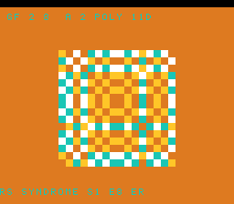

# #55 — SNES GF(2⁸) Galois Field: Reed–Solomon carryless multiply

**Status:** SHIPPED ✓ — clean positive, no compiler bug. Demo **#55** (Round 4). Published
[/snes/gf256/](https://biohack.net/snes/gf256/). Gate CRC **`0xC028`**,
`host == default == +mos-a16 == +mos-xy16` on bsnes-jg, `-verify` clean ×2.

## Context

A morphing "finite-field plaid": each cell's colour is a GF(2⁸) combination
`gf_mul(A, α^x) ^ gf_mul(B, α^y)`, where `A` and `B` rotate through the α-powers each frame. The HUD
tracks a live **Reed–Solomon syndrome** of a 16-symbol message that is periodically corrupted (non-zero
syndrome = error detected).

**Distinct vs the other 54 demos:** the ALU profile has **no carry chain at all**. GF(2⁸) addition is a
bare XOR; the multiply is a *carryless* multiply done as two log-table lookups + an add + an antilog
lookup — the arithmetic under Reed–Solomon / QR codes. The nearest prior demos (CRC #40, TEA #30) still
ride the ordinary integer carry paths; nothing does field arithmetic.

## Algorithm

- Generator α = 2, primitive polynomial `0x11D` (the QR/RS standard). `gf_init()` builds the log/antilog
  tables via the α-power step `x <<= 1; if (x & 0x100) x ^= 0x11D` — the reduction is an XOR, not a carry.
- `gf_mul(a,b) = GF_EXP[GF_LOG[a] + GF_LOG[b]]` (the carryless product; `EXP` doubled to 512 so the
  log-sum indexes directly with no `% 255`).
- `rs_syndrome(r,n,j) = R(α^j)` by Horner's rule in GF — the core RS error-detection operation.
- **Gate cross-check:** the gate folds `gf_mul` against an *independent* slow bit-by-bit carryless
  multiply (`gf_mul_slow`) — they must agree — plus `gf_pow` and two RS syndromes of a walking message,
  over `GATE_N = 200` iterations. Host-side I verified `gf_mul == gf_mul_slow` over **all 65 536 pairs**
  (0 mismatches), `gf_mul(2,0x80)=0x1D`, syndrome(zeros)=0.

**Width discipline:** tables are `uint8`; the reduction accumulator is an explicit `uint16` (the 9th-bit
test). Operand/message spreads use shifts/XORs, not multiplies, so there is **no integer mul/div libcall**
on the field path.

## Display architecture

`BitmapCanvas` BG3 2bpp (16×16 cells) + two-row `TextLayer` + `TitleLayer`. Palette CGRAM[0..3]
violet/teal/gold/white. `field_step` recomputes the whole plaid each frame (two `gf_mul` + XOR per cell);
`hud_syndrome` writes `RS SYNDROME S1=XX OK/ERR`. `corpus_result` runs its own `gf256_gate_crc`.

## Differential gate

- `corpus_result = gf256_gate_crc()`, `GATE_N = 200`. **EXPECT = `0xC028`.** 5-way bar (bank-0 WRAM).
- Disasm probe: `GF_EXP`/`GF_LOG` table refs ≥ 2 each, `eor` ≥ 4, **`mul/div-libcalls == 0`**, native-16.
  Measured: `GF_EXP=13  GF_LOG=5  eor=16  mul/div-libcalls=0  rep/sep=21`.

## Verification steps

1. Host oracle — `gf256 gate_crc = 0xC028`; `gf_mul` matches slow carryless multiply over all 65 536 pairs. PASS.
2. ROM builds; corpus_result @ WRAM 0x68. PASS.
3. Disasm gate — `PASS  GF_EXP=13  GF_LOG=5  eor=16  mul/div-libcalls=0  rep/sep=21`. PASS.
4. `dev/run.sh gf256` — `SMOKE: PASS got=0xC028`; `RESULT: PASS`. PASS.
5. Full 5-way + `-verify` — `host==default==a16==xy16==0xC028`, verify OK ×2. PASS — clean positive, no bug.
6. Title + animation — `build/gf256-jg.png` frame 500 shows the morphing GF plaid + HUD. PASS.
7. Plan title card embedded above. PASS.
8. `/snes-rom-page` publishes. 9. `task md` renders cleanly.

## Note (no bug)

The field multiply is table-based by design, so no `__mulqi3`/`__mulhi3` appears — the whole point of GF
arithmetic. Correct across default/a16/xy16; the independent slow-multiply cross-check makes a table or
reduction miscompile impossible to miss.
