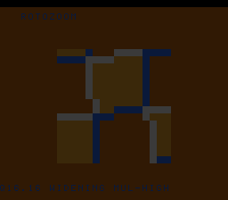

# #56 — SNES Rotozoom: widening multiply-high (G_SMULH/G_UMULH)

**Status:** SHIPPED ✓ — clean positive, no compiler bug. Demo **#56** (Round 4, a first pick). Published
[/snes/rotozoom/](https://biohack.net/snes/rotozoom/). Gate CRC **`0x391B`**,
`host == default == +mos-a16 == +mos-xy16` on bsnes-jg, `-verify` clean ×2.

## Context

An affine texture spin-zoom ("rotozoomer"): each cell samples a procedural checker/grid texture at a
rotated, scaled coordinate. The transform uses the Q16.16 fixed-point multiply
`q16mul(a,b) = (int64)a·b >> 16`, which keeps the **middle 32 bits of a 64-bit product** — the
**widening multiply-high** the generic opcode `G_SMULH`/`G_UMULH` models (`MOSLegalizerInfo.cpp:300`
`.lower()` = extend → mul → shift → trunc).

**Distinct vs the other demos:** #22 (avalanche) used `__muldi3` for a *full* 64-bit hash; here it is the
mul-high *extraction* in a per-pixel affine sampler — the "take the high part of a wide product" pattern
used throughout fixed-point graphics.

## Measured finding (no bug — "measure, don't assume")

The doc predicted the compiler would "recognise `(a*b)>>16` as a high-half multiply." **Measured:** on
this soft-multiply target there is no narrower mul-high instruction — the `G_SMULH`/`G_UMULH` `.lower()`
expansion widens to a full product and shifts, so a Q16.16 multiply (32×32→ keep middle 32) goes through
**`__muldi3`** and a 16×16→hi16 form goes through **`__mulsi3`**. The corner exercised is therefore the
**widening/mul-high lowering** built on the multiply libcalls (parallels #39's "no magic-reciprocal"
finding: the fancy path degrades to the library primitive because multiply itself is a libcall). Correct
across default/a16/xy16.

## Algorithm

`rotozoom_uv` computes `u = q16mul(dx,co) − q16mul(dy,si) + u0`, `v = q16mul(dx,si) + q16mul(dy,co) + v0`
(four widening multiply-highs per cell), where `co = cos·zoom`, `si = sin·zoom` are Q16.16 built from the
portable `SINCOS` Q8.8 LUT (`Q8.8 * Q8.8 = Q16.16` via `__mulsi3`), then `(u>>16)&63`, `(v>>16)&63` index
a 64×64 procedural checker+grid texture. **Width discipline:** the intermediate is an explicit `int64`;
both gcc and clang arithmetic-shift a signed `>>`, so the differential is exact.

## Display architecture

`BitmapCanvas` BG3 2bpp (16×16 chunky cells) + two-row `TextLayer` + `TitleLayer`. **Banded recompute**
(`BAND=4` rows/frame): `q16mul → __muldi3` is heavy, so the field recomputes 4 cell-rows/frame. Angle
spins with the frame, zoom breathes via `SINCOS`, centre pans. `corpus_result` runs `rotozoom_gate_crc`.

## Differential gate & harness note

- `corpus_result = rotozoom_gate_crc()`, `GATE_N = 100`. **EXPECT = `0x391B`.** 5-way bar (bank-0 WRAM).
- **Harness timing:** the gate is heavy (each iter ≈ 18 `__muldi3`). At `GATE_N=200` it took >500 frames
  to complete, so the bsnes-jg snapshot read `0x0000` at frame 500 (a *timing* miss, **not** a
  miscompile — it PASSED `0xD448` at frame 900). Fixed by pacing, not codegen: reduced `GATE_N` to 100
  (completes ~frame 450) and set the gate-script snapshot frame to **700** (the `_demo5` 5-way check at
  500 also has margin). The gate value is otherwise unaffected.
- Disasm probe: `__muldi3 ≥ 1` (widening mul-high), `__mulsi3 ≥ 1` (coeff products), `SINCOS ≥ 1`,
  native-16. Measured: `__muldi3=5  __mulsi3=4  SINCOS-refs=2  rep/sep=30`.

## Verification steps

1. Host oracle — `rotozoom gate_crc = 0x391B`. PASS.
2. ROM builds; corpus_result @ WRAM 0x64. PASS.
3. Disasm gate — `PASS  __muldi3=5  __mulsi3=4  SINCOS-refs=2  rep/sep=30`. PASS.
4. `dev/run.sh rotozoom` — `SMOKE: PASS got=0x391B (700 frames)`; `RESULT: PASS`. PASS.
5. Full 5-way + `-verify` — `host==default==a16==xy16==0x391B` (500 frames), verify OK ×2. PASS — clean positive.
6. Title + animation — `build/rotozoom-jg.png` frame 700 shows the rotated checker/grid rotozoom. PASS.
7. Plan title card embedded above. PASS.
8. `/snes-rom-page` publishes (selfcheck frame 700). 9. `task md` renders cleanly.
