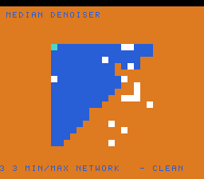

# #57 — SNES Median Denoiser: branchless min/max/abs network

**Status:** SHIPPED ✓ — clean positive, no compiler bug. Demo **#57** (Round 4, a first pick). Published
[/snes/medfilt/](https://biohack.net/snes/medfilt/). Gate CRC **`0x87FE`**,
`host == default == +mos-a16 == +mos-xy16` on bsnes-jg, `-verify` clean ×2.

## Context

A source image is corrupted with salt-and-pepper impulse noise every frame; a sweeping wipe reveals the
**3×3 median-filtered** result on one side and the raw noisy input on the other, so you watch the speckle
get removed. The median-of-9 is a **19-comparator branchless sorting network** — each compare-exchange is
`lo=min(a,b); hi=max(a,b)` written as the select idiom `(a<b)?a:b` / `(a<b)?b:a`.

**Distinct vs the other demos:** the hot op is **min/max** — the generic opcodes `G_UMIN`/`G_UMAX`
(`MOSLegalizerInfo.cpp:272` `.lower()`), plus `abs` (`G_ABS.custom()` @281) for the noise-removed
difference. #44 (hdr-bloom) stressed carry/V-flag *saturating add*; this is the select-lowered min/max
path, a different shape.

## Measured note (no bug)

The 65816 has **no conditional-move**, so `G_UMIN`/`G_UMAX` (icmp+select) lower to `cmp` + branch rather
than a branchless cmov. So "branchless" describes the *source* idiom (no data-dependent control flow in
C); the backend realises it with compares and short branches. No `__mul`/`__div` on the path — the whole
network is compares, loads and stores. Correct across default/a16/xy16.

## Algorithm

`medfilt_median9` runs the classic Smith 19-comparator network (`medfilt_cmpx` = min/max on two array
slots); the median lands in `p[4]`. **Cross-check:** the gate folds the network median against an
*independent* insertion-sort median (`medfilt_sorted_median9`) — they must agree. Host-side I verified
**0 mismatches over 200 000 random 9-tuples**. Width discipline: pixels are `uint8`; the abs-diff promotes
through `int16` → width-exact.

## Display architecture

`BitmapCanvas` BG3 2bpp (16×16 cells) + two-row `TextLayer` + `TitleLayer`. Each frame regenerates a
16×16 noisy buffer (`medfilt_noisy`, xorshift16 salt/pepper) and renders: cells left of a back-and-forth
sweeping wipe show the 3×3 median (gathering the clamped neighbourhood), cells right show the raw noisy
value. Palette-0 cells are BG-transparent (backdrop shows through). `corpus_result` runs `medfilt_gate_crc`.

## Differential gate

- `corpus_result = medfilt_gate_crc()`, `GATE_N = 150`. **EXPECT = `0x87FE`.** 5-way bar (bank-0 WRAM).
- Disasm probe: `cmp ≥ 8` (the min/max compare network), **`mul/div-libcalls == 0`**, native-16.
  Measured: `cmp=12  mul/div-libcalls=0  rep/sep=19`.

## Verification steps

1. Host oracle — `medfilt gate_crc = 0x87FE`; network median == insertion-sort median over 200k tuples (0 mismatches). PASS.
2. ROM builds; corpus_result @ WRAM 0x7B. PASS.
3. Disasm gate — `PASS  cmp=12  mul/div-libcalls=0  rep/sep=19`. PASS.
4. `dev/run.sh medfilt` — `SMOKE: PASS got=0x87FE`; `RESULT: PASS`. PASS.
5. Full 5-way + `-verify` — `host==default==a16==xy16==0x87FE`, verify OK ×2. PASS — clean positive.
6. Title + animation — `build/medfilt-jg.png` shows clean (denoised) vs speckle (noisy) across the wipe. PASS.
7. Plan title card embedded above. PASS.
8. `/snes-rom-page` publishes. 9. `task md` renders cleanly.
