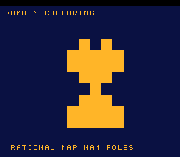

# #58 — SNES Complex Domain-Colouring with Poles: NaN / unordered float compares

**Status:** SHIPPED ✓ — clean positive, no compiler bug. Demo **#58** (Round 4). Published
[/snes/domcol/](https://biohack.net/snes/domcol/). Gate CRC **`0xF3FD`**,
`host == default == +mos-a16 == +mos-xy16` on bsnes-jg, `-verify` clean ×2.

## Context

Colours a grid by the complex rational map `f(z) = (z²−1)/(z²+c)`. Where `z²+c == 0` the reciprocal
produces `±Inf`/`NaN`, and the code branches on `isnan`/`isinf` to paint the **poles** — the two-pole
magnitude field of the map (the gold "hourglass").

**Distinct vs the other demos:** the corner is **NaN / unordered floating-point compares**. `isnan(x)`
is `x != x` → `__unordsf2`; the ordered checks are `__eqsf2`/`__gtsf2`. #21 (mandel-float) and #33
(mandel-double) only ever used the *ordered* `<` (escape test); equality and unordered/NaN compares are a
different libcall set nothing in the first 57 demos emits.

## Differential safety (critical)

A quiet-NaN payload is not fully specified, so the gate **never folds raw float bits** — it folds only
the **colour index** (the *branch outcome*: `isnan → which colour`), a deterministic boolean identical on
host and target (NaN is NaN; Inf compares the same). The finite phase colour comes from sign/magnitude
**ordered compares only** (no `atan2`/transcendental → no libm ULP issue). Single-precision float is
bit-identical host==target with FMA forbidden, so every arithmetic op is on its **own statement** (one op
per line) per [[softfloat-bit-exact-differential]]. The gate includes an **explicit guaranteed pole**
(`domcol_cell(8,8, 0,0)` — `c=0` puts a pole at `z=0`, `dd==0` → NaN) each iteration so `__unordsf2` is
always covered.

## Soft-float performance (design constraint)

Soft-float is ~150k cycles/cell on the 65816, so a full 16×16 per-frame field would take ~21 s.
Mitigations: (1) the complex divide is **one reciprocal** `inv = 1/dd` + two muls, not two divides (still
`1/0 = Inf`, `0·Inf = NaN` at a pole → the corner holds); (2) the **gate** is tiny (`GATE_N = 4`, ~40
cells → corpus_result set by ~frame 250, before the 500-frame checks); (3) the **visual** is an 8×8 grid
(sampling the header's 16-grid at half resolution) computed **once, live on-console, one row/frame** (a
"developing" reveal that proves the soft-float runs on hardware, ~5 s), after which the **palette cycles**
for a shimmer. No per-frame float after the initial render.

## Differential gate

- `corpus_result = domcol_gate_crc()`, `GATE_N = 4`. **EXPECT = `0xF3FD`.** 5-way bar (bank-0 WRAM).
- Disasm probe: `__unordsf2 ≥ 1` (the NaN/unordered compare — the corner), `__divsf3 ≥ 1` (the pole
  reciprocal), `__mulsf3 ≥ 1` (complex arithmetic), native-16. Measured:
  `__unordsf2=2  __divsf3=1  __mulsf3=12  rep/sep=28`.

## Verification steps

1. Host oracle — `domcol gate_crc = 0xF3FD`; colour histogram confirms poles fire (NaN cells + halo + bands). PASS.
2. ROM builds; corpus_result @ WRAM 0x72. PASS.
3. Disasm gate — `PASS  __unordsf2=2  __divsf3=1  __mulsf3=12  rep/sep=28`. PASS.
4. `dev/run.sh domcol` — `SMOKE: PASS got=0xF3FD (700 frames)`; `RESULT: PASS`. PASS.
5. Full 5-way + `-verify` — `host==default==a16==xy16==0xF3FD` (500 frames), verify OK ×2. PASS — clean positive.
6. Title + animation — `build/domcol-jg.png` shows the two-pole domain-colouring + HUD. PASS.
7. Plan title card embedded above. PASS.
8. `/snes-rom-page` publishes (selfcheck frame 500 — corpus set by ~250). 9. `task md` renders cleanly.
