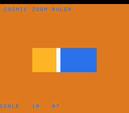

# #59 — SNES Cosmic Zoom Ruler: 64-bit integer ⇄ float conversion

**Status:** SHIPPED ✓ — clean positive, no compiler bug. Demo **#59** (Round 4). Published
[/snes/cosmzoom/](https://biohack.net/snes/cosmzoom/). Gate CRC **`0x502F`**,
`host == default == +mos-a16 == +mos-xy16` on bsnes-jg, `-verify` clean ×2.

## Context

A `uint64` "scale" grows exponentially (nanometres to the cosmos); it is converted to `float` to place it
on a **logarithmic** ruler (so exponential growth reads as a *linear* sweep of the bar), and converted
back to `uint64` for the read-out. The corner is **64-bit integer ⇄ float conversion**:
`(float)v` → `__floatundisf`, `(uint64_t)fv` → `__fixunssfdi`, `(float)(int64)v` → `__floatdisf`,
`(int64_t)fv` → `__fixsfdi`.

**Distinct vs the other demos:** #21 (mandel-float) and #33 (mandel-double) only ever converted *32-bit*
ints to/from float; a **64-bit** integer ⇄ float conversion is a wholly separate libcall set nothing in
the first 58 demos emits.

## Design notes

- **Float, not double.** The `__float*di*df` double siblings are the same conversion family, but `double`
  balloons the ROM (#33 barely fit 32 KB) and is slower; using `float` keeps the ROM small and the
  per-frame work light (only a few conversions/frame → no soft-float slowness like #58).
- **Overflow safety.** `scale` stays `< 10^18` (`< 2^60`), so `(float)v` never rounds up to `≥ 2^64` →
  `(uint64_t)fv` is always defined (no overflow UB). `__floatundisf`/`__fixunssfdi` are correctly-rounded
  → bit-identical host vs target. Float ops are one-per-statement (no FMA).

## Algorithm

`cosm_pos(v)` finds the decade `d` (largest `k` with `v ≥ 10^k`), then the within-decade fraction via
`ratio = (float)v / (float)10^d` (two `__floatundisf` + a divide) → `(ratio−1)/9`, returning
`d·256 + frac256` (0..18·256). `cosm_roundtrip` / `cosm_signed_rt` fold the float round-trips. The gate
folds position + both round-trips (as 16-bit slices, so a lost/added bit shows) over 90 scales spanning
all 18 decades.

## Display architecture

`BitmapCanvas` BG3 2bpp (16×16 cells) + two-row `TextLayer` + `TitleLayer`. A horizontal log bar (rows
5–10) fills gold left-to-right to `cosm_pos(scale)·16/(18·256)`, with a white cursor cell at the tip and a
blue empty track; the HUD reads `SCALE = 10 ^ dd`. `scale` grows ~×1.25 every 4th frame, wrapping at
`10^18`. Per-frame float work is just `cosm_pos` (fast).

## Differential gate & snapshot note

- `corpus_result = cosm_gate_crc()`, `GATE_N = 90`. **EXPECT = `0x502F`.** 5-way bar (bank-0 WRAM).
- The zoom bar fills slowly (scale is exponential; the bar reaches 10^7 only ~1000 frames in), so the
  **bsnes-jg snapshot frame is 1400** for a filled-bar preview. `corpus_result` is set far earlier, so
  the `_demo5` 5-way check at frame 500 and the web self-check at 500 both pass (they read only
  `corpus_result`, not the visual).
- Disasm probe: `__floatundisf ≥ 1`, `__fixunssfdi ≥ 1`, `__floatdisf ≥ 1`, native-16. Measured:
  `__floatundisf=2  __fixunssfdi=1  __floatdisf=1  rep/sep=28`.

## Verification steps

1. Host oracle — `cosmzoom gate_crc = 0x502F`. PASS.
2. ROM builds; corpus_result @ WRAM 0x54. PASS.
3. Disasm gate — `PASS  __floatundisf=2  __fixunssfdi=1  __floatdisf=1  rep/sep=28`. PASS.
4. `dev/run.sh cosmzoom` — `SMOKE: PASS got=0x502F (1400 frames)`; `RESULT: PASS`. PASS.
5. Full 5-way + `-verify` — `host==default==a16==xy16==0x502F` (500 frames), verify OK ×2. PASS — clean positive.
6. Title + animation — `build/cosmzoom-jg.png` frame 1400 shows the log bar at 10^07 + HUD. PASS.
7. Plan title card embedded above. PASS.
8. `/snes-rom-page` publishes (selfcheck frame 500). 9. `task md` renders cleanly.
