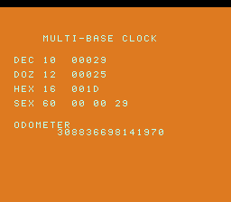

# #60 — SNES Multi-Base Clock: libc `div()`/`ldiv()` `div_t` struct-return

**Status:** SHIPPED ✓ — clean positive, no compiler bug. Demo **#60** (Round 4, a first pick). Published
[/snes/multibase/](https://biohack.net/snes/multibase/). Gate CRC **`0x371A`**,
`host == default == +mos-a16 == +mos-xy16` on bsnes-jg, `-verify` clean ×2.

## Context

One climbing counter is shown in four bases at once — decimal, dozenal, hex and sexagesimal — plus a
64-bit odometer. Each digit is split with the libc **`div()` returning a `div_t` (quotient+remainder)
BY VALUE** (`div_t d = div(n, B); digit = d.rem; n = d.quot;`), and the odometer uses **`lldiv()`
returning an `lldiv_t`**.

**Distinct vs the other demos:** the corner is the **`div_t`/`lldiv_t` aggregate-return ABI** braided with
the custom `G_SDIVREM` legalizer (`MOSLegalizerInfo.cpp:229`, `legalizeDivRem`, which loads the remainder
from a stack temporary). #39 used the constant `/`,`%` *operators*; #43 used raw signed 64-bit divmod;
neither called a *libc function* returning an *aggregate by value*. Confirmed via relocations: the corpus
makes real `div` and `lldiv` calls (aggregate-return ABI), not inlined.

## Width discipline (critical)

`div()` takes `int` = **16-bit on target, 32-bit on host**, so it is only width-safe for values that fit a
signed 16-bit int → the multi-base counter is kept **< 32768**. `lldiv()` takes `long long` = **64-bit on
both**, so the 64-bit odometer is always safe; its input is kept **< 10^18 (< 2^63)** so the
`(long long)` cast is well-defined. `ldiv()` (`long` = 32/64) is a mismatch → deliberately **not used**.
A `noinline` wrapper `mb_div()` forces the `div_t` by-value return even if `div()` would inline. The
reconstruction check in the gate uses `uint32_t` accumulators (identical width host/target → no 16-bit
overflow UB).

## Algorithm

`mb_to_base` / `mb_to_base64` extract digits LSD-first via `div`/`lldiv`. The gate folds base conversions
(bases 10/12/16/60) of a value sweep + a reconstruction check (digits back to value, must equal the input)
+ the throttled 64-bit odometer. `GATE_N = 60`, the odometer runs every 4th iter (lldiv is heavy).

## Display architecture

A **custom multi-row text `Drawable`** (`MbHud`, modeled on the skill template): loads `font8` glyphs at
tile 256, programs BG3, and **clears the whole 32×32 tilemap to the space glyph in `reserve()`** (else
uninitialised VRAM shows as garbage stripes outside the text region — the display-dirty-mask trap). Rows
show `DEC/DOZ/HEX/SEX` read-outs (each formatted via `div_t`) + the `lldiv` odometer; `emit()` DMAs only
dirty rows. `TitleLayer` on BG2. `corpus_result` runs `multibase_gate_crc`.

## Differential gate & timing note

- `corpus_result = multibase_gate_crc()`, `GATE_N = 60`. **EXPECT = `0x371A`.** 5-way bar (bank-0 WRAM).
- The gate is `lldiv`-heavy; at `GATE_N=120` it took >500 frames (a **timing** miss — corpus `0x0000` at
  500 — **not** a miscompile; it PASSED at 800). Fixed by pacing: `GATE_N=60` + odometer throttle
  (completes ~frame 350). The read-out appears after the title, so the **snapshot frame is 700**;
  `_demo5`/web self-check read `corpus_result` (set by ~350) at 500 and pass.
- Disasm probe: `div` call ≥ 1, `lldiv` call ≥ 1 (via relocations; built with `--config -fno-lto` for
  stdlib.h, not `--target=mos`), native-16. Measured: `div-calls=1  lldiv-calls=1  rep/sep=22`.

## Verification steps

1. Host oracle — `multibase gate_crc = 0x371A`; `12345`→"12345", `255`→"FF". PASS.
2. ROM builds; corpus_result @ WRAM 0x46. PASS.
3. Disasm gate — `PASS  div-calls=1  lldiv-calls=1  rep/sep=22`. PASS.
4. `dev/run.sh multibase` — `SMOKE: PASS got=0x371A (700 frames)`; `RESULT: PASS`. PASS.
5. Full 5-way + `-verify` — `host==default==a16==xy16==0x371A` (500 frames), verify OK ×2. PASS — clean positive.
6. Title + read-out — `build/multibase-jg.png` frame 700 shows DEC/DOZ/HEX/SEX all = 29 + the 64-bit odometer. PASS.
7. Plan title card embedded above. PASS.
8. `/snes-rom-page` publishes (selfcheck frame 500). 9. `task md` renders cleanly.
