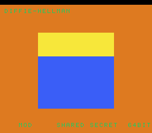

# #61 — SNES Diffie-Hellman Colour-Mixer: 64-bit modular exponentiation 🐞→✅

<p align="center"></p>

**Status:** SHIPPED ✓ — **🐞 CAUGHT + FIXED A REAL BACKEND BUG.** Demo **#61** (Round 4). Published
[/snes/dhmix/](https://biohack.net/snes/dhmix/). Gate CRC **`0x69AA`**,
`host == default == +mos-a16 == +mos-xy16` on bsnes-jg (post-fix), `-verify` clean ×2.

## The bug this demo found + fixed

Building the #61 corpus (64-bit modular exponentiation) under `+mos-a16` **crashed the backend**:

```
fatal error: unable to legalize instruction: %..(s16),.. = G_UNMERGE_VALUES %..(s64)   (in @main)
```

Default 8-bit compiled fine — the gap was only in the 16-bit-register modes. Isolated to a minimal 8-line
repro; two legalizer gaps in the #321 a16 rules: `G_UNMERGE_VALUES {S16,S64}` (splitting an `s64` into
16-bit lanes — the fork had s32↔s16 glue but not the s64 level) and `G_ANYEXT {S32,S24}` (a 20-bit-masked
value widened to `u64`). **Fixed** in patch **`0017-321-a16-s64-unmerge-anyext-legalize`** by adding the
s64↔s16 (un)merge 2-level glue (`s64 ↔ 2×s32 ↔ 4×s16`, mirroring the existing s32 handlers) and routing
odd-width `G_ANYEXT` through `G_ZEXT`. Rebuilt the toolchain; the demo + repro compile, **all 62 corpus
slices stay green (0 regressions)**, 64-bit demos differential-clean, `-verify` clean. Full write-up +
minimal repro: [`docs/investigations/2026-06-30-a16-s64-unmerge-anyext-legalize-crash.md`](../investigations/2026-06-30-a16-s64-unmerge-anyext-legalize-crash.md);
queued upstream in [`docs/upstream-contribution-status.md`](../upstream-contribution-status.md).

## Context

Two parties pick secrets a, b; publish `A = g^a mod p`, `B = g^b mod p`; then both compute the shared
secret `s = B^a mod p == A^b mod p == g^(a·b) mod p`. Three colour bands (Alice public / shared / Bob
public) shift as the secrets animate, but the shared band is always the colour both sides agree on.

**Distinct corner:** the hot op is a **64-bit modulo (`__umoddi3`)** after a 64-bit multiply (`__muldi3`)
per exponent bit of a square-and-multiply `modpow`. #22 (avalanche) was 64-bit mul/shift/xor (no modulo);
#27 (cardioid) was 16/32-bit `%`. A 64-bit `%`-per-iteration loop is neither.

## Algorithm & width discipline

`dh_modpow(base, exp, mod)` square-and-multiply. All values `uint64` (identical host/target). The modulus
`p = 2^32−5` is kept `< 2^32`, so every operand is `< 2^32` and each `result*base < 2^64` (no uint64
overflow before `% mod`). The gate folds `A`, `B`, both shared computations `s1 = B^a` and `s2 = A^b`, and
`s1 ^ s2` (**= 0 iff the DH property holds** — an independent cross-check baked into the hash). Host-side
verified `B^123 == A^456`. The exponents are masked (`& 0xFFFFF`, the s24-producing pattern) — the demo is
thus a permanent regression guard for the 0017 fix.

## Display / gate

- `BitmapCanvas` BG3 2bpp, three colour bands + two-row `TextLayer` + `TitleLayer`. `dh_step` runs one
  exchange every 40 frames (modexp is heavy) and recolours the bands.
- `corpus_result = dhmix_gate_crc()`, `GATE_N = 8` (64-bit modexp is very heavy: ~4 modpow × ~20 modmuls
  per iter). **EXPECT = `0x69AA`.** Completes ~frame 450 → `_demo5` at 500 passes; the visual read-out
  appears after the title, so the **snapshot frame is 700**.
- Disasm probe: `__umoddi3 ≥ 1` (the 64-bit modulo hot op), `__muldi3 ≥ 1`, native-16. Measured:
  `__umoddi3=8  __muldi3=8  rep/sep=28`.

## Verification steps

1. Host oracle — `dhmix gate_crc = 0x69AA` (was `0xB7C4` at GATE_N=40); DH property `B^a==A^b` holds. PASS.
2. Corpus/demo compile under a16/xy16 (post-0017) — was a crash pre-fix. PASS.
3. Disasm gate — `PASS  __umoddi3=8  __muldi3=8  rep/sep=28`. PASS.
4. `dev/run.sh dhmix` — `SMOKE: PASS got=0x69AA (700 frames)`; `RESULT: PASS`. PASS.
5. Full 5-way + `-verify` — `host==default==a16==xy16==0x69AA` (500 frames), verify OK ×2. PASS.
6. Corpus regression — all 62 slices compile a16/xy16 (0 regressions); 64-bit demos differential-green. PASS.
7. Title + bands — `build/dhmix-jg.png` frame 700 shows the DH colour bands + HUD. PASS.
8. `/snes-rom-page` publishes (selfcheck frame 500). 9. `task md` renders cleanly.
