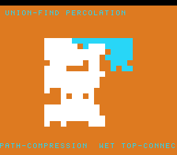

# #62 — SNES Union-Find Percolation: disjoint-set with path compression

**Status:** SHIPPED ✓ — clean positive, no compiler bug. Demo **#62** (Round 4, a first pick). Published
[/snes/percol/](https://biohack.net/snes/percol/). Gate CRC **`0x025B`**,
`host == default == +mos-a16 == +mos-xy16` on bsnes-jg, `-verify` clean ×2.

## Context

Bond percolation on a 16×16 grid: cells start as singleton sets; each frame a few random adjacent bonds
union their sets; cells connected to the top row light up "wet" until the wet region spans to the bottom —
the percolation phase transition (the white spanning cluster) — then it reseeds.

**Distinct corner:** a **disjoint-set (union-find) with path compression** — the `find` that chases parent
pointers to a root **and rewrites every pointer on the path to point straight at the root** (pointer-chasing
with in-place update). #18 (maze A*) used a flat-array heap; #31 (Barnes-Hut) built an append-only pooled
tree; neither did the find-with-compression flatten idiom.

## Algorithm

`pc_find` does two passes (walk to root, then re-point each node on the path to it); `pc_union` links by
rank. `pc_add_bond` unions a random adjacent pair; `pc_percolates` tests whether any top-row cell shares a
root with any bottom-row cell. **Width discipline:** `parent[]` is `uint16` indices, `rank[]` `uint8`;
all integer → bit-exact. The RNG (xorshift16) and bond order are seeded/deterministic. (The gate's parent-
array checksum uses a `uint32` multiply to avoid a 16-bit overflow UB — the only `__mulhi3` on the path.)

## Display architecture

`BitmapCanvas` BG3 2bpp (16×16 cells) + two-row `TextLayer` + `TitleLayer`. Each frame adds `BONDS_FRAME`
bonds, then `draw_grid` colours every cell: dry / wet (root shared with a top-row cell) / white (the
spanning cluster once percolated). Holds the spanning frame, then reseeds. `corpus_result` runs its own
`percol_gate_crc` on a separate `Percol` instance.

## Differential gate

- `corpus_result = percol_gate_crc()`, `GATE_N = 400` bonds. **EXPECT = `0x025B`.** 5-way bar (bank-0 WRAM).
- Folds the component count + a compressing `find` after every bond + the final percolation verdict + the
  full parent-array checksum. A miscompile in the find/union pointer-chasing or the path compression
  diverges. Host-side: percolates after ~325 bonds (comps 256→43).
- The wet region grows over frames, so the bsnes-jg snapshot frame is **900** (a well-percolated state);
  `corpus_result` is set far earlier so the `_demo5` 5-way check and web self-check at 500 pass.
- Disasm probe: `parent`-refs ≥ 2 (the array chase), branches ≥ 8 (find/union loops), native-16. Measured:
  `parent-refs=43  branches=24  rep/sep=106`.

## Verification steps

1. Host oracle — `percol gate_crc = 0x025B`; percolates after ~325 bonds. PASS.
2. ROM builds; corpus_result @ WRAM 0x7D. PASS.
3. Disasm gate — `PASS  parent-refs=43  branches=24  rep/sep=106`. PASS.
4. `dev/run.sh percol` — `SMOKE: PASS got=0x025B (900 frames)`; `RESULT: PASS`. PASS.
5. Full 5-way + `-verify` — `host==default==a16==xy16==0x025B` (500 frames), verify OK ×2. PASS — clean positive.
6. Title + animation — `build/percol-jg.png` frame 900 shows the white spanning cluster + wet/dry cells. PASS.
7. Plan title card embedded above. PASS.
8. `/snes-rom-page` publishes (selfcheck frame 500). 9. `task md` renders cleanly.
