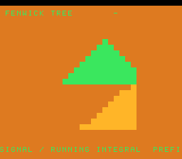

# #63 — SNES Fenwick Tree: the `i & -i` low-bit-isolation trick

**Status:** SHIPPED ✓ — clean positive, no compiler bug. Demo **#63** (Round 4). Published
[/snes/fenwick/](https://biohack.net/snes/fenwick/). Gate CRC **`0x3454`**,
`host == default == +mos-a16 == +mos-xy16` on bsnes-jg, `-verify` clean ×2.

## Context

A moving triangular bump point-updates 16 bins each frame; the running prefix sum (the integral) is
queried back out and drawn as a rising staircase below the signal. Both operations walk a binary-indexed
tree via the **`i & -i`** low-bit-isolation trick: `update` climbs `i += i & -i`, `query` descends
`i -= i & -i`.

**Distinct corner:** the **`i & -i` two's-complement idiom** — masking a value with its own negation to
isolate the lowest set bit — is a codegen shape nothing in the first 62 demos emits.

## Algorithm & width discipline

`fw_lowbit(i)` is computed width-safely as `(uint16_t)(i & (uint16_t)(0u - i))`: `0u - i` is
two's-complement-mod-2^16 after the `uint16` cast on **both** host (`int`=32) and target (`int`=16), so
`i & -i` is bit-identical. `fw_add`/`fw_prefix` are the standard BIT walks over `int16` bins. **Cross-check:**
the gate folds the BIT prefix against an *independent* linear prefix sum (`fw_prefix_ref`) — they must
agree — plus `fw_lowbit` directly across a range so the bit trick itself is exercised. Host-side:
`lowbit(12)=4`, `prefix(10)=55` for `val[i]=i`.

## Display architecture

`BitmapCanvas` BG3 2bpp (16 columns × 16 cell-rows) + two-row `TextLayer` + `TitleLayer`. Top 8 rows =
signal bars (green, `draw_bar` from the base up); bottom 8 rows = the integral bars (amber, `prefix[i]`
scaled to the total). The bump advances every 8 frames. `corpus_result` runs `fenwick_gate_crc`.

## Differential gate

- `corpus_result = fenwick_gate_crc()`, `GATE_N = 120`, `FW_N = 16`. **EXPECT = `0x3454`.** 5-way bar.
- Disasm probe: `and` masks ≥ 3 (the `& -i`), **`mul/div-libcalls == 0`** (BIT indices are power-of-2
  shifts), native-16. Measured: `and=5  mul/div-libcalls=0  rep/sep=56`.

## Verification steps

1. Host oracle — `fenwick gate_crc = 0x3454`; `lowbit(12)=4`, `prefix(10)=55` (== reference). PASS.
2. ROM builds; corpus_result @ WRAM 0x80. PASS.
3. Disasm gate — `PASS  and=5  mul/div-libcalls=0  rep/sep=56`. PASS.
4. `dev/run.sh fenwick` — `SMOKE: PASS got=0x3454`; `RESULT: PASS`. PASS.
5. Full 5-way + `-verify` — `host==default==a16==xy16==0x3454`, verify OK ×2. PASS — clean positive.
6. Title + animation — `build/fenwick-jg.png` shows the green signal bump + amber integral staircase. PASS.
7. Plan title card embedded above. PASS.
8. `/snes-rom-page` publishes. 9. `task md` renders cleanly.
