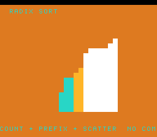

# #64 — SNES Radix / Counting Sort: a non-comparison sort

**Status:** SHIPPED ✓ — clean positive, no compiler bug. Demo **#64** (Round 4). Published
[/snes/radix/](https://biohack.net/snes/radix/). Gate CRC **`0x123E`**,
`host == default == +mos-a16 == +mos-xy16` on bsnes-jg, `-verify` clean ×2.

## Context

A row of 16 bars is sorted base-16, one nibble at a time. Each pass **histograms** the digit,
**prefix-sums** the counts into starting offsets, and **stable-scatters** each element to its offset — a
**non-comparison sort** (zero comparisons on the data). The demo shows the array after each pass — raw →
after the low-nibble pass → fully sorted — then reshuffles.

**Distinct corner:** #17 (sort-race) animated quicksort / heapsort / mergesort, all comparison-based; a
compare-free scatter sort is a different loop nest — array reads/writes and running sums, no `cmp` on the
ordering path.

## Algorithm

`rx_pass(in, out, n, shift)` is one stable counting-sort pass: zero `count[16]`, histogram
`count[(in[i]>>shift)&0xF]++`, prefix-sum the counts into offsets, then scatter `out[count[d]++] = in[i]`.
`rx_sort` runs two passes (shift 0 then 4). **Width discipline:** values are `uint8`, counts/offsets
`uint16`, all integer → bit-exact. **Cross-checks in the gate:** after each sort the array must be
non-decreasing (an inversion counter, folded — must be 0) *and* a permutation of the input (input/output
XOR and sum must match, folded — must be 0). Host-side verified sorted, first=0 last=255.

## Display architecture

`BitmapCanvas` BG3 2bpp (16 columns × 16 cell-rows) + two-row `TextLayer` + `TitleLayer`. Each bar:
height `arr[i]>>4` (0..16), colour `(arr[i]>>6)&3` (value band) — so a sorted array reads as an ascending
staircase with a low→high colour gradient. A 3-state machine (raw / after low-nibble pass / sorted) holds
each state 50 frames, then reshuffles. `corpus_result` runs `radix_gate_crc`.

## Differential gate

- `corpus_result = radix_gate_crc()`, `GATE_N = 60`, `RX_N = 16`. **EXPECT = `0x123E`.** 5-way bar.
- Disasm probe: indexed load/sta ≥ 4 (the histogram/scatter array access), **`mul/div-libcalls == 0`**,
  native-16. Measured: `indexed-load/sta=9  mul/div-libcalls=0  rep/sep=34`.

## Verification steps

1. Host oracle — `radix gate_crc = 0x123E`; sorted, first=0/last=255. PASS.
2. ROM builds; corpus_result @ WRAM 0x73. PASS.
3. Disasm gate — `PASS  indexed-load/sta=9  mul/div-libcalls=0  rep/sep=34`. PASS.
4. `dev/run.sh radix` — `SMOKE: PASS got=0x123E`; `RESULT: PASS`. PASS.
5. Full 5-way + `-verify` — `host==default==a16==xy16==0x123E`, verify OK ×2. PASS — clean positive.
6. Title + animation — `build/radix-jg.png` shows the sorted ascending staircase with value bands. PASS.
7. Plan title card embedded above. PASS.
8. `/snes-rom-page` publishes. 9. `task md` renders cleanly.
