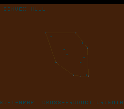

# #65 — SNES Convex Hull Rubber-Band: cross-product orientation tests

**Status:** SHIPPED ✓ — clean positive, no compiler bug. Demo **#65** (Round 4). Published
[/snes/hull/](https://biohack.net/snes/hull/). Gate CRC **`0x84E3`**,
`host == default == +mos-a16 == +mos-xy16` on bsnes-jg, `-verify` clean ×2.

## Context

A cloud of 14 points drifts and bounces; each frame the convex hull is recomputed by **gift-wrapping**
(Jarvis march) and drawn as a taut rubber band around the cloud.

**Distinct corner:** the **signed 2-D cross-product orientation predicate**. Gift-wrap picks each next
hull vertex purely from the *sign* of `cross(O,A,B) = (A.x−O.x)(B.y−O.y) − (A.y−O.y)(B.x−O.x)` (> 0 left
turn, < 0 right turn, = 0 collinear). Nothing in the first 64 demos runs a computational-geometry
orientation test; #16 (wireframe) drew lines but never asked which side of a segment a point is on.

## Algorithm & width discipline

`hl_cross` computes the cross product in **`int32`** (an explicit `(int32_t)` cast on each `int16`
difference) to avoid 16-bit overflow — so host (`int`=32) and target (`int`=16) agree. `hl_giftwrap`
starts at the leftmost point and repeatedly selects the most-clockwise candidate (`cross < 0`), breaking
collinear ties by distance. **Cross-check in the gate:** every hull edge must have *all* points on its
left (a valid convex hull) — a violation counter is folded (must stay 0). Host-side: square + interior
point → 4-vertex hull. The int32 cross is `__mulsi3` on target.

## Display architecture

`BitmapCanvas` BG3 2bpp (128×128, `canvas_line` + `canvas_plot`) + two-row `TextLayer` + `TitleLayer`.
Each frame: move/bounce the points, gift-wrap, `canvas_clear`, draw the hull edges (amber), the points
(cyan crosses), and the hull vertices (white). `corpus_result` runs `hull_gate_crc`.

## Differential gate

- `corpus_result = hull_gate_crc()`, `GATE_N = 12`, `HL_N = 14`. **EXPECT = `0x84E3`.** 5-way bar.
- The gift-wrap + O(n²) validity check with int32 cross is heavy (~1300 frames at GATE_N=60), so
  `GATE_N=12` (completes ~frame 450 → `_demo5`/web check at 500 pass); the bsnes-jg snapshot frame is 700.
- Disasm probe: `__mulsi3 ≥ 1` (the int32 cross), `cmp ≥ 4` (orientation sign tests), native-16. Measured:
  `__mulsi3=8  cmp=27  rep/sep=110`.

## Verification steps

1. Host oracle — `hull gate_crc = 0x84E3`; square+center → 4-vertex hull. PASS.
2. ROM builds; corpus_result @ WRAM 0x73. PASS.
3. Disasm gate — `PASS  __mulsi3=8  cmp=27  rep/sep=110`. PASS.
4. `dev/run.sh hull` — `SMOKE: PASS got=0x84E3 (700 frames)`; `RESULT: PASS`. PASS.
5. Full 5-way + `-verify` — `host==default==a16==xy16==0x84E3` (500 frames), verify OK ×2. PASS — clean positive.
6. Title + animation — `build/hull-jg.png` shows the amber rubber-band hull around the cyan point cloud. PASS.
7. Plan title card embedded above. PASS.
8. `/snes-rom-page` publishes (selfcheck frame 500). 9. `task md` renders cleanly.
