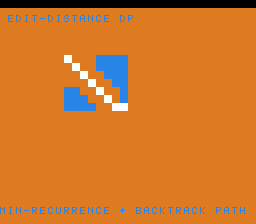

# #66 — SNES Edit-Distance DP: a 2-D dynamic-programming table

**Status:** SHIPPED ✓ — clean positive, no compiler bug. Demo **#66** (Round 4). Published
[/snes/editdist/](https://biohack.net/snes/editdist/). Gate CRC **`0xFB59`**,
`host == default == +mos-a16 == +mos-xy16` on bsnes-jg, `-verify` clean ×2.

## Context

For each word pair the `(m+1)×(n+1)` Levenshtein table `D[i][j]` (the edit distance between the first i
chars of A and first j of B) is filled by the **min-recurrence**
`D[i][j] = min(D[i-1][j-1]+cost, D[i-1][j]+1, D[i][j-1]+1)`, then the optimal alignment is **backtracked**
from `D[m][n]` to `D[0][0]`. The table is drawn as a cost heat-map with the traced path lit; the demo
cycles through five word pairs.

**Distinct corner:** a **2-D dynamic-programming table** — a doubly-indexed memoised recurrence (`D[i][j]`
addressing) with data-dependent min reductions + a backtrack pointer walk. Nothing in the first 65 demos
fills a 2-D DP table.

## Algorithm & width discipline

The table and strings are `uint8`; `D[i][j]` in `uint8 D[16][16]` is `base + i·16 + j` (16 = power of 2 →
shift, no multiply). `ed_min3` is the min-of-3 recurrence; `ed_backtrack` walks back choosing which
predecessor gave the min. **Cross-check in the gate:** `edit(A,B)` must equal `edit(B,A)` (symmetry) — both
are computed and folded, a mismatch diverges. Host-side: `edit(KITTEN, SITTING) = 3` (the textbook value).
(The gate's random string lengths use a `% 11`, the only incidental `__umodhi` — not the DP path.)

## Display architecture

`BitmapCanvas` BG3 2bpp (16×16 cells) + two-row `TextLayer` + `TitleLayer`. `solve_and_draw` fills +
backtracks the current pair, then colours cell `(row i, col j)` by `D[i][j]` (low/mid/high cost bands) or
white if on the path; unused cells cleared. Cycles pairs every 120 frames. `corpus_result` runs
`editdist_gate_crc`.

## Differential gate

- `corpus_result = editdist_gate_crc()`, `GATE_N = 40`, `ED_MAX = 15`. **EXPECT = `0xFB59`.** 5-way bar.
- Disasm probe: indexed load/sta ≥ 6 (the 2-D `D[i][j]` access), `cmp ≥ 6` (the min-of-3 recurrence),
  native-16. Measured: `indexed-load/sta=15  cmp=13  rep/sep=92`.

## Verification steps

1. Host oracle — `editdist gate_crc = 0xFB59`; `edit(KITTEN,SITTING) = 3`. PASS.
2. ROM builds; corpus_result @ WRAM 0x73. PASS.
3. Disasm gate — `PASS  indexed-load/sta=15  cmp=13  rep/sep=92`. PASS.
4. `dev/run.sh editdist` — `SMOKE: PASS got=0xFB59`; `RESULT: PASS`. PASS.
5. Full 5-way + `-verify` — `host==default==a16==xy16==0xFB59`, verify OK ×2. PASS — clean positive.
6. Title + animation — `build/editdist-jg.png` shows the DP heat-map with the white alignment path. PASS.
7. Plan title card embedded above. PASS.
8. `/snes-rom-page` publishes. 9. `task md` renders cleanly.
