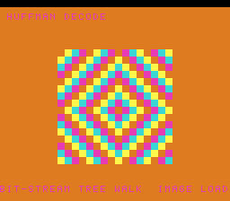

# #67 — SNES Huffman Decode Reveal: bit-stream tree walk

**Status:** SHIPPED ✓ — clean positive, no compiler bug. Demo **#67** (Round 4). Published
[/snes/huffman/](https://biohack.net/snes/huffman/). Gate CRC **`0xE8E4`**,
`host == default == +mos-a16 == +mos-xy16` on bsnes-jg, `-verify` clean ×2.

## Context

A 16×16 image (4 colours) is Huffman-encoded into a bitstream, then **decoded bit by bit** — pull one bit
(MSB-first), descend the pointer-linked Huffman tree (left on 0, right on 1), emit a symbol at each leaf,
restart at the root — and the pixels are revealed a few per frame (the classic "image loading in"), then
it replays.

**Distinct corner:** a **bit-granular stream reader + tree descent**. #49 (LZ) was a *byte*-oriented
decoder copying back-references; this is a *bit* reader threading a tree of node indices.

## Algorithm

`hf_decode_one` pulls a bit `(in[bit>>3] >> (7−(bit&7))) & 1`, advances the cursor, and follows
`HF_KID0`/`HF_KID1` until `HF_SYM[node] ≥ 0` (a leaf). The tree is a flat const node array (children +
leaf symbols) for a canonical prefix code (`0→"0"`, `1→"10"`, `2→"110"`, `3→"111"`). Encoding is a setup
helper; the **decode is the corner**. **Width discipline:** cursor/indices/symbols are `uint8`/`uint16`,
the stream a byte array → bit-exact. **Cross-check in the gate:** the decoded image must equal the source
(a mismatch counter, folded, must be 0); the fold mixes pixel position (so the symmetric image can't
cancel) and folds the stream bytes. Host-side: 256 pixels → 576 bits (72 bytes), 0 mismatches.

## Display architecture

`BitmapCanvas` BG3 2bpp (16×16 cells) + two-row `TextLayer` + `TitleLayer`. `hf_encode` runs once at
init; `reveal` decodes `PIX_FRAME = 3` more symbols per frame via `hf_decode_one` (persisting the bit
cursor + pixel index), colouring each cell by its symbol; when the image completes it holds ~120 frames,
then restarts. `corpus_result` runs `huffman_gate_crc`.

## Differential gate

- `corpus_result = huffman_gate_crc()` (single-pass: 256-pixel decode). **EXPECT = `0xE8E4`.** 5-way bar.
- Disasm probe: `lsr`/`ror`/etc bit-shifts ≥ 4 (the MSB-first reader), `HF_SYM`/`HF_KID` tree refs ≥ 2,
  native-16. Measured: `bit-shifts=22  tree-refs=5  rep/sep=49`.

## Verification steps

1. Host oracle — `huffman gate_crc = 0xE8E4`; 256 px → 576 bits, 0 decode mismatches. PASS.
2. ROM builds; corpus_result @ WRAM 0x84. PASS.
3. Disasm gate — `PASS  bit-shifts=22  tree-refs=5  rep/sep=49`. PASS.
4. `dev/run.sh huffman` — `SMOKE: PASS got=0xE8E4`; `RESULT: PASS`. PASS.
5. Full 5-way + `-verify` — `host==default==a16==xy16==0xE8E4`, verify OK ×2. PASS — clean positive.
6. Title + animation — `build/huffman-jg.png` shows the decoded concentric-diamond image. PASS.
7. Plan title card embedded above. PASS.
8. `/snes-rom-page` publishes. 9. `task md` renders cleanly.
