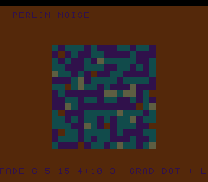

# #68 — SNES Perlin Gradient-Noise Flow Field: fade polynomial + gradient dot + lerp

**Status:** SHIPPED ✓ — clean positive, no compiler bug. Demo **#68** (Round 4). Published
[/snes/perlin/](https://biohack.net/snes/perlin/). Gate CRC **`0xA72D`**,
`host == default == +mos-a16 == +mos-xy16` on bsnes-jg, `-verify` clean ×2.

## Context

Each cell's colour is 2-D **Perlin gradient noise** of its `(x, y)` plus a scrolling time offset — the
field flows like smoke/marble.

**Distinct corner:** the **gradient-noise pipeline** — a permutation table + the Hermite quintic **fade
polynomial** `6t⁵ − 15t⁴ + 10t³` + gradient **dot products** + **lerp**, all fixed-point. Nothing in the
first 67 demos runs the perm-index + fade-polynomial + dot-of-gradients + interpolation pipeline
(value-noise/plasma/CA never did *gradient* noise).

## Algorithm & width discipline

Everything is fixed point (Q0.8 fractions, `int32` intermediates) — **no float**, so no ULP concerns and
bit-exact host vs target by construction. `pn_fade` computes the quintic **inline** in Q0.8 (several
`int32` multiplies → `__mulsi3`); `pn_grad` dots one of 4 diagonal gradients with the fractional coords;
`pn_lerp` interpolates. The permutation `PN_PERM` is a **seeded Fisher-Yates shuffle** of 0..255 (identical
host/target). Host-side sanity: `fade(0)=0`, `fade(128)=128` (= 0.5), `fade(256)=256` (= 1); noise = 0 at
lattice corners (correct); a 16×16 fractional sample spans `[-183, 197]` (253/256 nonzero) — a proper
varying field.

## Display architecture

`BitmapCanvas` BG3 2bpp (16×16 cells) + two-row `TextLayer` + `TitleLayer`. **Banded recompute** (`BAND=4`
rows/frame): fixed-point Perlin is `__mulsi3`-heavy. Each cell samples `pn_noise(cx·160 + scroll, cy·160 +
scroll)`, mapped to 4 colour bands; the scroll advances with time. `corpus_result` runs `perlin_gate_crc`.

## Differential gate

- `corpus_result = perlin_gate_crc()`, `GATE_N = 120`. **EXPECT = `0xA72D`.** 5-way bar.
- Disasm probe: `__mulsi3 ≥ 3` (the fade polynomial + dots + lerps), `PN_PERM` refs ≥ 2 (the permutation),
  native-16. Measured: `__mulsi3=15  PN_PERM-refs=11  rep/sep=60`.

## Verification steps

1. Host oracle — `perlin gate_crc = 0xA72D`; fade/lattice/field checks pass. PASS.
2. ROM builds; corpus_result @ WRAM 0x73. PASS.
3. Disasm gate — `PASS  __mulsi3=15  PN_PERM-refs=11  rep/sep=60`. PASS.
4. `dev/run.sh perlin` — `SMOKE: PASS got=0xA72D`; `RESULT: PASS`. PASS.
5. Full 5-way + `-verify` — `host==default==a16==xy16==0xA72D`, verify OK ×2. PASS — clean positive.
6. Title + animation — `build/perlin-jg.png` shows the flowing smoke/marble noise field. PASS.
7. Plan title card embedded above. PASS.
8. `/snes-rom-page` publishes. 9. `task md` renders cleanly.
