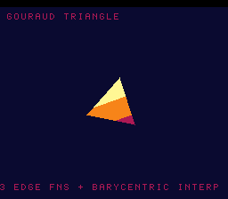

# #69 — SNES Gouraud Triangle Tumbler: barycentric edge-function rasterisation

**Status:** SHIPPED ✓ — clean positive on the correctness bar (differential green); the `+mos-a16`/`+mos-xy16`
`-verify` crash is the **documented `a16-rc-undef-ra-pure-virtual` known issue** (XFAIL, code bit-exact
correct). Demo **#69** (Round 4). Published [/snes/gouraud/](https://biohack.net/snes/gouraud/). Gate CRC
**`0xC5E9`**, `host == default == +mos-a16 == +mos-xy16` on bsnes-jg.

## Context

A spinning equilateral triangle whose three vertices carry three brightnesses is **filled and
colour-interpolated** per pixel. Three signed 2-D cross-product **edge functions**
`E(A,B,P) = (Bx-Ax)(Py-Ay) - (By-Ay)(Px-Ax)` decide inside/outside (all three agree with the winding),
and their values **are** the barycentric weights that interpolate the attribute across the face
(`I = (e0·a0 + e1·a1 + e2·a2) / area`).

**Distinct corner:** #16 (wireframe) drew Bresenham **lines** only — it never filled a face nor
interpolated an attribute across one. The edge-function cross products are `int32` multiplies
(`__mulsi3`); the barycentric normalise is an `int32` divide (`__divsi3`) on the hot per-pixel path — a
fill-loop shape none of the first 68 demos run.

## Algorithm & width discipline

Everything is integer (positions `int16`, edge/area/numerator `int32`) — no float, so bit-exact host vs
target by construction. `gs_edge` is the shared `int32` cross product. The **gate** (`gs_raster_fold`,
`examples/65816/gouraud.h`) rasterises `GATE_N=2` tumble orientations of a radius-10 triangle over its
bounding box, evaluating the three edge functions **fresh per pixel** (`__mulsi3`) and the barycentric
divide (`__divsi3`) for each covered pixel, folding `I` mixed with the pixel position (so a symmetric
triangle can't cancel to 0). Host oracle: area=537, 272 covered px, avg interpolated I=146 — a proper
varying field.

## Display architecture

`BitmapCanvas` BG3 2bpp (128×128) + two-row `TextLayer` + `TitleLayer`. The **on-screen** fill
(`draw_tri`, demo-only) steps the same edge functions **incrementally** (int16 hot loop for the
inside-test, int32 numerator stepped with adds for the band) — no per-pixel multiply or divide, so the
triangle tumbles at interactive speed. Four colour bands: dark backdrop + crimson → orange → gold. The
CGRAM palette is re-pushed after `title_end` (the title layer leaves CGRAM[0] warm).

## Differential gate

- `corpus_result = gouraud_gate_crc()`, `GATE_N = 2`, radius 10. **EXPECT = `0xC5E9`.**
- Disasm probe: `__mulsi3 ≥ 3` (edge functions), `__divsi3 ≥ 1` (barycentric normalise), native-16.
  Measured: `__mulsi3=11  __divsi3=1  rep/sep=165`.

## Compiler findings — one known-issue witness, and a demo-code bug caught by eye (not the gate)

**1. `-verify-machineinstrs` XFAIL — the documented `a16-rc-undef-ra-pure-virtual` known issue.** Under
BOTH `+mos-a16` and `+mos-xy16` at `-Os`, the corpus slice `gouraud_sim.c` trips
`*** Bad machine code: Using an undefined physical register ***` — 3 errors, all
`renamable $x/$a = COPY killed renamable $rcN` (a post-RA pure-virtual COPY). This is **Cause #2** of the
rc-undef symptom (the coalescer-guard fix for Cause #1 does not cover it; still deferred pending the RA
fix — see `docs/plans/2026-06-29-a16-rc-undef-ra-machineverifier-fix.md`), classified by
`tools/a16_fuzz.py` KNOWN_ISSUES as `a16-rc-undef-ra-pure-virtual`. The **code is bit-exact correct** —
the full differential is green: `host == default == +mos-a16 == +mos-xy16 == 0xC5E9` on bsnes-jg across
600 frames. So this is an XFAIL witness, **not** a new defect; the divide-heavy barycentric fold is the
kind of high-register-pressure slice that trips it. (Consistent with the soft-float slices already
recorded as rc-undef witnesses; gouraud shows the same symptom from an `int32`-divide kernel.)

**2. Incremental-raster stepper-sign bug — a DEMO bug, and a cautionary note on gate coverage.** The
on-screen `draw_tri` initially rendered **nothing** while the gate stayed green. Diagnosis: the
incremental edge-function steppers had **inverted signs** — for `E(a,b,p)` the true gradients are
`dE/dpx = a.y - b.y` and `dE/dpy = b.x - a.x`, but they were coded as the negatives, so stepping from the
bbox corner walked *away* from the triangle interior and the inside-test never fired (host cross-check:
covered=0). The **gate never caught it** because `gs_raster_fold` recomputes `gs_edge` **fresh per
pixel** (no steppers) — the incremental optimisation lives only in the demo renderer, outside the
differential. Fixed by correcting the six stepper signs (host cross-check restored: ~2080 covered px).
*Lesson:* an optimisation that lives only in HAL/demo code is invisible to the differential — cross-check
it against the same math computed the slow, obviously-correct way. (A brief by-value-`GVert`-ABI
hypothesis was ruled out first: switching `draw_tri` to a pointer changed nothing; the bug was the
stepper signs.)

## Verification steps

1. Host oracle — `gouraud gate_crc = 0xC5E9`; area=537, covered=272, avg_I=146. PASS.
2. ROM builds; corpus_result @ WRAM 0x7c. PASS.
3. Disasm gate — `PASS  __mulsi3=11  __divsi3=1  rep/sep=165`. PASS.
4. `dev/run.sh gouraud` — `SMOKE: PASS got=0xC5E9`; `RESULT: PASS`. PASS.
5. Full 3-way on bsnes-jg (MAME BIOS absent here) — `host==default==+mos-a16==+mos-xy16==0xC5E9`, 600
   frames each. PASS. `-verify` → XFAIL `a16-rc-undef-ra-pure-virtual` (known issue; code correct).
6. Title + animation — `build/gouraud-jg.png` (frame 1500) shows the bright Gouraud-shaded triangle
   (gold apex → orange → crimson) tumbling on the dark backdrop, HUD intact. PASS.
7. Plan title card embedded above. PASS.
8. `/snes-rom-page` publishes. 9. `task md` renders cleanly.
