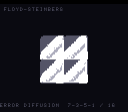

# #70 — SNES Floyd-Steinberg Error-Diffusion Dither: forward-carried signed residual

**Status:** SHIPPED ✓ — clean positive, no compiler bug. Demo **#70** (Round 4). Published
[/snes/dither/](https://biohack.net/snes/dither/). Gate CRC **`0x80C4`**,
`host == default == +mos-a16 == +mos-xy16` on bsnes-jg, `-verify` clean ×2.

## Context

A smooth drifting gradient is reduced to four grey levels by **Floyd-Steinberg error diffusion**: each
pixel is quantised, and its **signed** quantisation residual `e = value − level` is spread to the
down-right neighbours — **7/16 right, 3/16 down-left, 5/16 down, 1/16 down-right** — so the following
pixels see the accumulated error. The smooth scene resolves into shimmering ordered dither, the error
visibly flowing down and to the right.

**Distinct corner:** forward-carried **signed** error propagation across a **two-row error buffer**
threaded through a raster sweep. #7 (doom-fire) was decay + PRNG; nothing in the first 69 demos carries a
signed residual forward into a data-dependent quantise.

## Algorithm & width discipline

Everything is `int16` (values *and* error, signed) — no float, bit-exact host vs target by construction.
The quantiser is **3 compares** (`v<43?0 : v<128?1 : v<213?2 : 3`); the four output levels come from a
4-entry LUT `{0,85,170,255}` (no multiply). The residual split is `(e*k)>>4` — an **arithmetic shift of a
signed value**; both the host (gcc) and llvm-mos arithmetic-shift signed right, so the result is
identical. The `e*7/e*3/e*5` constant multiplies strength-reduce to shift-adds; the remainder term
`e1 = e − e7 − e3 − e5` keeps the distributed total exactly `e` (no error lost to truncation). So the FS
core is **pure add/shift/compare — no divide/mod libcalls** (the whole point: naive FS divides by 16).

## Display architecture

`BitmapCanvas` BG3 2bpp (128×128) + two-row `TextLayer` + `TitleLayer`. A 48×48 dither grid (RAM budget —
the `out[]` band buffer must coexist with the 4 KB canvas shadow in <7680 B low-WRAM) is blitted as 2×2
blocks, centred (96×96). Four-grey ramp palette (the classic error-diffusion "camera" look). The scene
drifts (`t += 3`/frame); CGRAM is re-pushed after `title_end`.

## Differential gate

- `corpus_result = dither_gate_crc()`, `GATE_N = 3` animated frames of a 24×24 grid (all four quantiser
  branches fire). **EXPECT = `0x80C4`.** Folds the band indices mixed with pixel position.
- Disasm probe: **divide/mod libcalls = 0** (FS needs no division), arithmetic shifts present, native-16.
  Measured: `divide-libcalls=0  shifts=25  rep/sep=69` (incidental index/scene mul=2 — the runtime
  row-index `y*W` and the scene stride, not the FS core).

## Note — a measured detail (not a bug)

The scene stride `x*11` and the runtime row-index `y*W` (`W` a function parameter, so not a compile-time
constant) emit `__mulqi3`/`__mulhi3` rather than strength-reducing — expected (a variable multiply can't
be strength-reduced, and llvm-mos leaves the `×11` as a libcall). These are **incidental to the FS
algorithm**; the probe deliberately targets the *division*-freedom of error diffusion (the real stress
claim), and reports the mul count for transparency. Consistent with #39's finding that llvm-mos does not
always strength-reduce constant integer multiplies on this soft-multiply target.

## Verification steps

1. Host oracle — `dither gate_crc = 0x80C4`; bands 45/247/243/41 (all four levels used). PASS.
2. ROM builds; corpus_result @ WRAM 0x30. PASS.
3. Disasm gate — `PASS  divide-libcalls=0  shifts=25  rep/sep=69`. PASS.
4. `dev/run.sh dither` — `SMOKE: PASS got=0x80C4`; `RESULT: PASS`. PASS.
5. Full 3-way on bsnes-jg (MAME BIOS absent here) — `host==default==+mos-a16==+mos-xy16==0x80C4`,
   `-verify` clean ×2. PASS — clean positive.
6. Title + animation — `build/dither-jg.png` (frame 2000) shows the drifting gradient resolved into the
   4-level Floyd-Steinberg dither, HUD intact. PASS.
7. Plan title card embedded above. PASS.
8. `/snes-rom-page` publishes. 9. `task md` renders cleanly.
