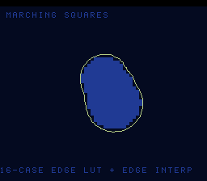

# #71 — SNES Marching-Squares Iso-Contours: 16-case edge LUT + edge interpolation

**Status:** SHIPPED ✓ — clean positive on the correctness bar (differential green); the `+mos-a16`/`+mos-xy16`
`-verify` crash is the **documented `a16-rc-undef-ra-pure-virtual` known issue** (XFAIL, code bit-exact
correct). Demo **#71** (Round 4). Published [/snes/msquares/](https://biohack.net/snes/msquares/). Gate CRC
**`0x86A7`**, `host == default == +mos-a16 == +mos-xy16` on bsnes-jg.

## Context

A scalar field (a sum of moving parabolic "metaball" domes) is sampled on a grid; each cell's four
corners are thresholded against the iso value into a **4-bit CASE index** (`tl<<3|tr<<2|br<<1|bl`); a
**16-entry const edge table** `MS_SEG` says which cell edges the contour crosses; and each crossing is
placed by **edge-crossing linear interpolation** `t = (iso − va)/(vb − va)` (a signed int32 divide). The
iso-contour is drawn as bright yellow outlines around dim-filled blobs that merge and split.

**Distinct corner:** #45 rendered the metaball *field*; **extracting** its iso-contour is a separate
case-table-indexing + edge-interpolation loop none of the first 70 demos run.

## Algorithm & width discipline

Everything is integer (`int16` coords, `int32` field/interp) — no float, bit-exact host vs target. The
field `ms_field` sums `clamp(R²−dx²−dy², 0)` domes (int32 `dx*dx`). The case index is 4 corner-sign
compares; `MS_SEG[16][4]` maps it to up to two segments (edge pairs, `0xFF` = none); `ms_interp` does the
signed int32 crossing divide (guarded against `vb==va`).

## Display architecture

`BitmapCanvas` BG3 2bpp (128×128) + two-row `TextLayer` + `TitleLayer`. A 32×32 cell grid. **Performance:**
the naïve field sample is `__mulsi3`-heavy (dx², dy² per corner) — evaluating it 4× per cell made the
demo crawl (bright only by frame ~5000). The demo fills the value grid with an **incremental
second-difference** stepper (`d2 += delta; delta += 2·CELL²`) so the inner loop is adds only — no
per-point multiply. **This fast path lives only in the ROM (the gate uses `ms_field`), so it is NOT
differential-covered — it was cross-checked against `ms_field` on the host (0 mismatches over 200 frames
× 1089 points) before trusting it** (the incremental-raster blind-spot lesson from #69). CGRAM is
re-pushed after `title_end`.

## Differential gate

- `corpus_result = msquares_gate_crc()`, `GATE_N = 2` frames of a 16×16 cell grid; the field is sampled
  **once per grid point** into `vg[]` (not 4× per cell) so the `__mulsi3`-heavy field stays inside the
  gate settle window. Folds the case index + every crossing point. **EXPECT = `0x86A7`.**
- Disasm probe: `MS_SEG` referenced (the 16-case edge table) + `__divsi3 ≥ 1` (edge interpolation) +
  native-16. Measured: `MS_SEG-refs=4  __divsi3=4  rep/sep=155`.

## Compiler finding — an rc-undef XFAIL witness (not a new bug)

Under both `+mos-a16` and `+mos-xy16` at `-Os`, `msquares_sim.c` trips
`*** Bad machine code: Using an undefined physical register ***` under `-verify-machineinstrs` — the
documented **`a16-rc-undef-ra-pure-virtual`** known issue (Cause #2, deferred pending the RA fix). The
**code is bit-exact correct**: the differential is green `host == default == +mos-a16 == +mos-xy16 ==
0x86A7` on bsnes-jg (900 frames). Like #69, a high-register-pressure int32-**divide** kernel (here the
edge-crossing interpolation) is the population that trips it. XFAIL witness, not a new defect.

## Verification steps

1. Host oracle — `msquares gate_crc = 0x86A7`; 55 crossed cells (live contour, all case types). PASS.
2. ROM builds; corpus_result @ WRAM 0x72. PASS.
3. Disasm gate — `PASS  MS_SEG-refs=4  __divsi3=4  rep/sep=155`. PASS.
4. `dev/run.sh msquares` — `SMOKE: PASS got=0x86A7`; `RESULT: PASS`. PASS.
5. Full 3-way on bsnes-jg (MAME BIOS absent here) — `host==default==+mos-a16==+mos-xy16==0x86A7`, 900
   frames each. PASS. `-verify` → XFAIL `a16-rc-undef-ra-pure-virtual` (known issue; code correct).
6. Incremental field cross-check — `fill_field` == `ms_field`, 0 mismatches over 200 frames × 1089 pts.
7. Title + animation — `build/msquares-jg.png` (frame 1800) shows the iso-contour (yellow outline, dim
   blob fill) of the metaball field, HUD intact. PASS.
8. Plan title card embedded above. `/snes-rom-page` publishes; `task md` renders cleanly.
