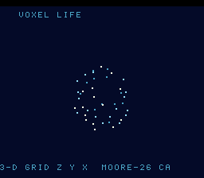

# #72 — SNES 3-D Grid Voxel Life: multi-dimensional array indexing

**Status:** SHIPPED ✓ — clean positive, no compiler bug. Demo **#72** (Round 4) — the **final demo of the
battery**. Published [/snes/grid3d/](https://biohack.net/snes/grid3d/). Gate CRC **`0xFCDE`**,
`host == default == +mos-a16 == +mos-xy16` on bsnes-jg, `-verify` clean ×2.

## Context

A life-like cellular automaton (survive 4..7, born 5..6, Moore-26 neighbourhood, toroidal wrap) runs in a
**true 3-D array** `uint8_t grid[6][6][6]`, accessed as `grid[z][y][x]`, so the **compiler generates the
plane/row stride arithmetic** `z*(D*D) + y*D + x` (D = 6, non-power-of-2 → strides 36 and 6). The live
voxels tumble as a depth-shaded rotating cube.

**Distinct corner:** every prior grid demo was 1-D or hand-indexed `y*W+x`; this is the first that leans
on the compiler's **N-dimensional GEP lowering** — and does so 26 times per cell (the Moore neighbourhood)
plus once per fold, across two double-buffered 3-D arrays.

## Algorithm & width discipline

`uint8_t` cells, `int`/`int8_t` indices — bit-exact host vs target by construction (the indexing must
compute the same linear offset both ways). `g3_neighbours` walks the 26 Moore neighbours with manual wrap;
`g3_step` applies the rule into the double buffer. The rule stays active (population 20–80 over 120 steps,
host-verified). The rotation/projection in the ROM uses the shared Q8.8 `SINCOS` LUT + a per-vertex
perspective divide.

## Differential gate

- `corpus_result = grid3d_gate_crc()`, `GATE_N = 3` automaton steps (Moore-26 is heavy — kept small so
  the synchronous startup gate settles before the title fades). Folds every cell (mixed with its 3-D
  coordinate) + the population after each step. **EXPECT = `0xFCDE`.**
- Disasm probe: the 3-D arrays `g3_a`/`g3_b` are referenced + native-16 + stride shift/adds. Measured:
  `g3_a/g3_b-refs=28  shifts=35  rep/sep=88` (stride mul=0 — the small non-power-of-2 strides 36/6
  **strength-reduce to shift-adds** rather than `__mulhi3` libcalls, like #39/#70; the multi-dim GEP is
  still exercised and differential-verified).

## A demo-code bug caught by eye (not the gate) — and how it was diagnosed

The on-screen voxel cube first rendered as **only ~6 dots** in a top strip, while the host projected all
~50–70 live voxels spread across the frame. The methodical isolation (documented here as the sequence the
directive asks for):

1. **Not the CA / not the indexing** — the gate is green and a WRAM probe (`dbg_live`) showed
   `draw_voxels` correctly *sees* 69 live cells; a WRAM probe of the projected `|sx−64|` spread read 48,
   i.e. the geometry spans the full width. So the read and the projection are correct.
2. **Not a codegen miscompile** — the **default 8-bit** build (the trusted reference) rendered *identically*
   to `+mos-a16`/`+mos-xy16` (all three ~6 dots). A real codegen bug would make default differ from a16;
   all targets agreeing rules that out.
3. **The actual cause: a missing `#define CANVAS_FLUSH_TILES 256`.** With the default cap of 64 tiles, and
   `canvas_clear` resetting `lo=0` every frame, only the top 64 tiles (the top 32 px) ever DMA to VRAM —
   the visible dots were *exactly* the voxels landing in that top strip; the rest never reached the PPU.
   A pure **display bug** (differential green throughout), fixed by the one-line define every other
   BitmapCanvas demo already carries. *Lesson:* a full-canvas clear+redraw needs the raised flush cap
   (noted in the snesgfx budget) — and "differential green but wrong picture" points at the display path,
   not the compute (the [[incremental-raster-gate-blindspot]] family).

Also: the Moore-26 gate is `__mulsi3`-free but read-heavy; `GATE_N` was trimmed 6→3 so the startup gate
settles by ~frame 500 (it was freezing the title card ~800 frames).

## Verification steps

1. Host oracle — `grid3d gate_crc = 0xFCDE`; population 44/69/44 over the gate steps (active). PASS.
2. ROM builds; corpus_result @ WRAM 0x69. PASS.
3. Disasm gate — `PASS  g3_a/g3_b-refs=28  shifts=35  rep/sep=88` (stride mul=0). PASS.
4. `dev/run.sh grid3d` — `SMOKE: PASS got=0xFCDE`; `RESULT: PASS`. PASS.
5. Full 3-way on bsnes-jg (MAME BIOS absent here) — `host==default==+mos-a16==+mos-xy16==0xFCDE`, 700
   frames each; `-verify` clean ×2. PASS — clean positive, no compiler bug.
6. Title + animation — `build/grid3d-jg.png` (frame 800) shows the depth-shaded rotating voxel cloud of
   the 3-D automaton, HUD intact. PASS.
7. Plan title card embedded above. `/snes-rom-page` publishes; `task md` renders cleanly.
