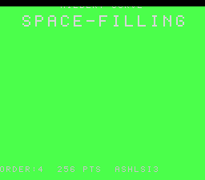

# Title screen: BG2VOFS scroll + ease-in/hold/fast-ease-out + mixed 8×8/16×16 font

## Problem

The previous `title_layer.h` fly-in moved text by erasing and re-writing VRAM tilemap rows
via `upq_push_vram` DMA each frame. Movement was quantised to 8 px (one tile row); the Q4
fixed-point just spaced out those coarse jumps. Additionally, both lines used the same font
size (all-8×8 or all-16×16 selected per demo).

## Solution

1. **BG2VOFS scroll instead of VRAM DMA.** Write both title lines to their final tilemap rows
   once in `reserve()`, then drive `REG_BG2VOFS` (via `upq_push_scroll`) each frame to scroll
   the whole BG2 layer. Pixel-smooth, zero VRAM traffic during animation.

2. **Unified mixed-font layout.** All demos get:
   - line0 — 8×8 font (category/subtitle), centred at tilemap row 12
   - line1 — 16×16 pixel-doubled font (demo name), centred at tilemap rows 14–15

3. **Eased animation.**
   - **Ease-in:** `vofs -= max(1, vofs>>3)` per frame — exponential decay from 220 to 0
     (~35 frames at 60 fps; fast when far, decelerates gently to rest).
   - **Hold:** BG2VOFS stays at 0; shimmer + rainbow backdrop continue.
   - **Ease-out:** `vel += 6; vofs += vel` per frame — quadratic acceleration upward;
     text exits the top of the screen in ≤ 6 frames during the fade-to-black.

## VRAM layout

| Tiles | Content | VRAM words |
|---|---|---|
| 0 – 63 | 8×8 glyphs (line0) | 0x1000 – 0x13FF (1 K) |
| 64 – 319 | 16×16 expanded glyphs (line1, 4 tiles/glyph) | 0x1400 – 0x23FF (4 K) |

Total: 5 K words at `TITLE_CHR_WORD` = 0x1000. (Canvas data for all demos ends at 0x0FFF —
256 tiles × 8 words/tile × 2bpp = 2 K words from 0x0000. No overlap.)

## Struct delta

Fields removed (384 bytes freed):
- `rbuf0[TITLE_RBUF_COLS]`, `rbuf1[TITLE_RBUF_COLS]`, `rblank[TITLE_RBUF_COLS]`
- `py0`, `py1`
- `font16`

Fields changed:
- `y0`, `y1` → `vofs` (int16_t, current BG2VOFS) + `vel` (int16_t, ease-out accumulator)

## API

`title_begin16` is now a `#define` alias for `title_begin` — all 30 existing call sites
compile unchanged. `rdiff.c` (the one demo using `title_begin`) also gains the new animation
automatically. `splash16` wraps `title_begin` unchanged.

## Code delta

~65 lines deleted, ~15 lines added → **net −50 lines**. 384 bytes of struct RAM freed.
Branching on `font16` gone from both `_title_reserve` and `_title_emit`.

## Verification

*Frame 70 of hilbert — hold phase, vofs=0. "HILBERT CURVE" in 8×8 (line0),
"SPACE-FILLING" in 16×16 (line1). Rainbow backdrop at green phase.*

1. Build `hilbert` (was `title_begin16`):
   `task hilbert` → `RESULT: PASS — corpus hash 0x5999 host == +mos-a16`

2. Build `rdiff` (was `title_begin`, tight-BSS override `TITLE_RBUF_COLS=TITLE_COLS`):
   `task rdiff` → `RESULT: PASS — corpus hash 0x5555 host == +mos-a16`

3. Build `avalanche` (uses `splash16`):
   `task avalanche` → `RESULT: PASS — corpus hash 0x27EA host == +mos-a16`

All three: `-verify-machineinstrs` clean, gate passes, differential confirmed.
