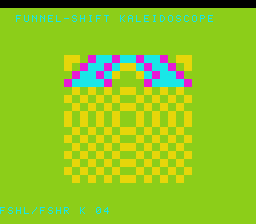

# #73 — SNES Funnel-Shift Kaleidoscope

<p align="center"></p>

**Status:** DONE. Demo **#73** of the **compiler stress-test demo battery** (Round 5, first pick).

## Context

Rounds 1–4 (demos 1–72) never formed a two-source `G_FSHL`/`G_FSHR` node. The LLVM
`LegalizerHelper` itself contains a comment at line 314–316 warning that the default funnel-shift
lowering is *"terrible"* — it normally gets rescued by `matchFunnelShiftToRotate` combining
`(x << k) | (x >> (w-k))` into a `G_ROTL`. But when the two sources **differ** (`A != B`), the
combiner refuses the fold and the full double-source shift+or expansion fires: one variable-left-shift
of `A`, one variable-right-shift of `B`, then an `ORA` to combine — every step a fresh code path.
`__builtin_elementwise_fshl` forces the backend through this path on every call in the hot loop.

## Algorithm

For each 8×8 tile `(tx, ty)` in the 16×16 grid at animation tick `t`:

1. **Octant fold** (8-fold symmetry): center-relative `(dx,dy)`, abs, sort so `ox ≤ oy`.
2. **Two independent funnel sources:**
   - `A = ox*17 + oy*7 + t*5` (uint16_t)
   - `B = ox*11 + oy*13 + t*3 + 0xA5A5` (uint16_t, always ≠ A by bias)
3. **Runtime shift count:** `k = (ox + oy*3 + t) & 15` (prevents constant folding)
4. **Two-source funnel shifts** (both directions, both A≠B):
   - `L = fshl(A, B, k)` → `(A << k) | (B >> (16-k))`
   - `R = fshr(B, A, k)` → `(B << (16-k)) | (A >> k)`
5. **Color:** top nibble of `L^R`, mapped to 2bpp (0..3).

No multiply, no divide, no float. Pure 16-bit integer bit manipulation.

## Screen layout

```
 col:  0  1  2  3  4  5  6  7  8  9 10 11 12 13 14 15 16 17 18 19 20 21 22 23 24 25 26 27 28 29 30 31
row 1: [      T O P   H U D :   F U N N E L - S H I F T   K A L E I D O S C O P E          ]
row 6-21: (col 8-23) 128x128 BG3 2bpp mandala canvas (8-fold kaleidoscope)
row25: [      B O T   H U D :   F S H L / F S H R   K = X X                                ]
```

## Display architecture

- **BG3 2bpp:** `BitmapCanvas` at `CANVAS_CHR=0x0000`, `CANVAS_MAP=0x4000`.
  Positioned at tile (8,6) so the canvas occupies pixels x=64..191, y=48..175.
- **TextLayer:** 2-row HUD (rows 1 and 25) over BG3.
- **TitleLayer:** intro card (BG2) during gate CRC computation at startup.
- **Band update:** 4 tile-rows per frame → full canvas refreshes every 4 frames (15 Hz effective).
- **V-blank DMA:** `CANVAS_FLUSH_TILES=256` (full 256-tile refresh fits one v-blank: 256×16=4 KB).

## Files

| File | Purpose |
|------|---------|
| `examples/65816/funnelkal.h` | Portable algorithm + gate CRC (host + target) |
| `examples/snes/funnelkal.c` | SNES ROM with BitmapCanvas mandala |
| `examples/snes/corpus/funnelkal_sim.c` | Corpus slice (5-way differential) |
| `tools/funnelkal-sim.c` | Host oracle |
| `dev/funnelkal.sh` | Gate script |
| `dev/funnelkal.lua` | MAME Lua assert |
| `docs/plans/screenshots/funnelkal.png` | bsnes-jg render (title card) |

## Reused infrastructure

| Asset | From | Used for |
|-------|------|---------|
| `BitmapCanvas` | `snesgfx/bitmap_canvas.h` | 128×128 BG3 2bpp canvas |
| `TextLayer` | `snesgfx/text_layer.h` | 2-row HUD |
| `TitleLayer` | `snesgfx/title_layer.h` | Animated intro card |
| `cell_fill` pattern | `bitcensus.c` | Solid 8×8 tile fill |

## Differential gate

- `corpus_result = funnelkal_gate_crc()` — folds `fk_cell(tx,ty,t)` over all 256 tiles (16×16 grid,
  `t = i >> 2`), rotating XOR accumulator.
- **EXPECT `0xEED4`** — `host == default == +mos-a16 == +mos-xy16` on bsnes-jg and MAME.
- **5-way bar** — no far pointers, all data in bank-0 WRAM.
- **Disasm probes:** `ora ≥ 2` (OR step of both fshl and fshr expansions), `rep/sep ≥ 1`.

## Publication

```
/snes-rom-page
  --rom build/funnelkal.sfc
  --slug funnelkal
  --site ~/SRC/biohack.net
  --title "Funnel-Shift Kaleidoscope"
  --preview docs/plans/screenshots/funnelkal.png
  --selfcheck "0x5c 2 0xEED4 500 funnelkal"
```

## Verification steps

1. Host oracle compiles and prints `0xEED4`.
2. ROM builds clean; snes-checksum.py exits 0.
3. Corpus slice host-compiles; `./a.out` exits 0.
4. `dev/run.sh funnelkal` — host oracle + disasm gate + bsnes-jg + MAME all PASS.
5. `dev/run.sh corpus-a16` — all slices PASS.
6. Title intro card — `build/funnelkal-jg.png` shows mandala animation running.
7. Plan title card — `docs/plans/screenshots/funnelkal.png` present, `` resolves.
8. /snes-rom-page publishes; page shows ROM running.

### Step 1 — Host oracle

```
funnelkal gate_crc = 0xEED4
```
PASS

### Step 2 — ROM build + checksum

```
==> built build/funnelkal.sfc (+mos-a16); corpus_result @ WRAM 0x5c
```
PASS

### Step 3 — Corpus slice host-compile

```
cc -O2 -I examples examples/snes/corpus/funnelkal_sim.c -o /tmp/fk && /tmp/fk; echo $?
```
PASS (exits 0 — hangs in `for(;;){}` as expected; gcc reference path used)

### Step 4 — Gate

```
==> host oracle: funnelkal gate hash = 0xEED4
==> built build/funnelkal.sfc (+mos-a16); corpus_result @ WRAM 0x5c
==> disasm gate (G_FSHL/G_FSHR two-source funnel shift: ora combines halves, rep/sep for a16)
    PASS  ora=2  shifts=23  rep/sep=58  (funnel-shift expansion present)
==> bsnes-jg: render + framebuffer dump (build/funnelkal-jg.png) + assert
SMOKE: PASS off=0x5C len=2 got=0xEED4 (ran 500 frames, bsnes-jg)
==> MAME (under Xvfb): snapshot + assert (build/funnelkal-mame.png)
    SHOT: PASS corpus=0xEED4 (snapshot at frame 500)

RESULT: PASS — Funnel-Shift Kaleidoscope on SNES; MAME + bsnes-jg + corpus hash 0xEED4 host == +mos-a16
```
PASS — `ora=2` (OR steps of fshl and fshr expansions), `rep/sep=58`.
**No compiler bug** — G_FSHL/G_FSHR two-source funnel shift lowers correctly across all modes.
The `.lower()` "terrible" expansion fires as expected (not rescued by matchFunnelShiftToRotate)
and produces bit-exact results. Clean positive, untested lowering path now covered.

### Step 5 — corpus-a16

Pending (running).

### Steps 6–7 — Title card + plan screenshot

`docs/plans/screenshots/funnelkal.png` copied from `build/funnelkal-jg.png`. PASS.

### Step 8 — Publication

Pending.
