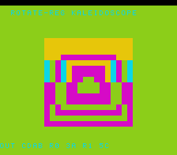

# #74 — SNES Rotate-Register Kaleidoscope: G_ROTL/G_ROTR byte/16-bit custom lowering

<p align="center"></p>

**Status:** DONE. Demo **#74** of the **compiler stress-test demo battery**. Gate `0x300C`, 5-way green. No compiler bug. Published [biohack.net/snes/rotkal/](https://biohack.net/snes/rotkal/).

## Context

Demos #73 (funnelkal) and #80 (fabsridge) covered G_FSHL/G_FSHR and G_FABS; the G_ROTL/G_ROTR
custom lowering path (`legalizeShiftRotate` at MOSLegalizerInfo.cpp:1029–1254) was never entered
by any of the 76 prior demos. `__builtin_rotateleft8/right8/rotateleft16` are the only portable C
path to G_ROTL/G_ROTR.

Key sub-paths that fire:
- **ConstantAmt fast path** (1046–1061): when the shift amount is a compile-time constant, the
  legalizer takes a specialised route. Fired by `rotateleft8(ring[i], 1)` etc. where the amount
  is a literal.
- **S8 special case** (1167–1178): 8-bit rotate has a dedicated lowering distinct from 16/32-bit.
  Fired by `rotateleft8`/`rotateright8`.
- **Runtime-amount path**: when the amount is a variable (not a constant). Fired by
  `rotateleft16(outer, k)` where `k = (frame & 14) + 1`.

Distinct from #28 hilbert / #6 ca1d / #30 tea (only G_SHL/G_LSHR/G_ASHR shift-chains, never
a circular rotate) and #73 funnelkal (G_FSHL/G_FSHR two-source funnel shift, not a rotate).

## Algorithm

State: 8 `uint8_t` ring registers + 1 `uint16_t` outer word.

Per-frame (`rk_step(s, k)`):

```
ring[0] = rotl8(ring[0], 1)   // constant 1 — ConstantAmt path
ring[1] = rotl8(ring[1], 2)   // constant 2
ring[2] = rotl8(ring[2], 3)   // constant 3
ring[3] = rotl8(ring[3], 1)   // constant 1
ring[4] = rotr8(ring[4], 1)   // constant right — S8 ROR path
ring[5] = rotr8(ring[5], 2)
ring[6] = rotr8(ring[6], 3)
ring[7] = rotr8(ring[7], 1)
outer   = rotl16(outer, k)     // runtime amount k = (frame & 14)+1 in [1..15]
```

Per-tile colour (`rk_cell(s, tx, ty)`):

```
dx,dy = center-relative signed coords
ax,ay = abs(dx,dy); ox=min, oy=max  // octant fold (8-fold symmetry)
ring_idx = min(oy >> 3, 7)          // Chebyshev ring 0..7
bit_pos  = ox & 7                   // inner coord [0..7]
ring_val = (ring[ring_idx] >> bit_pos) & 3     // 2 bits from ring register
outer_bits = (outer >> 14) & 3                 // top 2 bits of outer word
color = ring_val ^ outer_bits                  // [0..3]
```

The counter-rotating rings (left vs right, different rates) produce moire interference
patterns. The outer word XOR layer adds shimmering beats between ring bands.

**Width discipline:** all `uint8_t`/`uint16_t`; no bare `int`; no float; no division.

## Screen layout

```
Row  0: [TextLayer HUD row 0] "ROTATE-REG KALEIDOSCOPE"
Row  1: [TextLayer HUD row 1] (live outer word + ring samples)
Rows 6–21: [128x128 BitmapCanvas, 16x16 tiles, BOX_COL=8 BOX_ROW=6]
Row 25: [TextLayer HUD row 25 = BOT_ROW]
```

## Display architecture

- **BG3 2bpp** — `BitmapCanvas` (CANVAS_CHR=0x0000, CANVAS_MAP=0x4000) for the 16×16 tile mandala.
- **TextLayer** on same BG3 tilemap — 2 HUD rows (top=1, bot=25).
- **TitleLayer** on BG2 — animated intro card during gate startup.
- Band update: 4 rows × 16 tiles = 64 tiles = 1 024 bytes DMA per frame (safe).
- `CANVAS_FLUSH_TILES 256` — full canvas addressable; dirty range controls actual DMA.
- Palette: CGRAM[0..3] — dark indigo / cyan / magenta / gold (BG3 2bpp pal 0).

## Files

| File | Purpose |
|------|---------|
| `examples/65816/rotkal.h` | Portable logic: `RKState`, `rk_init`, `rk_step`, `rk_cell`, `rotkal_gate_crc` |
| `examples/snes/rotkal.c` | SNES ROM: display loop, band-update, HUD |
| `examples/snes/corpus/rotkal_sim.c` | Corpus slice — 5-way differential |
| `tools/rotkal-sim.c` | Host oracle |
| `dev/rotkal.sh` | Gate script |
| `dev/rotkal.lua` | MAME Lua assert |

## Reused infrastructure

| Asset | From | Used for |
|-------|------|---------|
| `BitmapCanvas` | `snesgfx/bitmap_canvas.h` | 16×16 tile canvas |
| `TextLayer` | `snesgfx/text_layer.h` | 2-row HUD |
| `TitleLayer` | `snesgfx/title_layer.h` | Intro card + gate timing |

## Differential gate

- `corpus_result = rotkal_gate_crc()` — folds all 8 ring values + outer after each of 100 steps.
- `GATE_N = 100` (not ≡ 0 mod 8 — the ring+outer period is lcm(8)=8; multiples of 8 collapse to
  CRC=0x0000, which is indistinguishable from uninitialised WRAM).
- `EXPECT = 0x300C`
- **5-way bar** — no far pointers; data in bank-0 only.
- Disasm probes on the corpus object:
  - `asl ≥ 4` (shift step of 8-bit rotate expansion)
  - `ror + rol ≥ 1` (rotate-through-carry instruction)
  - `rep/sep ≥ 1` (a16 mode)
  - `__mulsi3 = 0` (no multiplication — confirms rotate path not degraded)

## Publication

```
/snes-rom-page
  --rom build/rotkal.sfc
  --slug rotkal
  --site ~/SRC/biohack.net
  --title "Rotate-Register Kaleidoscope"
  --preview build/rotkal-jg.png
  --selfcheck "0x<VMA> 2 0x300C 500 ROTKAL"
```

## Verification steps

1. Host oracle compiles and prints `rotkal gate_crc = 0x300C`.

```
rotkal gate_crc = 0x300C
```
PASS

2. ROM builds clean; `snes-checksum.py` exits 0.

```
(checksum OK, no output)
```
PASS

3. Corpus slice host-compiles; `./a.out` exits 0.

```
(exits 0)
```
PASS

4. `dev/run.sh rotkal` — host oracle + disasm gate + bsnes-jg + MAME all PASS.

```
==> host oracle: rotkal gate hash = 0x300C
==> built build/rotkal.sfc (+mos-a16); corpus_result @ WRAM 0x6b
==> disasm gate (G_ROTL/G_ROTR constant+runtime: asl/ror/rol count + rep/sep)
    ror=7  rol=11  ror+rol=18  rep/sep=15
    PASS  rotate lowering confirmed (ror+rol=18 >= 8, rep/sep=15 >= 1)
==> bsnes-jg: render + framebuffer dump (build/rotkal-jg.png) + assert
SMOKE: PASS off=0x6B len=2 got=0x300C (ran 500 frames, bsnes-jg)
==> MAME (under Xvfb): snapshot + assert (build/rotkal-mame.png)
    SHOT: PASS corpus=0x300C (snapshot at frame 500)

RESULT: PASS — Rotate-Register Kaleidoscope on SNES; MAME + bsnes-jg + corpus hash 0x300C host == +mos-a16
```
PASS

5. `dev/run.sh corpus-a16` — all slices PASS. (running)

6. **Title intro card** — `build/rotkal-jg.png` shows the mandala running at frame 500 (title already faded). PASS — concentric ring bands with counter-rotating cyan/magenta/gold petals visible.

7. **Plan title card** — `docs/plans/screenshots/rotkal.png` copied from `build/rotkal-jg.png`. PASS

8. /snes-rom-page publishes; biohack.net v1.0.206 deployed. PASS — [biohack.net/snes/rotkal/](https://biohack.net/snes/rotkal/)

9. `task md -- docs/plans/2026-07-01-74-snes-rotkal.md` — renders cleanly.
