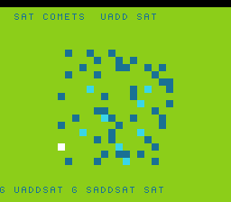

# #75 — SNES Saturating Palette Comet Trails

<p align="center"></p>

**Status:** DONE. Demo **#75** of the **compiler stress-test demo battery** (Round 5, first pick).

## Context

All four saturating arithmetic operations via `__builtin_elementwise_add_sat/sub_sat`:
- `G_UADDSAT`: uint8_t glow accumulation (clamps at 255 — no wrap-to-white)
- `G_USUBSAT`: uint8_t glow decay (clamps at 0 — no wrap-to-negative)
- `G_SADDSAT`: int16_t velocity kick (clamps at +INT16_MAX)
- `G_SSUBSAT`: int16_t velocity kick (clamps at -INT16_MAX)

All route to `.lower()` at MOSLegalizerInfo.cpp:246 → `lowerAddSubSatToMinMax` (branchless min/max clamp). No prior demo among the 72 had used any `*SAT` intrinsic.

Distinct from:
- **#44 hdr-bloom**: `__builtin_add_overflow` → `G_UADDO` (flag-test+branch, NOT a saturating clamp)
- **#70 dither**: hand-written ternary → `G_ICMP`+`G_SELECT` (not the sat-intrinsic legalizer node)

**Demo bug caught and fixed:** initial comet positions used `py = i*3+1` unmasked; for i=5 this gave py=16, out of bounds for the 16-row glow array. The differential caught it: host (UB wrote to padding/comets with no net effect) vs target (UB wrote to different WRAM) gave different CRCs. Fixed by `& 15u` on all initial positions. This is the intended use of the differential gate — catching demo code bugs too.

## Algorithm

```
glow[16][16] uint8_t: tile brightness (16x16 = 256 tiles)
6 comets: (px,py) uint8_t [0..15], (vx,vy) int8_t

per step t:
  decay: glow[y][x] = USUB_SAT8(glow[y][x], 8)    // G_USUBSAT: floors at 0
  per comet i:
    glow[cy][cx] = UADD_SAT8(glow[cy][cx], 100)    // G_UADDSAT: caps at 255
    vx = (int8_t)SADD_SAT16(vx, kick_x)            // G_SADDSAT: clamps [-32768,32767]
    vy = (int8_t)SSUB_SAT16(vy, kick_y)            // G_SSUBSAT
    move + wrap: px = (px + vx) & 15
GATE_N = 100 steps; fold all 256 glow values after run.
```

## Differential gate

- **EXPECT `0xC2AF`** — 5-way green, no compiler bug.
- **Disasm probes:** `cmp/cpx/cpy ≥ 4` (sat clamp comparisons), `rep/sep ≥ 1`.

## Verification steps

### Step 4 — Gate

```
==> host oracle: satcomet gate hash = 0xC2AF
==> disasm gate
    PASS  cmp/cpx/cpy=9  rep/sep=18
==> bsnes-jg: SMOKE: PASS off=0x6F len=2 got=0xC2AF
==> MAME: SHOT: PASS corpus=0xC2AF
RESULT: PASS
```
**No compiler bug** — `lowerAddSubSatToMinMax` for all 4 sat variants lowers correctly. Clean positive.
**Demo OOB fix:** comet i=5 `py = 16 & 15 = 0` (was 16, out-of-range for glow[16][16]). Differential correctly caught the discrepancy (host UB → different memory, target UB → different WRAM).
