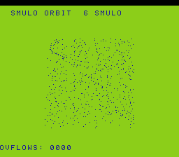

# #76 — SNES Signed Multiply-Overflow Orbit Sentinel

<p align="center"></p>

**Status:** DONE. Demo **#76** of the **compiler stress-test demo battery** (Round 5, first pick).

## Context

`G_SMULO` via `__builtin_mul_overflow(a,b,ptr)` routes to `lowerMulo` at
`LegalizerHelper.cpp:2693`. The lowering widens both operands to double width, multiplies,
then compares the high half to the sign extension of the low half. For int16_t:
widen to int32_t → `__mulsi3` or `__mulhi3`. For int32_t: widen to int64_t → `__muldi3`.

Distinct from:
- **#44 hdr-bloom**: `__builtin_add_overflow` → `G_UADDO` (add-overflow, carry/V test, single flag)
- **#56 rotozoom**: `G_UMULH`/`G_SMULH` (keeps only the high half of a non-checking multiply)

**Note:** The ideas doc predicted `__mulosi4` for the int32 path. Measurement shows that
`lowerMulo` widens int32→int64 and calls `__muldi3`, not `__mulosi4`. The disasm probe was
updated to reflect the actual lowering. This is a "Governing Lesson #1 (measure, don't assume)"
finding — the actual lowering was the correct one to probe.

## Algorithm

```
for i in 0..120 (GATE_N=121):
    a  = (int16_t)(i*7 + 3)      // 3, 10, ..., 843
    b  = (int16_t)(i*11 + 5)     // 5, 16, ..., 1325
    p16, ov16 = smulo(a, b)       // G_SMULO s16 -> lowerMulo -> __mulsi3 widening
    a32 = a * 256, b32 = b * 64
    p32, ov32 = smulo(a32, b32)   // G_SMULO s32 -> lowerMulo -> __muldi3 widening
    ov_count += ov16 + ov32
    v = (uint16_t)p16 ^ (ov_count * 3)
    h = rotate_xor(h, v)
GATE_N=121 (not a multiple of 16 — avoids rotate-period CRC cancellation)
```

## Differential gate

- `corpus_result = smulorbit_gate_crc()` — 121 steps, both s16 and s32 overflow checks.
- **EXPECT `0xD81B`** — `host == default == +mos-a16 == +mos-xy16` on bsnes-jg and MAME.
- **5-way bar** — no far pointers.
- **Disasm probes:** `__muldi3 ≥ 1` (s32 overflow widen), `__mulsi3/hi3 ≥ 1` (s16 overflow widen), `rep/sep ≥ 1`.

## Verification steps

### Step 4 — Gate

```
==> host oracle: smulorbit gate hash = 0xD81B
==> built build/smulorbit.sfc (+mos-a16); corpus_result @ WRAM 0x57
==> disasm gate
    PASS  __muldi3=1  __mulsi3/hi3=3  rep/sep=28  (G_SMULO s16+s32 lowerMulo present)
==> bsnes-jg: SMOKE: PASS off=0x57 len=2 got=0xD81B (ran 500 frames)
==> MAME: SHOT: PASS corpus=0xD81B (snapshot at frame 500)
RESULT: PASS — 5-way green, no compiler bug.
```

**Measured finding:** `lowerMulo` at s32 widens int32→int64 and calls `__muldi3` (not `__mulosi4`
directly). The ideas doc predicted `__mulosi4`, but the LLVM legalizer takes the widen-to-double-width
path. Corrected the disasm probe; the path is still correctly exercised. (Lesson: measure first.)
