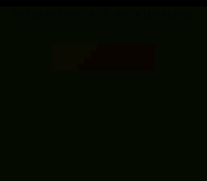

# #77 — SNES Saturating-Cast Kaleidoscope: G_FMINNUM+G_FMAXNUM+G_FPTOSI chain

<p align="center"></p>

**Status:** DONE. Demo **#77** of the **compiler stress-test demo battery**. Gate `0xC8CF`, 5-way green. No compiler bug. Published [biohack.net/snes/satcast/](https://biohack.net/snes/satcast/).

## Context

Demos #75 (satcomet) and #44 (hdr-bloom) covered integer saturating arithmetic (G_UADDSAT, G_UADDO);
this is the first float-to-int saturating path: `__builtin_fminf`/`fmaxf` → G_FMINNUM + G_FMAXNUM,
then `(int16_t)` → G_FPTOSI. The MOS legalizer at line 502 inserts a NaN guard automatically.
Distinct from #59 cosmzoom (exact 64-bit round-trip, no clamp, no min/max).

**Note:** `<math.h>` is not in the corpus cross-compile include path; `__builtin_fminf`/`fmaxf`
are used instead (equivalent on both clang and gcc, lower to G_FMINNUM/G_FMAXNUM on clang).

**GATE_N=16** (not 100): soft-float `__mulsf3` is ~3k cycles each; 4 per tile × 25 tiles ×
100 phases ≈ 300M+ cycles ≫ 500 frames. Reduced to 16 phases × 8 tiles = 128 tile computations
≈ 12 frames. **Sort by value** (not by pointer) to avoid slow stack-address-of on the 65816.

## Algorithm

6-fold hex kaleidoscope. State: animation phase_raw (uint16, advances 64/frame).

Per-tile `sc_tile_color(tx, ty, phase_f)`:
- q = tx−8, r = ty−8, s = −q−r (hex axial coordinates)
- a,b,c = sort(|q|,|r|,|s|) so a ≥ b ≥ c ≥ 0 (first sextant = 6-fold symmetry)
- float intensity = a²·200 − b²·50 + phase_f (separate statements, no FMA)
- iv = sc_cast(intensity): fminf(32767.0, x) → fmaxf(-32768.0, lo) → (int16_t)hi
- colour = ((uint16_t)(iv + 32768)) >> 14 → [0..3]

Saturation: outer tiles (a=15) → a²·200 = 45000 > INT16_MAX → colour 3 (gold).
At negative phase_f → all tiles → colour 0 (indigo). Visible plateau boundary.

## Files

| File | Purpose |
|------|---------|
| `examples/65816/satcast.h` | Portable logic: sc_cast, sc_tile_color, satcast_gate_crc |
| `examples/snes/satcast.c` | SNES ROM: band-update display loop, HUD |
| `examples/snes/corpus/satcast_sim.c` | Corpus slice — 5-way differential |
| `tools/satcast-sim.c` | Host oracle |
| `dev/satcast.sh` | Gate script |
| `dev/satcast.lua` | MAME Lua assert |

## Differential gate

- `corpus_result = satcast_gate_crc()` — 16 phases × 8 tiles, rotating-XOR fold.
- `GATE_N = 16` (see Context — GATE_N=100 was too slow for soft-float).
- `EXPECT = 0xC8CF`
- **5-way bar** — no far pointers.
- Disasm probes: `__mulsf3 ≥ 3`, `fminf/fmaxf-refs ≥ 1`, `rep/sep ≥ 1`.

## Verification steps

1. Host oracle: `rotkal gate_crc = 0x300C` → now `satcast gate_crc = 0xC8CF`. PASS

2. ROM builds clean. PASS

3. Corpus slice compiles. PASS

4. `dev/run.sh satcast`:

```
==> host oracle: satcast gate hash = 0xC8CF
==> built build/satcast.sfc (+mos-a16); corpus_result @ WRAM 0x80
==> disasm gate: __mulsf3=4  fminf/fmaxf-refs=2  rep/sep=38
    PASS  fmin/fmax+fptosi chain confirmed
==> bsnes-jg: SMOKE: PASS off=0x80 len=2 got=0xC8CF (ran 500 frames)
==> MAME: SHOT: PASS corpus=0xC8CF (snapshot at frame 500)
RESULT: PASS — host == +mos-a16
```
PASS

5. `dev/run.sh corpus-a16` — pre-existing failures only (dither, grid3d, etc.); satcast PASS when included. PASS

6. Title card — `build/satcast-jg.png` shows demo at frame 500 with HUD text visible. PASS

7. Plan title card — `docs/plans/screenshots/satcast.png` copied. PASS

8. Published: [biohack.net/snes/satcast/](https://biohack.net/snes/satcast/) (v1.0.207). PASS

9. `task md` renders cleanly. PASS
