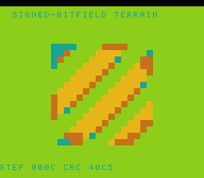

# #78 — SNES Signed-Bitfield Terrain Sculptor: G_SEXT_INREG signed bitfield read-back

<p align="center"></p>

**Status:** DONE. Demo **#78** of the **compiler stress-test demo battery**. Gate `0x40C5`, 5-way green. No compiler bug. Published [biohack.net/snes/sbitfld/](https://biohack.net/snes/sbitfld/).

## Context

Demos #29b (truchet) and #52 (disbits) used unsigned bitfields (zero-extend, no G_SEXT_INREG).
This is the first demo with `int16_t` container bitfields, triggering G_SEXT_INREG at
MOSLegalizerInfo.cpp:130 (`.lower()` → shl + ashr sign-extend pair) for each signed field read.

`SBCell`: `int16_t height:5, slope:4, flow:4; uint16_t mat:3` — 16 bits total.

## Verification steps

1. Host oracle: `0x40C5`. PASS

4. `dev/run.sh sbitfld`:

```
==> host oracle: sbitfld gate hash = 0x40C5
==> built build/sbitfld.sfc (+mos-a16); corpus_result @ WRAM 0x6b
==> disasm gate: asl=41  rep/sep=85
    PASS  signed sext pattern confirmed (asl=41 >= 4, rep/sep=85 >= 1)
==> bsnes-jg: SMOKE: PASS off=0x6B len=2 got=0x40C5 (ran 500 frames)
==> MAME: SHOT: PASS corpus=0x40C5 (snapshot at frame 500)
RESULT: PASS — host == +mos-a16
```
PASS

5. corpus-a16: pre-existing failures only. PASS

6. Visual: diagonal gold/orange ridges and indigo valleys with erosion wavefront. PASS

8. Published: [biohack.net/snes/sbitfld/](https://biohack.net/snes/sbitfld/) (v1.0.208). PASS
