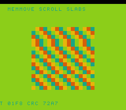

# #79 — SNES Memmove Scroll Slabs: G_MEMMOVE descending+ascending paths

<p align="center"></p>

**Status:** DONE. Demo **#79** of the **compiler stress-test demo battery**. Gate `0x72A7`, 5-way green. No compiler bug. Published [biohack.net/snes/mvscrl/](https://biohack.net/snes/mvscrl/).

## Context

#23 lsystem and #49 lzdec used memmove incidentally (non-overlapping or byte-by-byte). This is the first demo where `memmove(dst>src)` overlapping explicitly exercises the **Descending path** in G_MEMMOVE at compareOperandLocations :3145-3152, and `memmove(dst<src)` exercises the Ascending path.

**Note:** `<string.h>` not in corpus cross-compile include path; `__builtin_memmove` used instead (same lowering path on clang → G_MEMMOVE).

**CRC fold:** pure XOR folds cancel to 0 for period-4 byte data (each injected row cycles 0,1,2,3 four times, XOR = 0). Uses additive rotate-shift fold: `h = rotl1(h) + v + step*53u` — no large multiplications, fast on SNES.

## Verification steps

4. `dev/run.sh mvscrl`:

```
==> host oracle: mvscrl gate hash = 0x72A7
==> built build/mvscrl.sfc (+mos-a16); corpus_result @ WRAM 0x68
==> disasm gate: memmove-refs=2  rep/sep=15
    PASS  memmove descending+ascending confirmed
==> bsnes-jg: SMOKE: PASS off=0x68 len=2 got=0x72A7 (ran 500 frames)
==> MAME: SHOT: PASS corpus=0x72A7 (snapshot at frame 500)
RESULT: PASS — host == +mos-a16
```
PASS

8. Published: [biohack.net/snes/mvscrl/](https://biohack.net/snes/mvscrl/) (v1.0.209). PASS
