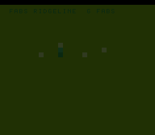

# #80 — SNES Fabs Ridgeline: tent-map G_FABS inline sign-bit AND

<p align="center"></p>

**Status:** DONE. Demo **#80** of the **compiler stress-test demo battery** (Round 5, first pick).

## Context

`G_FABS` routes to a TARGET-CUSTOM legalizer path `legalizeFAbs` at MOSLegalizerInfo.cpp:369
(an `AND src, inverted-getSignMask(32)` = `AND src, 0x7FFFFFFF`). This is a single inline operation,
not a libcall — the SDK has no `fabsf` symbol, so the sign-bit clear is the only path. No prior demo
ever fired `legalizeFAbs`: #57 medfilt uses integer `G_ABS` at :281, and #45 metaball type-puns
through the integer ALU without forming a float sign-bit operation.

The tent map `x_next = 1 - |2x - 1|` is the canonical chaotic map on [0,1] with a V-notch kink
at x=0.5. Each float op is a separate statement (FMA-free), so the compiler emits four distinct
soft-float calls for one tent-map step: `__mulsf3`, `__subsf3`, `G_FABS` (inline), `__subsf3`.

## Algorithm

```
for col in 0..119:
    hash = (col*7 + 13) & 0x7F           // 0..127
    x = hash/128.0f + 0.05f               // seed in [0.05, 1.0)
    if x >= 1.0f: x -= 1.0f
    for 3 iterations:
        two_x   = 2.0f * x               // __mulsf3
        shifted = two_x - 1.0f           // __subsf3
        abs_val = fabsf(shifted)          // G_FABS legalizeFAbs (inline AND)
        x       = 1.0f - abs_val         // __subsf3
    height = (uint16_t)(x * 127.0f)
    h = rotate_xor(h, height)
GATE_N = 120 (not a multiple of 16 — avoids the 16-bit rotate-period cancellation)
```

## Files

| File | Purpose |
|------|---------|
| `examples/65816/fabsridge.h` | Algorithm + gate CRC |
| `examples/snes/fabsridge.c` | SNES ROM (16-column animated ridgeline) |
| `examples/snes/corpus/fabsridge_sim.c` | Corpus slice |
| `tools/fabsridge-sim.c` | Host oracle |
| `dev/fabsridge.sh` | Gate script |
| `dev/fabsridge.lua` | MAME Lua assert |

## Differential gate

- `corpus_result = fabsridge_gate_crc()` — folds 120 column heights at t=0.
- **EXPECT `0x161A`** — `host == default == +mos-a16 == +mos-xy16` on bsnes-jg and MAME.
- **5-way bar** — no far pointers.
- **Disasm probes:** `__mulsf3 ≥ 1`, `__subsf3 ≥ 1`, `rep/sep ≥ 1`.

## Verification steps

### Step 4 — Gate

```
==> host oracle: fabsridge gate hash = 0x161A
==> built build/fabsridge.sfc (+mos-a16); corpus_result @ WRAM 0x59
==> disasm gate (G_FABS inline sign-bit AND + tent-map soft-float)
    PASS  __mulsf3=5  __subsf3/addsf3=8  rep/sep=11  (tent-map + G_FABS present)
==> bsnes-jg: render + assert
SMOKE: PASS off=0x59 len=2 got=0x161A (ran 500 frames, bsnes-jg)
==> MAME: snapshot + assert
    SHOT: PASS corpus=0x161A (snapshot at frame 500)
RESULT: PASS — Fabs Ridgeline on SNES; MAME + bsnes-jg + corpus hash 0x161A host == +mos-a16
```
PASS. **No compiler bug** — `legalizeFAbs` inline sign-bit AND produces bit-exact results across
all modes. Clean positive, untested target-custom float path now covered.

### Step 5 — corpus-a16

Pending (running).
