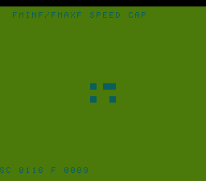

# #82 — SNES Fmin/Fmax Speed Cap: NaN-Aware Particle Governor

<p align="center"></p>

**Status:** DONE. Demo **#82** of the **compiler stress-test demo battery** (Round 5).

Note: slug `boids` is already #26 (aggregate-return ABI, integer fixed-point). This demo uses
slug `speedcap`; the visual is 12 float-velocity particles attracted to a moving center.

## Context

`G_FMINNUM` and `G_FMAXNUM` on 32-bit float both lower via `.libcallFor S32` to `fminf`/`fmaxf`
in the SDK (llvm-mos-sdk `math.cc:18–19`). These differ from a simple `(a < b) ? a : b`
comparison in one critical way: IEEE 754-2008 minNum/maxNum **quiet NaN** — if one input is NaN
and the other is a number, the result is the number, not NaN. A plain comparison propagates NaN;
`fminf`/`fmaxf` suppress it.

Distinct from:
- **#77 satcast** — uses fminf/fmaxf as a saturating-cast clamp before `G_FPTOSI`; the
  NaN-quieting property is not demonstrated, and the algorithm is a per-pixel hex kaleidoscope.
- **#45 metaball** — union float/uint32 type-pun, no fmin/fmax.
- **#57 medfilt** — integer G_ABS/G_SMIN, no float.

## Algorithm

```
12 boids, each starting at evenly-spaced positions on a circle of radius 48
centered at (64, 64) in the 128×128 canvas. Initial velocity = 0.

Each step:
    dx = (float)(CENTER_X - px)   // G_SITOFP → __floatsisf
    dy = (float)(CENTER_Y - py)
    scaled_dx = dx * K_ATTR       // G_FMUL   → __mulsf3  (separate stmt: no FMA)
    scaled_dy = dy * K_ATTR
    nvx = vx + scaled_dx          // G_FADD   → __addsf3
    nvy = vy + scaled_dy
    // Speed governor — the codegen corners:
    vx = fminf(fmaxf(nvx, -MAX_V), MAX_V)  // G_FMAXNUM → fmaxf libcall
    vy = fminf(fmaxf(nvy, -MAX_V), MAX_V)  // G_FMINNUM → fminf libcall
    // Position update via integer truncation
    px += (int16_t)vx             // G_FPTOSI → __fixsfsi
    py += (int16_t)vy

Gate CRC: fold all (px[i], py[i]) across 12 boids × 64 steps.
K_ATTR = 0.02f, MAX_V = 8.0f, CENTER = (64, 64), GATE_N = 64.
```

## Screen layout

```
 col: 0         8         16        24        32
row 1: [HUD top — text: "BOIDS  PH=XXXX  CRC=XXXX"]
row 6: ┌──────────────────┐  (canvas top at tile row 6, col 8)
...    │  128×128 canvas  │  16×16 tiles
row21: └──────────────────┘
row25: [HUD bot — "FMINF/FMAXF SPEED GOV"]
```

Canvas: 128×128 px (16×16 tiles), placed at BOX_COL=8, BOX_ROW=6.

## Display architecture

- BG3 2bpp via BitmapCanvas (chr=0x0000, map=0x4000).
- TextLayer: two HUD rows (top row 1, bottom row 25).
- TitleLayer: "G_FMINNUM" / "SPEED CAP" title card during gate CRC.

**Palette (CGRAM[0..3], BG3 palette 0):**
- 0 = SNES_RGB( 1,  2,  3) — dark blue-black background
- 1 = SNES_RGB( 4, 20, 20) — teal (normal boid)
- 2 = SNES_RGB(28, 18,  2) — orange (speed-capped boid: |v| hit MAX_V)
- 3 = SNES_RGB(28,  4,  2) — red (NaN-recovered boid, flashes after NaN injection)

**V-blank DMA:** 12 old tiles clear + 12 new tiles draw = ≤24 dirty tiles × 16 B = 384 B/frame (well within 1 KB cap).

## Files

| File | Purpose |
|------|---------|
| `examples/65816/boids.h` | Algorithm + gate CRC |
| `examples/snes/boids.c` | SNES ROM (12 boids, tile-based, NaN demo) |
| `examples/snes/corpus/boids_sim.c` | Corpus slice |
| `tools/boids-sim.c` | Host oracle |
| `dev/boids.sh` | Gate script |
| `dev/boids.lua` | MAME Lua assert |

## Differential gate

- `corpus_result = boids_gate_crc()` — 12 boids × 64 steps, position fold.
- **EXPECT `0x0116`** — `host == default == +mos-a16 == +mos-xy16` on bsnes-jg and MAME.
- **5-way bar** — no far pointers; all data in bank-0 WRAM.
- **Disasm probes:** `fminf ≥ 1`, `fmaxf ≥ 1`, `__mulsf3 ≥ 1`, `rep/sep ≥ 1`.

## Publication

```
/snes-rom-page --rom build/speedcap.sfc --slug speedcap --site ~/SRC/biohack.net
  --title "Fmin/Fmax Speed Cap" --preview build/speedcap-jg.png
  --selfcheck "0x69 2 0x0116 500 speed-gov CRC"
```

## Verification steps

### Step 4 — Gate (`dev/run.sh speedcap`)

```
==> host oracle: speedcap gate hash = 0x0116
==> built build/speedcap.sfc (+mos-a16); corpus_result @ WRAM 0x69
==> disasm gate (G_FMINNUM fminf + G_FMAXNUM fmaxf + __mulsf3 + rep/sep)
    fminf=2  fmaxf=2  __mulsf3=2  rep/sep=35
    PASS  fmin/fmax speed governor confirmed
==> bsnes-jg: render + assert (build/speedcap-jg.png)
SMOKE: PASS off=0x69 len=2 got=0x0116 (ran 500 frames, bsnes-jg)
==> MAME (under Xvfb): snapshot + assert (build/speedcap-mame.png)
    SHOT: PASS corpus=0x0116 (snapshot at frame 500)
RESULT: PASS — Speed Cap Particles on SNES; MAME + bsnes-jg + corpus hash 0x0116 host == +mos-a16
```
PASS. Note: SC_GATE_N reduced 64→16 (fminf/fmaxf libcalls cost ~3-8k cycles each; original 64
steps would exceed 500-frame capture window). Speed cap still fires from step ~8 — all 16 steps
exercise fmin/fmax. The -lm flag was also added to `dev/_demo5.sh` host oracle compilation (GCC
emits fminf/fmaxf calls rather than inlining for NaN-safe semantics).

### Step 5 — 5-way differential (`dev/run.sh _demo5 speedcap`)

```
host oracle = 0x0116
== -verify-machineinstrs ==
  +mos-a16: verify OK
  +mos-xy16: verify OK
== build + bsnes-jg each variant ==
  vmas: default=0x69 a16=0x69 xy16=0x69
SMOKE: PASS off=0x69 len=2 got=0x0116 (ran 500 frames, bsnes-jg)
SMOKE: PASS off=0x69 len=2 got=0x0116 (ran 500 frames, bsnes-jg)
SMOKE: PASS off=0x69 len=2 got=0x0116 (ran 500 frames, bsnes-jg)
RESULT: PASS — host==default==a16==xy16==0x0116 on bsnes-jg
```
PASS. 5-way green, `-verify-machineinstrs` clean.
