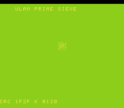

# #85 — SNES Ulam Prime Sieve: Bit-Array as a Set

<p align="center"></p>

**Status:** DONE. Demo **#85** of the **compiler stress-test demo battery** (Round 5).

## Context

A Sieve of Eratosthenes stored in a **bit-array**, using **variable-count** shifts:
`arr[i>>3] |= (1u << (i&7))` to set and `(arr[i>>3] >> (i&7)) & 1` to test. The shift amount
`i&7` is a runtime value, so the backend emits variable-count `G_SHL`/`G_LSHR` (a shift loop or
table), NOT a fixed shift. Distinct from **#5 life** (fixed `1<<k` neighbour masks) and **#28
hilbert** (fixed bit twiddles). The primes render as an **Ulam spiral** — the famous diagonal
clustering of primes.

## Algorithm

```
bit-array comp[1024/8]; sieve:
  set(0), set(1)
  for i=2.. while i*i<N: if is_prime(i): for j=i*i; j<N; j+=i: set(j)
  set(i)      = comp[i>>3] |= 1u<<(i&7)     // variable G_SHL
  is_prime(i) = !((comp[i>>3] >> (i&7)) & 1)// variable G_LSHR
Ulam spiral: square-spiral walk maps step k -> (x,y); plot prime k.
GATE_N = 1024: fold membership of every k (prime→*97, composite→*13).
```

## Files

| File | Purpose |
|------|---------|
| `examples/65816/ulam.h` | Bit-array sieve + spiral + gate CRC |
| `examples/snes/ulam.c` | SNES ROM (Ulam spiral reveal) |
| `examples/snes/corpus/ulam_sim.c` | Corpus slice |
| `tools/ulam-sim.c` | Host oracle |
| `dev/ulam.sh` | Gate script |
| `dev/ulam.lua` | MAME Lua assert |

## Differential gate

- `corpus_result = ulam_gate_crc()` — sieve + fold all 1024 memberships.
- **EXPECT `0x1F2F`** — host == default == +mos-a16 == +mos-xy16.
- **5-way bar** — no far pointers.
- **Disasm probes:** variable-shift helpers `__ashlhi3`/`__lshrhi3` (or shift loop) ≥ 1, `rep/sep` ≥ 1.

## Verification steps

1-8. Host oracle → ROM build → gate (`dev/run.sh ulam`) → corpus-a16 → screenshot → publish.

## Verification results (2026-07-01)
Gate: host `0x1F2F`; shift-ops=12, rep/sep=35; bsnes-jg PASS; MAME PASS. 5-way green
host==default==a16==xy16==`0x1F2F`, -verify clean. **No compiler bug** — variable-count
bit-array shifts lower correctly.
