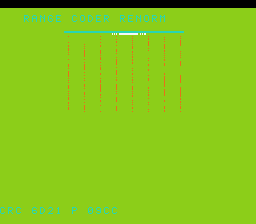

# #86 — SNES Range Coder: Multiply-Carry Renormalizer

<p align="center"></p>

**Status:** DONE. Demo **#86** of the **compiler stress-test demo battery** (Round 5).

## Context

A binary **range coder** (arithmetic coding). The interval split
`bound = (range >> PBITS) * prob` uses a 32-bit multiply (`__mulsi3`) and a logical shift
(`G_LSHR`); the byte-wise **renormalization carry loop** (`while (range < TOP) { emit(low>>24);
low<<=8; range<<=8; }`) is 32-bit `G_SHL`/`G_LSHR` in a data-dependent loop. Distinct from
**#67 huffman** (table / bit-length codes, no multiply-interval) and **#49 lzdec** (match/literal
copy, no arithmetic coding). An adaptive probability drifts with the coded bits.

## Algorithm

```
low=0, range=0xFFFFFFFF
encode_bit(bit, prob):                      # prob/4096 = P(bit==0)
  bound = (range >> PBITS) * prob           # __mulsi3 + G_LSHR
  if bit==0: range = bound
  else:      low += bound; range -= bound
  while range < 2^24:                       # renormalize
    emit(low >> 24); low <<= 8; range <<= 8 # 32-bit G_SHL/G_LSHR carry loop
adaptive prob: bit0 -> prob += (4096-prob)>>5 ; bit1 -> prob -= prob>>5
GATE_N = 200 model-driven bits; fold emitted bytes + final range/prob.
```

## Files

| File | Purpose |
|------|---------|
| `examples/65816/rangecode.h` | Range coder + gate CRC |
| `examples/snes/rangecode.c` | SNES ROM (interval-zoom + byte waterfall) |
| `examples/snes/corpus/rangecode_sim.c` | Corpus slice |
| `tools/rangecode-sim.c` | Host oracle |
| `dev/rangecode.sh` | Gate script |
| `dev/rangecode.lua` | MAME Lua assert |

## Differential gate

- `corpus_result = rangecode_gate_crc()` — encode 200 bits, fold output + state.
- **EXPECT `0x6D21`** — host == default == +mos-a16 == +mos-xy16.
- **5-way bar** — no far pointers.
- **Disasm probes:** `__mulsi3 ≥ 1`, `rep/sep ≥ 1`.

## Verification steps
1-8. Host oracle → ROM build → gate (`dev/run.sh rangecode`) → corpus-a16 → screenshot → publish.

## Verification results (2026-07-01)
Gate: host `0x6D21`; __mulsi3=1, rep/sep=24; bsnes-jg PASS; MAME PASS. 5-way green
host==default==a16==xy16==`0x6D21`, -verify clean. **No compiler bug.**
