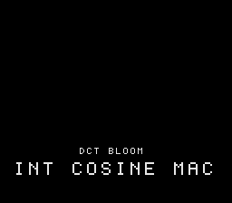

# #88 — SNES DCT Bloom: 8×8 Integer Cosine Transform

<p align="center"></p>

**Status:** DONE. Demo **#88** of the **compiler stress-test demo battery** (Round 5).

## Context

An 8×8 **separable integer DCT**. Each 1D pass is an int32 **multiply-accumulate**
(`sum(M[u][x] * block[x])`, a 16×16→32 `__mulsi3` MAC) followed by a **signed
arithmetic-shift-right** descale (`>> 8`, `G_ASHR`) and a **narrowing cast** back to int16
(`G_SEXT_INREG` on reload). Distinct from **#25 fft** (radix-2 butterflies with a twiddle LUT
and complex pairs) — this is the dense O(N²) cosine-MAC with signed descale/narrow.

## Algorithm

```
M[u][x] = round(256 * c(u) * cos((2x+1)u·π/16))    # Q8 DCT-II basis
dct8(in→out): out[u] = ( Σ_x M[u][x]*in[x] ) >> 8   # int32 MAC, signed >>, narrow to i16
dct8x8: row pass → tmp; column pass → coeff          # separable
GATE_N phases; fold every coefficient.
```

## Files

| File | Purpose |
|------|---------|
| `examples/65816/dctbloom.h` | 8×8 integer DCT + gate CRC |
| `examples/snes/dctbloom.c` | SNES ROM (source block + coefficient heat grid) |
| `examples/snes/corpus/dctbloom_sim.c` | Corpus slice |
| `tools/dctbloom-sim.c` | Host oracle |
| `dev/dctbloom.sh` | Gate script |
| `dev/dctbloom.lua` | MAME Lua assert |

## Differential gate

- `corpus_result = dctbloom_gate_crc()` — DCT at GATE_N phases, fold coefficients.
- **EXPECT `0x5364`** — host == default == +mos-a16 == +mos-xy16.
- **5-way bar** — no far pointers.
- **Disasm probes:** `__mulsi3 ≥ 1`, `rep/sep ≥ 1`.

## Verification steps
1-8. Host oracle → ROM build → gate (`dev/run.sh dctbloom`) → corpus-a16 → screenshot → publish.

## Verification results (2026-07-01)
Gate: host `0x5364`; __mulsi3=2, rep/sep=74; bsnes-jg PASS; MAME PASS. 5-way green
host==default==a16==xy16==`0x5364`, -verify clean. **No compiler bug** — int32 MAC +
signed ashr descale + narrowing cast all lower correctly.
