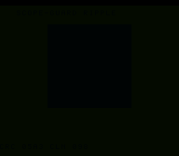

# #90 — SNES Scope-Guard Ripple Tank: Cleanup-Attr Scope-Exit Destructors

<p align="center"></p>

**Status:** DONE. Demo **#90** of the **compiler stress-test demo battery** (Round 5).

## Context

`__attribute__((cleanup(fn)))` — compiler-synthesized **scope-exit calls** (Clang CGDecl.cpp:2254).
A guarded local runs its cleanup at **every** exit of its lexical scope: normal fall-through,
early `return`, `break`, and nested-block close — and multiple guards run in **reverse
declaration order**. The compiler must fan the cleanup JSR out to each control-flow exit edge.
No other battery demo uses the cleanup attribute. The visual is a fixed-point ripple tank; a HUD
shows the running cleanup count.

## Algorithm

```
sg_process(a,b): guarded locals with cleanup(sg_guard) across several scopes/exit paths:
  outer guard (whole fn) · a branch with an early return · a loop with an early break ·
  a nested block with two guards (reverse order). Each exit fires the right guards.
sg_guard folds the guarded value + increments a cleanup counter.
GATE_N calls; CRC = fold ^ (cleanup_count * 31).  Ripple tank = fixed-point 2D wave.
```

## Files

| File | Purpose |
|------|---------|
| `examples/65816/scopeguard.h` | cleanup-attr scope guards + gate CRC |
| `examples/snes/scopeguard.c` | SNES ROM (fixed-point ripple tank + cleanup HUD) |
| `examples/snes/corpus/scopeguard_sim.c` | Corpus slice |
| `tools/scopeguard-sim.c` | Host oracle |
| `dev/scopeguard.sh` | Gate script |
| `dev/scopeguard.lua` | MAME Lua assert |

## Differential gate

- `corpus_result = scopeguard_gate_crc()` — GATE_N sg_process calls, fold cleanup sequence.
- **EXPECT `0x05A3`** — host == default == +mos-a16 == +mos-xy16.
- **5-way bar** — no far pointers.
- **Disasm probes:** multiple `jsr sg_guard` (cleanup fan-out) ≥ 3, `rep/sep` ≥ 1.

## Verification steps
1-8. Host oracle → ROM build → gate (`dev/run.sh scopeguard`) → corpus-a16 → screenshot → publish.

## Verification results (2026-07-01)
Gate: host `0x05A3`; cleanup-calls(sg_guard)=31, rep/sep=23; bsnes-jg PASS; MAME PASS. 5-way green
host==default==a16==xy16==`0x05A3`, -verify clean. **No compiler bug** — the cleanup scope-exit
fan-out (every scope exit fires the right guards in reverse declaration order) lowers correctly.
Note: sg_guard is `noinline` to keep the realistic cleanup-CALL shape visible (real cleanup
handlers are functions); the differential already passed with it inlined.
