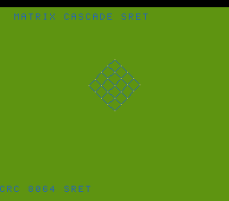

# #91 — SNES Matrix Cascade: sret Hidden-Pointer Struct Return

<p align="center"></p>

**Status:** DONE. Demo **#91** of the **compiler stress-test demo battery** (Round 5).

## Context

The **sret hidden-pointer** struct-return ABI. A `mat2 { int16_t a,b,c,d; }` is 8 bytes (64-bit)
— over the `getNaturalAlignIndirect` threshold (MOS.cpp:88) — so returning one by value forces
the compiler to pass a **hidden pointer** to caller-allocated result storage (sret), not a
register pair. `mat_mul` takes and returns `mat2` by value, and the cascade chains those returns
(`m = mul(m, R)` × N). Distinct from **#26 boids** (`vec2` = 32-bit register-pair return, NOT
sret) — this crosses the indirect-return threshold. Visual: a spinning wireframe lattice.

## Algorithm

```
mat2 (8 bytes) → returned via hidden sret pointer.
mat_mul(x,y): 4 elements, each (x.?*y.? + x.?*y.?) >> 8   # __mulsi3 MACs
cascade: m = identity; for k in GATE_N: m = mat_mul(m, rot(k)); renormalize
fold the 4 result elements each step.
```

## Files

| File | Purpose |
|------|---------|
| `examples/65816/matcascade.h` | mat2 sret multiply + cascade + gate CRC |
| `examples/snes/matcascade.c` | SNES ROM (spinning wireframe lattice) |
| `examples/snes/corpus/matcascade_sim.c` | Corpus slice |
| `tools/matcascade-sim.c` | Host oracle |
| `dev/matcascade.sh` | Gate script |
| `dev/matcascade.lua` | MAME Lua assert |

## Differential gate

- `corpus_result = matcascade_gate_crc()` — chain GATE_N mat_muls, fold result elements.
- **EXPECT `0x8064`** — host == default == +mos-a16 == +mos-xy16.
- **5-way bar** — no far pointers.
- **Disasm probes:** `__mulsi3 ≥ 1`, `mat_mul` call sites (sret) ≥ 1, `rep/sep ≥ 1`.

## Verification steps
1-8. Host oracle → ROM build → gate (`dev/run.sh matcascade`) → corpus-a16 → screenshot → publish.

## Verification results (2026-07-01)
Gate: host `0x8064`; __mulsi3=8, mat_mul-calls(sret)=293, rep/sep=57; bsnes-jg PASS; MAME PASS.
5-way green host==default==a16==xy16==`0x8064`, -verify clean. **No compiler bug** — the sret
hidden-pointer struct-return ABI for mat2 (8-byte, over threshold) lowers correctly across chains.
