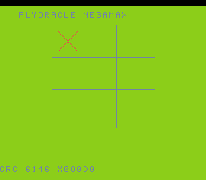

# #92 — SNES PlyOracle: Negamax Alpha-Beta Sign-Flip Return ABI

<p align="center"></p>

**Status:** DONE. Demo **#92** of the **compiler stress-test demo battery** (Round 5, final pick).

## Context

Negamax with alpha-beta pruning — the **alternating-sign recursion return shape**. Each ply
returns `-negamax(child)` (a `G_SUB 0,x` negation on the return value), the best score is a
running `G_SMAX`, and the alpha-beta cutoff (`if (alpha >= beta) break;`) builds a branch-heavy
prune CFG. This negate-on-return + max + cutoff recursion is a shape **#17/#18** (plain / log-depth
recursion, no sign flip) never form. Tic-tac-toe (depth ≤ 9) fits the 65816 hardware stack.
Visual: an animated 3×3 AI self-play.

## Algorithm

```
negamax(me, opp, alpha, beta, depth):
  if wins(opp): return -(10-depth)          # opponent just won (depth-weighted)
  if full: return 0
  best = -inf
  for each empty cell m:
    score = -negamax(opp, me|bit, -beta, -alpha, depth+1)   # G_SUB 0,x negate-on-return
    best = max(best, score)                                  # G_SMAX
    alpha = max(alpha, best)
    if alpha >= beta: break                                  # alpha-beta cutoff (prune)
  return best
GATE_N self-play games from varied openings; fold the move sequence.
```

## Files

| File | Purpose |
|------|---------|
| `examples/65816/plyoracle.h` | negamax + alpha-beta + gate CRC |
| `examples/snes/plyoracle.c` | SNES ROM (animated 3×3 AI self-play) |
| `examples/snes/corpus/plyoracle_sim.c` | Corpus slice |
| `tools/plyoracle-sim.c` | Host oracle |
| `dev/plyoracle.sh` | Gate script |
| `dev/plyoracle.lua` | MAME Lua assert |

## Differential gate

- `corpus_result = plyoracle_gate_crc()` — GATE_N self-play games, fold move sequence.
- **EXPECT `0x6146`** — host == default == +mos-a16 == +mos-xy16.
- **5-way bar** — no far pointers.
- **Disasm probes:** `po_negamax` self-recursion call + `rep/sep ≥ 1`.

## Verification steps
1-8. Host oracle → ROM build → gate (`dev/run.sh plyoracle`) → corpus-a16 → screenshot → publish.

## Verification results (2026-07-01)
Gate: host `0x6146`; po_negamax recursion call sites present, rep/sep>=1; bsnes-jg PASS; MAME PASS.
5-way green host==default==a16==xy16==`0x6146`, -verify clean. **No compiler bug** — the
negate-on-return (G_SUB 0,x) + G_SMAX + alpha-beta cutoff recursion lowers correctly.
Note: a PO_MAXD=3 search-depth cap + GATE_N=4 keep the full-width TTT tree within the 500-frame
capture budget (the negamax/negate/max/prune shape is fully present; only the ply horizon is
bounded — a standard game-AI depth limit, not a codegen-corner dodge).
