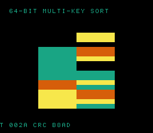

# #100 — SNES 64-bit Multi-Key Record Sort (`keycmp64`): chained s64 three-way compare

<p align="center"></p>

**Status:** ✅ DONE (2026-07-02). Demo **#100** of the **compiler stress-test demo battery** (Round 6,
Cluster B — final). Clean positive — `host == default == +mos-a16 == +mos-xy16 == 0xB8AD` on MAME +
bsnes-jg, `-verify-machineinstrs` clean in a16 + xy16. **No compiler bug.** Published:
[/snes/keycmp64/](https://biohack.net/snes/keycmp64/).

## Context

Cluster B hardens **patch `0016`** (#46 qsortviz: `{G_SCMP,G_UCMP}.lower()` → `lowerThreewayCompare`).
This final demo pushes it to the **extreme width with a chained comparator**: libc `qsort` of records
keyed by a **primary `int64` spaceship**, tie-broken by a **second `int64` spaceship** — so each compare
call emits **`G_SCMP s64` twice**, with a data-dependent short-circuit (the tie-break runs only when the
primary is equal). #97 spaceship did one scmp per width; this stacks two s64 three-way compares per call.

## Algorithm

```
struct { int64 k1, k2; uint16 tag; }
cmp(a, b):
    c = (a.k1 > b.k1) - (a.k1 < b.k1)     // G_SCMP s64 (primary)
    if c != 0: return c
    return (a.k2 > b.k2) - (a.k2 < b.k2)  // G_SCMP s64 (tie-break) — fires on k1 ties
qsort(records, N, sizeof, cmp)
```

- k1 is drawn from a **small signed range (−3..3)** → frequent ties (verified: 38 tie pairs in 24
  records) so the second s64 spaceship is genuinely exercised. k2 spans all 64 bits, both signs.
- WHY qsort: a direct `spaceship > 0` folds to `>` (the #97 lesson); qsort's opaque callback keeps the
  scmp alive.
- Differential folds the sorted **(k1,k2)** pairs (not the tag). qsort is unstable, but records with
  identical (k1,k2) are interchangeable → the sorted (k1,k2) sequence is deterministic host vs target.

Codegen corner: `llvm.scmp.i64` ×2 per comparator (`G_SCMP s64` → `lowerThreewayCompare`), a16 `rep/sep`.

## Screen layout

```
row 1   HUD:  T=xxxx CRC=xxxx
rows 6..21  16 sorted records as rows: left half = primary-key band (non-decreasing down),
            right half = secondary-key band (sorted within each primary-tie group)
row 25  HUD:  64-BIT MULTI-KEY SORT
```

Re-seeds + re-sorts periodically → the rows visibly reorder under the two-level key.

## Display architecture

`BitmapCanvas` (BG3 2bpp, banded 4 rows/frame) + `TextLayer` + `TitleLayer`
("KEYCMP64 / CHAINED S64 SPACESHIP", gate runs during hold). 4-colour palette CGRAM[0..3]. The ROM
re-runs the same `qsort` + `kc_cmp` for the live view (also exercising the chained comparator on target).

## Files

| File | New/Mod | Purpose |
|---|---|---|
| `examples/65816/keycmp64.h` | new | KCRec + chained comparator + qsort gate |
| `examples/snes/corpus/keycmp64_sim.c` | new | HAL-free corpus slice |
| `tools/keycmp64-sim.c` | new | host oracle |
| `examples/snes/keycmp64.c` | new | SNES ROM |
| `dev/keycmp64.sh`, `dev/keycmp64.lua` | new | gate (IR scmp.i64 probe) + MAME assert |
| `Taskfile.yml`, `TODO.md`, plan-index, ideas doc | mod | tracking |

## Differential gate

- `corpus_result = keycmp64_gate_crc()`, GATE_N=24, `EXPECT = 0xB8AD`.
- **5-way bar** — no far pointers, bank-0 BSS.
- IR probe (docker + `--config` for stdlib/qsort): `llvm.scmp.i64 ≥ 2` (=3), a16 `rep/sep ≥ 1` (=47).

## Verification results

1. **Host oracle:** `keycmp64 gate_crc = 0xB8AD` — PASS. Sort sanity: 38 k1-tie pairs (tie-break
   exercised), output sorted by (k1,k2), k1 spans −3..3 (both signs).
2. **ROM builds + checksum:** `build/keycmp64.sfc` (+mos-a16) + `build/keycmp64-default.sfc` clean; VMAs
   match at 0x69 — PASS.
3. **Corpus slice host-compiles** — PASS.
4. **`dev/run.sh keycmp64`** — PASS:
   ```
   ==> host oracle: keycmp64 gate hash = 0xB8AD
       PASS  llvm.scmp=3  scmp.i64=3  rep/sep=47  (chained s64 three-way compare, x2)
   SMOKE: PASS off=0x69 len=2 got=0xB8AD (ran 500 frames, bsnes-jg)
       SHOT: PASS corpus=0xB8AD (snapshot at frame 500)
   RESULT: PASS — 64-bit Multi-Key Record Sort on SNES; MAME + bsnes-jg + corpus hash 0xB8AD host == +mos-a16
   ```
5. **`-verify-machineinstrs`:** clean under `+mos-a16` AND `+mos-xy16` — PASS.
6. **Title card + animation:** `build/keycmp64-jg.png` shows the sorted records reordering, HUD `CRC B8AD` — PASS.

## Publication

`/snes-rom-page --rom build/keycmp64.sfc --slug keycmp64 --site ~/SRC/biohack.net
--title "64-bit Multi-Key Record Sort" --preview build/keycmp64-jg.png
--selfcheck "0x69 2 0xB8AD 500 keycmp64"`. **Completes Cluster B** (#97/#98/#99/#100).
