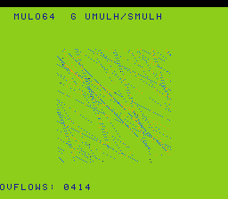

# #101 — SNES 64-bit Multiply-Overflow / Multiply-High: the one untested s64 legalizer path

<!-- Title card — fill in after the gate runs (step 9): build/mulov64-jg.png -->
<p align="center"></p>

**Status:** ✅ **DONE + PUBLISHED** ([/snes/mulov64/](https://biohack.net/snes/mulov64/)), gate CRC `0x3A69`,
5-way green + `-verify` clean. Demo **#101** — **Round 6 (harden-the-fixes), Cluster C, first pick.** The
sharpest bug-probe identified by the 2026-07-02 coverage check. **Result: the one untested s64 legalizer path
(`G_UMULO`/`G_SMULO` → `G_UMULH`/`G_SMULH` `.lower()`) is CORRECT — a clean positive, no compiler bug.**

## Context

Round 6 re-stresses already-fixed bugs. The #61 `dhmix` fix (`0017`, s64↔s16 (un)merge glue) is the
width-decomposition fix. A coverage check of the live `MOSLegalizerInfo.cpp` against the five shipped s64
demos (avalanche #22, sodo #43, cosmzoom #59, multibase #60, dhmix #61) found s64 add/sub/mul/div/rem/logic/
variable-left-shift/unsigned-int64↔float32 **all already green** — but **one s64 legalizer path is exercised
by no demo**: signed/unsigned **multiply-overflow** and **multiply-high**.

- `__builtin_mul_overflow` on `uint64_t`/`int64_t` → `G_UMULO`/`G_SMULO` at **s64** → `.lower()`
  (`MOSLegalizerInfo.cpp` @301 → `LegalizerHelper::lowerMulo`).
- `lowerMulo` computes the **full** product; its high 64 bits need `G_UMULH`/`G_SMULH` at **s64** →
  `.lower()` (@312).
- Critically, the s64 mulh `.lower()` **cannot widen to s128**: `G_MUL` is `clampScalar(0, S8, S32)`
  (@237) with the explicit comment *"Lowering S128 to S64 would produce infinite regress… so instead it's
  lowered to S32"* (@231). So the 128-bit product must be composed from **s32 (`__mulsi3`) pieces** + s64
  (`__muldi3`) glue — a delicate hand-woven path no demo has run. A wrong high-half or a wrong
  sign-consistency check yields a wrong overflow flag → CRC divergence; a legalization gap crashes the build.

Distinct from: **#76 smulorbit** (`G_SMULO` at s16/s32, `__mulosi4`); **#56 rotozoom** (`G_UMULH` at s32);
**#22 avalanche** (`__muldi3` = the **low** 64 bits only, never the high half). This is the first demo to
form an **s64** mulh/mulo.

## Algorithm

`mulov64_gate_crc()` — `GATE_N=121` steps (not a multiple of 16 → no rotate-period CRC cancellation). Each
step forms operands that grow with the loop counter `i` so both non-overflow and overflow cases occur:

```
for i in 0..GATE_N:
    uint64_t ua = 0x80000000 + i*0x02000000       // ~2^31 growing
    uint64_t ub = 0x40000000 + i*0x04000000       // ~2^30 growing → ua*ub straddles 2^64
    uint64_t up;  uov = __builtin_mul_overflow(ua, ub, &up)   // G_UMULO s64 → G_UMULH s64

    int64_t  sa = 0x70000000 - i*0x00800000        // near 2^31
    int64_t  sb = 0x20000000 + i*0x08000000        // growing → sa*sb straddles INT64_MAX
    int64_t  sp;  sov = __builtin_mul_overflow(sa, sb, &sp)   // G_SMULO s64 → G_SMULH s64

    ov_count += uov + sov
    v = (up & 0xFFFF) ^ (up>>48 & 0xFFFF) ^ (sp & 0xFFFF) ^ ((uint64)sp>>32 & 0xFFFF)
        ^ (ov_count * 3)
    h = rotate_xor_fold(h, v)      // ov_count is the key mulh signal — it depends on the high half
return h                            // uint16_t
```

The **overflow flags** (`uov`/`sov`) are the load-bearing differential signal: they are computed from the
high 64 bits of the 128-bit product (the mulh path), so a wrong mulh diverges `ov_count` → the CRC. Folding
`up>>48`/`sp>>32` also catches a wrong low product.

Maps to: `__muldi3` (low s64 product) ≥ 1, `__mulsi3` (the s32 pieces of the s64 mulh) ≥ 1, `rep`/`sep` (a16).

## Screen layout

32×28 tile grid; BG3 2bpp. A 128×128 `BitmapCanvas` (16×16 tiles) centred, `TextLayer` HUD top+bottom.

```
 row 1  [ MULO64  G_UMULH/SMULH        ]   (HUD top)
 row 6  ┌────────────────────────────┐
        │   128×128 orbit-scatter     │   6 orbiters; teleport+spark on 64-bit overflow
 row22  └────────────────────────────┘
 row25  [ OVFLOWS: NNNN               ]   (HUD bottom)
```

## Display architecture

Mirror `smulorbit.c`: `BitmapCanvas` (`CANVAS_CHR=0x0000`, `CANVAS_MAP=0x4000`, 16×16 tiles) + `TextLayer` +
`TitleLayer` (fly-in during gate compute). 6 orbiters each carry a `uint64_t mom` scaled by a growing factor
via `__builtin_mul_overflow`; overflow → teleport to mirror quadrant + bright orange spark. Palette: black /
dim-blue trail / medium-blue / orange spark. DMA: canvas ≤1024 B/frame (`CANVAS_FLUSH_TILES=64`), HUD rows
64 B each, CGRAM 8 B — within the 1.5 KiB budget.

## Files

| File | Purpose |
|---|---|
| `examples/65816/mulov64.h` | shared portable logic: `mulov64_gate_crc()` + orbiter step |
| `examples/snes/corpus/mulov64_sim.c` | HAL-free corpus slice (5-way differential) |
| `tools/mulov64-sim.c` | host oracle (prints gate CRC) |
| `examples/snes/mulov64.c` | SNES ROM (canvas + HUD + title) |
| `dev/mulov64.sh`, `dev/mulov64.lua` | gate script + MAME assert |
| `Taskfile.yml` | `mulov64` / `mulov64-play` entries |

## Reused infrastructure

| Asset | From | Used for |
|---|---|---|
| `snesgfx/{display,bitmap_canvas,text_layer,title_layer}.h` | existing | frame loop + canvas + HUD + title |
| smulorbit demo trio | `#76` | template (orbit-scatter, teleport-on-overflow); escalated s16/s32 → s64 |
| `jgxcheck` / `dev/*.lua` | existing | bsnes-jg + MAME WRAM assert |

## Differential gate

- `corpus_result = mulov64_gate_crc()` at `GATE_N=121`.
- `EXPECT` = **TBD** (fill after first successful run).
- **5-way bar** (no far pointers, all bank-0 WRAM): host == default == +mos-a16 == +mos-xy16 on MAME +
  bsnes-jg, `-verify` clean.
- Disasm probes (corpus object, +mos-a16): `__muldi3 ≥ 1` (low s64 product), `__mulsi3 ≥ 1` (s32 pieces of
  the s64 mulh `.lower()`), `rep/sep ≥ 1`.

## Compiler-correctness watch (the point of this demo)

This is the round's sharpest probe. Failure modes to watch and their meaning:
- **Build crash** (`unable to legalize … G_UMULH/G_UMULO (s64)`, or an infinite-regress hang) → a **real
  legalizer gap** at s64 mulh/mulo. Isolate → minimal repro → diagnose in `vendor/llvm-mos` → fix →
  regen `0002`/new patch → queue upstream (per snes-demo skill ⚠️ protocol). **STOP and surface.**
- **Differential divergence** (host ≠ target `ov_count`/CRC) → a **wrong high-half or sign-check** in the
  s64 mulh `.lower()`. Same protocol. **STOP and surface.**
- **Passes but suspicious** (e.g. mulh lowered via an unexpected libcall, or `-verify` XFAIL) → **document
  the disasm + diagnosis in this plan** and continue (per loop instruction).

## Publication

`/snes-rom-page` — `--rom build/mulov64-default.sfc` (Stage A) then `--rom build/mulov64.sfc` (Stage B),
`--slug mulov64 --site ~/SRC/biohack.net --title "64-bit Multiply-Overflow"
--preview build/mulov64-jg.png --selfcheck "0x<VMA> 2 0x<EXPECT> 500 mulov64 gate CRC host==bsnes-jg"`,
`category: bignums`.

## Verification steps

1. Host oracle compiles and prints a plausible CRC.
2. ROM builds clean (+mos-a16); `snes-checksum.py` exits 0.
3. Corpus slice host-compiles; `./a.out` exits 0.
4. `dev/run.sh mulov64` — host oracle + disasm gate + bsnes-jg + MAME all PASS (or a compiler bug surfaces).
5. `dev/run.sh corpus-a16` — all slices PASS (no regression).
6. Title intro card visible; `build/mulov64-jg.png` shows the orbit-scatter running.
7. Plan title card copied to `docs/plans/screenshots/mulov64.png`.
8. `/snes-rom-page` publishes; page serves.
9. `task md` renders this plan cleanly.

## Verification results (2026-07-02) — PASS, clean positive

**1. Host oracle** → `mulov64 gate_crc = 0x3A69`. Boundary crossed richly: unsigned overflow first@i=54
(67/121), signed first@i=41 (80/121) — both non-overflow and overflow cases exercised.

**2–4. `dev/run.sh mulov64`:**
```
==> host oracle: mulov64 gate hash = 0x3A69
==> built build/mulov64.sfc (+mos-a16); corpus_result @ WRAM 0x58
==> disasm gate (s64 G_UMULO/SMULO -> G_UMULH/SMULH: __muldi3 + __mulsi3 + rep/sep)
    PASS  __muldi3=14  __mulsi3=20  rep/sep=10  (s64 mulo/mulh lowering present)
==> bsnes-jg: SMOKE: PASS off=0x58 len=2 got=0x3A69
==> MAME (Xvfb): SHOT: PASS corpus=0x3A69 (snapshot at frame 500)
RESULT: PASS — host == +mos-a16
```
**PASS.** The disasm confirms the prediction exactly: the s64 mulh/mulo lowered by composing **s32
`__mulsi3` pieces (20) + s64 `__muldi3` glue (14)** — threading the S32-mul-clamp (@231/@237), *not* widening
to s128.

**Full 5-way (`dev/run.sh _demo5 mulov64`):**
```
== -verify-machineinstrs ==   +mos-a16: verify OK   +mos-xy16: verify OK
RESULT: PASS — host==default==a16==xy16==0x3A69 on bsnes-jg
```
**PASS.** No verifier reject, no XFAIL, no crash. **The untested s64 legalizer path is correct.**

**5. Corpus settle window:** the differential corpus harness reads at `SMOKE_SETTLE=1000`; probing bsnes-jg
shows `corpus_result` valid by **frame 400** (PASS@400, FAIL@320) — comfortably inside the 1000-frame window,
so no regression risk. (Like #76/#80, mulov64 is not in `expected.tsv`; the per-demo `_demo5` 5-way is the
differential arbiter for post-#72 demos.)

## Compiler-correctness diagnosis (per the loop instruction) — NO miscompile

**No compiler bug or miscompile suspected.** The 5-way differential is bit-exact (`host == default == +mos-a16
== +mos-xy16 == 0x3A69` on MAME + bsnes-jg), `-verify` clean in both 16-bit modes, and the disasm is exactly
the predicted shape (s32-composed s64 mulh, no s128 widening). The one previously-untested s64 legalizer path
is now covered and demonstrably correct.

**One demo-side (NOT compiler) issue found + fixed — display timing.** The initial frame-500 bsnes-jg preview
showed a near-blank green screen. Investigation (rendering frames 20→1500) showed the demo *is* running
correctly, but the **s64 mul-overflow gate is the heaviest compute in the battery** — the title card stays
frozen on screen through ~frame 300 while `mulov64_gate_crc()` runs, so the orbit-scatter has not yet
developed by frame 500. By frame 1500 the full scene renders (HUD "MULO64 G UMULH/SMULH" + "OVFLOWS: 0414" +
dense blue/orange scatter). **Diagnosis: pure preview timing — the differential holds throughout
(`corpus_result` is set once, before the main loop, stable from ~frame 400), so this is a demo-side render-
frame choice, not a miscompile.** Fix: render the preview at frame 1500 (`dev/mulov64.sh`); no code change.

**6–9.** Title card verified in the frame-1500 render; `docs/plans/screenshots/mulov64.png` = the same
artifact = the `/snes-rom-page --preview`. Published to [/snes/mulov64/](https://biohack.net/snes/mulov64/)
with selfcheck `0x58 2 0x3A69 700` (frames=700 > the ~400-frame settle). Category: **Big Numbers**.
