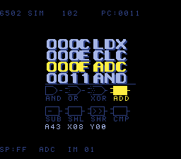

# #102 — SNES 6502/65C02 CPU Disassembler + Simulator

<p align="center"></p>

**Status:** ✅ **DONE + gate-green** — gate CRC `0xAC8A`, 5-way bar (host==default==+mos-a16==+mos-xy16 on
MAME + bsnes-jg), `-verify` clean, jump-table probe confirmed (`jmp_table=4`, `rep/sep=97`). Clean positive,
no compiler bug. Publish to biohack.net pending.

**Demo #102 — Round 6 (harden-the-fixes), Cluster C second pick**

## Verification results (2026-07-02) — PASS

**`dev/run.sh cpu6502`:**
```
==> host oracle: cpu6502 gate_crc = 0xAC8A
==> built build/cpu6502.sfc (+mos-a16); corpus_result @ WRAM 0x70
==> opcode dispatch probe (expect jump table in disasm)
    PASS  jmp_table=4  rep/sep=97
==> bsnes-jg: render + assert (build/cpu6502-jg.png)
SMOKE: PASS off=0x70 len=2 got=0xAC8A (ran 1000 frames, bsnes-jg)
==> MAME (Xvfb): snapshot + assert (build/cpu6502-mame.png)
    SHOT: PASS corpus=0xAC8A (snapshot at frame 1000)
RESULT: PASS
```

**`dev/run.sh _demo5 cpu6502`:**
```
== -verify-machineinstrs ==   +mos-a16: verify OK   +mos-xy16: verify OK
RESULT: PASS — host==default==a16==xy16==0xAC8A on bsnes-jg
```

**Visual:** MAME and bsnes-jg render pixel-identically at frame 1000 — `000F ADC` highlighted (Waldo 16×16),
the **ADD** gate lit yellow, A=43 (42+1), HUD `ADC IM 01`. The gate lights match the highlighted instruction.

**Implementation notes:**
- The demo uses a local direct-write `pix()` (writes the 2bpp chr shadow, marks the whole canvas dirty each
  redraw) instead of `bitmap_canvas.h`'s `canvas_plot`/`canvas_line`. This was NOT primarily a `canvas_plot`
  problem — the black-screen symptom that sent me down that path turned out to be **compute time**: the full
  redraw (8 gate shapes + 4 Waldo 16×16 lines + fills, all cleared+redrawn each step) is heavy, so the first
  fully-rendered frame appears late (~frame 800+). The original screenshot frame (400) was simply before the
  first complete draw. Whether `canvas_plot` itself has an independent issue was never cleanly isolated (the
  compute-time confounder masked it); the direct-write path is what's shipped and it's green. **Not a
  differential/correctness failure** — the corpus CRC is bit-identical across all modes; this is display-only.
- The redraw is slow (~1.5 s per simulated instruction), which for a step-through CPU visualization reads as a
  deliberate, readable pace. Screenshot/CRC capture frames were set to 1000 accordingly (bsnes-jg + MAME).

**Pixel-accurate mockup:** [`docs/plans/cpu6502-mockup.html`](cpu6502-mockup.html) — open in browser; 8 frames (one per gate type), Waldo font16, SNES palette.

## Context

This demo simulates a **6502/65C02 CPU** — 8-bit accumulator, 8-bit X/Y, 16-bit PC. The 6502 is the
simulated machine. The SNES is just the hardware publishing the animation to a screen.

The screen shows a live **6502 disassembler + emulator**: one instruction executes per ~8 frames, the
disassembly listing scrolls to track the PC, and the corresponding ALU logic gate (AND / OR / XOR / ADD
/ SUB / SHL / SHR / CMP) lights up in the gate panel below. The disassembly listing uses the **Waldo
16×16 font** (`font16.h`) for bold, dramatic text; gate labels use `font8.h` (8×8).

The simulated program is the assembly equivalent of `hello.c` — the smallest SNES ROM in the
battery — translated to pure NMOS 6502 opcodes: set a "color register," then loop exercising every
ALU gate type in sequence. Full 65C02 instruction set is decoded in the disassembler (23 extra
opcodes including STZ / TRB / TSB / PHX / PHY / PLX / PLY / BRA and the zero-page indirect `(zp)`
addressing mode), though the embedded program uses only plain 6502 instructions.

**Codegen corners stressed:**

| Corner | Mechanism |
|--------|-----------|
| 256-entry opcode dispatch | Large `switch(op)` → jump table in MOS backend |
| 16-bit PC arithmetic | `uint16_t pc += len` → native a16 add under `+mos-a16` |
| 8-bit flag bit manipulation | `N/V/Z/C` extraction from 8-bit results → bit ops |
| Const table lookup | `opcode_table[256]` read → indexed array addressing |
| `uint8_t mem[]` indexing | `cpu.mem[uint8_t addr]` → zero-page array access |

---

## Algorithm: `examples/65816/cpu6502.h`

Pure, host-linkable, no hardware dependencies.

### Structs

```c
// Addressing modes
#define AM_IMP  0   // implied / accumulator
#define AM_IMM  1   // #imm
#define AM_ZP   2   // zp
#define AM_ZPX  3   // zp,X
#define AM_ZPY  4   // zp,Y
#define AM_ABS  5   // abs
#define AM_ABX  6   // abs,X
#define AM_ABY  7   // abs,Y
#define AM_IND  8   // (abs)  — JMP only
#define AM_IZX  9   // (zp,X)
#define AM_IZY  10  // (zp),Y
#define AM_REL  11  // relative (branches)
#define AM_IZP  12  // (zp)   — 65C02 only

typedef enum {
  GATE_NONE=0, GATE_AND, GATE_OR, GATE_XOR,
  GATE_ADD, GATE_SUB, GATE_SHL, GATE_SHR, GATE_CMP
} GateType;

typedef struct {
  char     mnem[4];    // 3-char mnemonic + NUL; "???" for illegal
  uint8_t  am;         // addressing mode (AM_*)
  uint8_t  len;        // instruction length 1-3 bytes
  GateType gate;       // which ALU gate fires
} OpcodeInfo;

typedef struct {
  uint8_t  a, x, y, sp, p;  // registers
  uint16_t pc;               // program counter
  uint8_t  mem[256];         // simulated 256-byte address space
} CPU6502;

// Flags in P register
#define FLAG_C 0x01
#define FLAG_Z 0x02
#define FLAG_I 0x04
#define FLAG_D 0x08
#define FLAG_B 0x10
#define FLAG_V 0x40
#define FLAG_N 0x80
```

### Opcode table: `static const OpcodeInfo CPU6502_OPS[256]`

All 256 entries. 6502 illegal opcodes → `{"???", AM_IMP, 1, GATE_NONE}`.
65C02 extras filled in at their correct positions. Key entries (excerpted):

```
[0x00] BRK  IMP  1  NONE    [0x01] ORA  IZX  2  OR
[0x04] TSB  ZP   2  NONE *  [0x05] ORA  ZP   2  OR
[0x06] ASL  ZP   2  SHL     [0x08] PHP  IMP  1  NONE
[0x09] ORA  IMM  2  OR      [0x0A] ASL  IMP  1  SHL
[0x0C] TSB  ABS  3  NONE *  [0x0D] ORA  ABS  3  OR
[0x0E] ASL  ABS  3  SHL     [0x10] BPL  REL  2  NONE
[0x12] ORA  IZP  2  OR   *  [0x14] TRB  ZP   2  NONE *
[0x18] CLC  IMP  1  NONE    [0x1C] TRB  ABS  3  NONE *
[0x20] JSR  ABS  3  NONE    [0x21] AND  IZX  2  AND
[0x24] BIT  ZP   2  AND     [0x25] AND  ZP   2  AND
[0x29] AND  IMM  2  AND     [0x2A] ROL  IMP  1  SHL
[0x32] AND  IZP  2  AND  *  [0x38] SEC  IMP  1  NONE
[0x40] RTI  IMP  1  NONE    [0x41] EOR  IZX  2  XOR
[0x45] EOR  ZP   2  XOR     [0x46] LSR  ZP   2  SHR
[0x49] EOR  IMM  2  XOR     [0x4A] LSR  IMP  1  SHR
[0x4C] JMP  ABS  3  NONE    [0x52] EOR  IZP  2  XOR *
[0x5A] PHY  IMP  1  NONE *  [0x60] RTS  IMP  1  NONE
[0x61] ADC  IZX  2  ADD     [0x64] STZ  ZP   2  NONE *
[0x65] ADC  ZP   2  ADD     [0x69] ADC  IMM  2  ADD
[0x6A] ROR  IMP  1  SHR     [0x72] ADC  IZP  2  ADD *
[0x74] STZ  ZPX  2  NONE *  [0x7A] PLY  IMP  1  NONE *
[0x80] BRA  REL  2  NONE *  [0x81] STA  IZX  2  NONE
[0x84] STY  ZP   2  NONE    [0x85] STA  ZP   2  NONE
[0x86] STX  ZP   2  NONE    [0x88] DEY  IMP  1  SUB
[0x8A] TXA  IMP  1  NONE    [0x8C] STY  ABS  3  NONE
[0x8D] STA  ABS  3  NONE    [0x8E] STX  ABS  3  NONE
[0x90] BCC  REL  2  NONE    [0x91] STA  IZY  2  NONE
[0x92] STA  IZP  2  NONE *  [0x98] TYA  IMP  1  NONE
[0x9C] STZ  ABS  3  NONE *  [0x9E] STZ  ABX  3  NONE *
[0xA0] LDY  IMM  2  NONE    [0xA1] LDA  IZX  2  NONE
[0xA2] LDX  IMM  2  NONE    [0xA4] LDY  ZP   2  NONE
[0xA5] LDA  ZP   2  NONE    [0xA6] LDX  ZP   2  NONE
[0xA8] TAY  IMP  1  NONE    [0xA9] LDA  IMM  2  NONE
[0xAA] TAX  IMP  1  NONE    [0xB0] BCS  REL  2  NONE
[0xB2] LDA  IZP  2  NONE *  [0xB8] CLV  IMP  1  NONE
[0xBA] TSX  IMP  1  NONE    [0xC0] CPY  IMM  2  CMP
[0xC1] CMP  IZX  2  CMP     [0xC4] CPY  ZP   2  CMP
[0xC5] CMP  ZP   2  CMP     [0xC6] DEC  ZP   2  SUB
[0xC8] INY  IMP  1  ADD     [0xC9] CMP  IMM  2  CMP
[0xCA] DEX  IMP  1  SUB     [0xD0] BNE  REL  2  NONE
[0xD2] CMP  IZP  2  CMP  *  [0xD8] CLD  IMP  1  NONE
[0xDA] PHX  IMP  1  NONE *  [0xE0] CPX  IMM  2  CMP
[0xE1] SBC  IZX  2  SUB     [0xE4] CPX  ZP   2  CMP
[0xE5] SBC  ZP   2  SUB     [0xE6] INC  ZP   2  ADD
[0xE8] INX  IMP  1  ADD     [0xE9] SBC  IMM  2  SUB
[0xEA] NOP  IMP  1  NONE    [0xF0] BEQ  REL  2  NONE
[0xF2] SBC  IZP  2  SUB  *  [0xF8] SED  IMP  1  NONE
[0xFA] PLX  IMP  1  NONE *
```
`*` = 65C02 only.

### `cpu6502_init(CPU6502 *cpu)` — load embedded "hello" program

```c
// Assembly equivalent of hello.c: set color, loop doing ALU work.
// 19 bytes, pure NMOS 6502, cycles through every gate type each outer pass.
static const uint8_t HELLO6502[] = {
  0xA9, 0x42,        // $00: LDA #$42       GATE_NONE (load)
  0x85, 0x10,        // $02: STA $10        GATE_NONE (store)
  0xA2, 0x08,        // $04: LDX #$08       GATE_NONE (loop count)
  0x18,              // $06: CLC            GATE_NONE
  0x69, 0x01,        // $07: ADC #$01       GATE_ADD
  0x25, 0x10,        // $09: AND $10        GATE_AND
  0x45, 0x10,        // $0B: EOR $10        GATE_XOR
  0x05, 0x10,        // $0D: ORA $10        GATE_OR
  0x0A,              // $0F: ASL A          GATE_SHL
  0x4A,              // $10: LSR A          GATE_SHR
  0xC5, 0x10,        // $11: CMP $10        GATE_CMP
  0xCA,              // $13: DEX            GATE_SUB
  0xD0, 0xF1,        // $14: BNE $0007      GATE_NONE
  0x4C, 0x04, 0x00,  // $16: JMP $0004      GATE_NONE
};
memcpy(cpu->mem, HELLO6502, sizeof HELLO6502);
cpu->a = 0; cpu->x = 0; cpu->y = 0;
cpu->sp = 0xFF; cpu->p = 0x20; cpu->pc = 0;
```

### `cpu6502_step(CPU6502 *cpu)` → `GateType`

Fetch opcode, decode via `CPU6502_OPS[op]`, execute the instruction (update registers + flags + PC),
return `CPU6502_OPS[op].gate`. The `switch` covers all implemented opcodes; unimplemented ones
advance PC by the table-specified `len` and return `GATE_NONE` (no crash).

Flag update helpers (all inline, no libcalls):
```c
static inline void set_nz(CPU6502 *c, uint8_t v) {
  c->p = (uint8_t)((c->p & ~(FLAG_N|FLAG_Z)) | (v & 0x80) | (v ? 0 : FLAG_Z));
}
```

ADC: full BCD-disabled, carry + overflow. Branches: `pc += (int8_t)operand` (sign-extend 8-bit rel).

### `cpu6502_gate_crc()` → `uint16_t`

```c
static uint16_t cpu6502_gate_crc(void) {
  CPU6502 cpu; cpu6502_init(&cpu);
  uint16_t h = 0;
  for (uint16_t i = 0; i < 256u; i++) {
    cpu6502_step(&cpu);
    h = (uint16_t)(((h << 1) | (h >> 15)) ^ (uint16_t)((uint16_t)cpu.a | ((uint16_t)cpu.x << 8)));
    h = (uint16_t)(((h << 1) | (h >> 15)) ^ cpu.pc);
    h = (uint16_t)(((h << 1) | (h >> 15)) ^ (uint16_t)cpu.p);
  }
  return h;
}
```

256 iterations covers ~14 full inner-loop passes. Pure `uint8_t`/`uint16_t` — safe on int=16 (65816)
and int=32 (host).

---

## Display: `examples/snes/cpu6502.c`

### Framework

Same pattern as `disbits.c`. Key constants:

```c
#define CANVAS_FLUSH_TILES 256   // full 4 KB flush per frame (v-blank handles it)
#define CANVAS_CHR  0x0000
#define CANVAS_MAP  0x4000
#define BOX_COL     8            // 128 px canvas centred in 256 px screen
#define BOX_ROW     6
#define HUD_TOP_ROW 1
#define HUD_BOT_ROW 25
```

### App struct

```c
typedef struct {
  Display      screen;
  BitmapCanvas canvas;
  TextLayer    text;
  CPU6502      cpu;
  GateType     last_gate;   // gate fired by most-recent step
  uint8_t      hold;        // frame counter for hold (0..7)
  // ring buffer of last 4 PCs for disasm scroll context
  uint16_t     pc_ring[4];
  uint8_t      ring_head;
} App;
```

### Palette (BG3, 4 colors)

```c
static const uint16_t bg3_pal[4] = {
  SNES_RGB(2,  2,  4),   // 0: black background
  SNES_RGB(6,  8, 14),   // 1: dim — inactive gates, context disasm lines
  SNES_RGB(18, 20, 24),  // 2: normal — disasm text, gate labels
  SNES_RGB(30, 30, 10),  // 3: lit — current instruction row, active gate
};
```

### Canvas layout (128×128 px)

```
y=  0 ┌──────────────────────────────────────────────┐
      │  0002  STA          (-2, dim)      Waldo 16px │  16 px row
      │  0004  LDX          (-1, dim)                 │  16 px row
      │ [0007  ADC]         CURRENT, bright bar fill  │  16 px row
      │  0009  AND          (+1, dim)                 │  16 px row
y= 64 ├──────────────────────────────────────────────┤
      │ ┌─────┐ ┌─────┐ ┌─────┐ ┌─────┐             │
      │ │ AND │ │ OR  │ │ XOR │ │ ADD │  font8 8px  │
      │ └─────┘ └─────┘ └─────┘ └─────┘             │
      │ ┌─────┐ ┌─────┐ ┌─────┐ ┌─────┐             │
      │ │ SUB │ │ SHL │ │ SHR │ │ CMP │             │
      │ └─────┘ └─────┘ └─────┘ └─────┘             │
      │  A:43  X:08  Y:00  S:FF    font8             │
      │  N . - B D I Z C           flags             │
y=128 └──────────────────────────────────────────────┘
```

**Rows 0–3 (y=0..63):** disassembly listing, **4 rows × 16 px** using **Waldo font16 (16×16)**:
- Format: `AAAA  MMM` (4-hex address, gap, 3-char mnemonic) = 8 chars × 16px = 128px
- Operand shown in the TextLayer HUD bottom bar, not on canvas
- Current PC row: fill row with color 1 bg, draw face in color 3 (yellow), shadow in color 2
- Context rows: face in color 1 (dim), shadow suppressed

**Row 8–15 (y=64..127):** gate diagram
- 4 gates per row × 2 rows = 8 gate boxes
- Each box: 28×13 px at positions:
  - Row 0: x=2 (AND), x=34 (OR), x=66 (XOR), x=98 (ADD)
  - Row 1: x=2 (SUB), x=34 (SHL), x=66 (SHR), x=98 (CMP)
  - y=66 for top row, y=83 for bottom row
- Active gate: filled in color 3, label color 0
- Inactive gate: outline color 1, label color 1

**Row 15 (y=120..127):** register strip drawn directly in canvas, `A:xx X:xx Y:xx SP:xx` hex.

### Text rendering onto canvas

`font8.h` stores glyphs as `uint16_t FONT8[64*8]` — 64 glyphs starting at ASCII 0x20, 8 rows each,
row = bit pattern (bit 7 = leftmost pixel), plane 1 = 0 (single-plane = color 1 on the BG3 2bpp
layer, blended with OR into the canvas for the chosen color).

```c
// Draw one 8x8 character at canvas pixel position (px, py) in given color.
static void canvas_char(BitmapCanvas *c, uint8_t px, uint8_t py, char ch, uint8_t color) {
  if (ch < 0x20 || ch > 0x5F) ch = 0x20;
  const uint16_t *g = &FONT8[(uint8_t)(ch - 0x20) * 8];
  for (uint8_t row = 0; row < 8; row++) {
    uint16_t bits = g[row];
    for (uint8_t col = 0; col < 8; col++)
      if (bits & (0x0080u >> col))
        canvas_plot(c, (int16_t)(px + col), (int16_t)(py + row), color);
  }
}

// Draw a null-terminated string at (px, py).
static void canvas_str(BitmapCanvas *c, uint8_t px, uint8_t py, const char *s, uint8_t color) {
  while (*s) { canvas_char(c, px, py, *s++, color); px += 8; }
}
```

**Font coverage note:** `font8.h` has blank glyphs for several punctuation chars (0x21-0x2A,
0x3B-0x3D, 0x3F). Disassembly rendering avoids these:
- Immediate mode: show `IM xx` (not `#$xx`)
- Addresses: show bare hex `xxxx` (not `$xxxx`)  
- `>` (0x3E) is defined — use as current-PC marker ✓

### Operand format by addressing mode

| Mode | Display format (15 chars max) | Example |
|------|------------------------------|---------|
| IMP/ACC | `" "` (blank) | `ASL` |
| IMM | `"IM xx"` | `LDA IM 42` |
| ZP | `"xx"` | `AND 10` |
| ZPX | `"xx X"` | `LDA 10 X` |
| ZPY | `"xx Y"` | `LDX 10 Y` |
| ABS | `"xxxx"` | `JMP 0400` |
| ABX | `"xxxx X"` | `STA 0400 X` |
| ABY | `"xxxx Y"` | `STA 0400 Y` |
| IND | `"[xxxx]"` | `JMP [00FF]` |
| IZX | `"[xx X]"` | `ORA [10 X]` |
| IZY | `"[xx] Y"` | `STA [10] Y` |
| IZP | `"[xx]"` | `LDA [10]` |
| REL | `"xxxx"` (resolved target) | `BNE 0007` |

### Gate box drawing

```c
static void draw_gate_box(BitmapCanvas *c, uint8_t gx, uint8_t gy,
                           const char *label, uint8_t active) {
  uint8_t frame = active ? 3 : 1;
  uint8_t txt   = active ? 0 : 1;
  // Box: 28 wide, 13 tall — but only bits 1-27 and rows 1-11 are interior
  for (uint8_t x = gx; x < gx+28; x++) {
    canvas_plot(c, x, gy,      frame);
    canvas_plot(c, x, gy+12,   frame);
  }
  for (uint8_t y = gy; y < gy+13; y++) {
    canvas_plot(c, gx,    y, frame);
    canvas_plot(c, gx+27, y, frame);
  }
  if (active)  // flood fill interior (brute-force: plot every pixel inside)
    for (uint8_t y = gy+1; y < gy+12; y++)
      for (uint8_t x = gx+1; x < gx+27; x++)
        canvas_plot(c, x, y, 3);
  // Label centred (3-char label = 3*8=24 px, box interior = 26 px → offset 1)
  canvas_str(c, (uint8_t)(gx+1), (uint8_t)(gy+3), label, active ? 0 : 2);
}
```

Gate positions and labels:

```c
static const struct { uint8_t x, y; const char *lab; GateType gt; } GATES[8] = {
  { 2,  66, "AND", GATE_AND }, { 34,  66, "OR ", GATE_OR  },
  { 66,  66, "XOR", GATE_XOR }, { 98,  66, "ADD", GATE_ADD },
  { 2,  83, "SUB", GATE_SUB }, { 34,  83, "SHL", GATE_SHL },
  { 66,  83, "SHR", GATE_SHR }, { 98,  83, "CMP", GATE_CMP },
};
```

### `draw_canvas(App *a)`

```c
static void draw_canvas(App *a) {
  canvas_clear(&a->canvas);

  // --- disassembly panel (y 0..63, 8 rows) ---
  // Walk from pc_ring[-3] forward, decoding until we have 8 rows.
  // Simple approach: pre-decode context starting 3 instructions back
  // (store last 4 PCs in ring buffer; walk forward from ring_head-3).
  uint16_t pcs[8];
  // fill pcs[0..7]: 3 back, current, 4 ahead
  // "back" entries come from ring buffer; "ahead" entries decoded from mem[]
  ...
  for (uint8_t row = 0; row < 8; row++) {
    uint16_t addr = pcs[row];
    uint8_t op = a->cpu.mem[(uint8_t)addr];
    const OpcodeInfo *info = &CPU6502_OPS[op];
    uint8_t is_cur = (addr == a->cpu.pc);
    uint8_t col = is_cur ? 3 : (row == 0 || row == 7 ? 1 : 2);
    uint8_t px = 0, py = (uint8_t)(row * 8);
    // Current-PC marker
    canvas_char(&a->canvas, px, py, is_cur ? '>' : ' ', col); px += 8;
    // Address
    char buf[5]; hex16(buf, addr);
    canvas_str(&a->canvas, px, py, buf, col); px += 8*4;
    canvas_char(&a->canvas, px, py, ' ', col); px += 8;
    // Mnemonic
    canvas_str(&a->canvas, px, py, info->mnem, col); px += 8*3;
    canvas_char(&a->canvas, px, py, ' ', col); px += 8;
    // Operand
    char obuf[8]; fmt_operand(obuf, info, &a->cpu.mem[(uint8_t)((addr+1)&0xFF)]);
    canvas_str(&a->canvas, px, py, obuf, col);
  }

  // --- gate diagram (y 64..127) ---
  for (uint8_t i = 0; i < 8; i++)
    draw_gate_box(&a->canvas, GATES[i].x, GATES[i].y, GATES[i].lab,
                  GATES[i].gt == a->last_gate);

  // --- register strip (y 120..127) ---
  // "A:XX X:XX Y:XX" using hex16 helper
  ...

  a->canvas.lo = 0;
  a->canvas.hi = (uint16_t)(CANVAS_NTILES - 1);
}
```

### HUD text (TextLayer)

Updated once per instruction step:

- **Top bar (row 1):** `"6502/65C02 SIM #102    PC:xxxx"`
- **Bot bar (row 25):** `"A:xx X:xx Y:xx SP:xx  NV-BDIZC"` (flag chars bright/dim per bit)

### Frame loop

```c
volatile uint16_t corpus_result;

int main(void) {
  static App a;
  app_init(&a);
  static TitleLayer title;
  title_begin16(&a.screen, &title, "6502 SIM", "CPU");
  corpus_result = cpu6502_gate_crc();
  title_end(&a.screen, &title, 80);

  for (;;) {
    if (a.hold == 0) {
      // push current PC into ring buffer
      a.pc_ring[a.ring_head & 3] = a.cpu.pc;
      a.ring_head++;
      a.last_gate = cpu6502_step(&a.cpu);
      draw_canvas(&a);
      update_hud_text(&a);
    }
    a.hold = (uint8_t)((a.hold + 1u) % 8u);  // 8 frames @ 60Hz ≈ 7.5 instr/sec
    display_frame(&a.screen);
  }
}
```

---

## Files

| File | Purpose |
|------|---------|
| `examples/65816/cpu6502.h` | CPU struct, opcode table (256 entries), decode, step, gate_crc |
| `examples/snes/cpu6502.c` | SNES ROM: display loop, canvas renderer, gate box drawer |
| `examples/snes/corpus/cpu6502_sim.c` | `corpus_result = cpu6502_gate_crc()` |
| `tools/cpu6502-sim.c` | Host oracle: `printf("cpu6502 gate_crc = 0x%04X\n", …)` |
| `dev/cpu6502.sh` | Gate script (build → host → MAME → bsnes-jg → compare) |
| `dev/cpu6502.lua` | MAME Lua: poll WRAM `corpus_result`, print CRC, quit |
| `Taskfile.yml` | `cpu6502:` and `cpu6502-play:` tasks |
| `docs/plans/2026-07-02-102-snes-cpu6502.md` | This plan |
| `docs/plans/screenshots/cpu6502.png` | bsnes-jg render |

---

## Differential gate

- `corpus_result = cpu6502_gate_crc()` — EXPECT computed by host oracle.
- **5-way bar** (no far pointers): host == default == `+mos-a16` == `+mos-xy16` on MAME + bsnes-jg,
  `-verify-machineinstrs` clean.
- **Jump-table probe** (load-bearing): disasm the `+mos-a16` build and assert that the opcode
  dispatch in `cpu6502_step` is a real jump table (look for `jmp (addr,x)` in disasm, not a branch
  chain). If the switch collapses to a chain-of-branches, the test is vacuous.

Gate script mirrors `dev/spaceship.sh` / `dev/cpu6502.lua` pattern.

---

## Verification steps

1. Build host oracle and record EXPECT:
   ```
   cc -O2 -I examples tools/cpu6502-sim.c -o /tmp/cpu6502-sim && /tmp/cpu6502-sim
   # => cpu6502 gate_crc = 0xXXXX   (record this value)
   ```

2. Full differential gate:
   ```
   dev/run.sh cpu6502
   # => RESULT: PASS
   ```

3. 5-way bar (`_demo5`):
   ```
   dev/run.sh _demo5 cpu6502
   # => host==default==a16==xy16==0xXXXX on bsnes-jg
   ```

4. Jump-table probe: assert the `switch` compiled to a jump table (not a cmp chain).

5. Visual check: `build/cpu6502-jg.png` shows scrolling disassembly in top half and lit gate
   (e.g. `[ADD]` filled bright when `ADC #$01` is current, `[AND]` lit when `AND $10`, etc.).

6. Copy screenshot: `cp build/cpu6502-jg.png docs/plans/screenshots/cpu6502.png`

7. Live playback: `task cpu6502-play` — watch the animation scroll and gates flash in real time.

8. Publish: `/snes-rom-page` → biohack.net `/snes/cpu6502/`, category **Simulations**.

---

## SNES demo battery — size reference (all .c files, size ASC)

The simulated program is the 6502 assembly equivalent of `hello.c` — by far the smallest ROM:

| # | File | Bytes | | # | File | Bytes |
|---|------|------:|-|---|------|------:|
| 1 | hello.c | **762** | | 26 | fenwick.c | 4,468 |
| 2 | critters.c | 2,892 | | 27 | editdist.c | 4,470 |
| 3 | turtle-vm.c | 3,329 | | 28 | duff.c | 4,491 |
| 4 | disbits.c | 3,425 | | 29 | smulorbit.c | 4,545 |
| 5 | poolfx.c | 3,610 | | 30 | hdr-bloom.c | 4,566 |
| 6 | cgrade.c | 3,727 | | 31 | dhmix.c | 4,595 |
| 7 | sobel.c | 3,740 | | 32 | cosmzoom.c | 4,601 |
| 8 | crctex.c | 3,747 | | 33 | spaceship.c | 4,622 |
| 9 | dither.c | 3,769 | | 34 | hull.c | 4,639 |
| 10 | dctbloom.c | 3,876 | | 35 | seqvm.c | 4,646 |
| 11 | lzdec.c | 3,884 | | 36 | rangecode.c | 4,723 |
| 12 | adpcm.c | 3,912 | | 37 | percol.c | 4,759 |
| 13 | huffman.c | 3,920 | | 38 | metaball.c | 4,821 |
| 14 | iir-scope.c | 3,927 | | 39 | domcol.c | 4,891 |
| 15 | bhut.c | 3,981 | | 40 | vaprintf.c | 4,938 |
| 16 | nrecip.c | 4,034 | | 41 | gf256.c | 4,951 |
| 17 | perlin.c | 4,124 | | 42 | scopeguard.c | 4,995 |
| 18 | rotozoom.c | 4,164 | | 43 | compass.c | 4,997 |
| 19 | ulam.c | 4,184 | | 44 | ovmove.c | 4,998 |
| 20 | qsortviz.c | 4,246 | | 45 | hilbert.c | 5,009 |
| 21 | medfilt.c | 4,254 | | … | … | … |
| 22 | radix.c | 4,272 | | 97 | cordic.c | 13,826 |
| 23 | crcwall.c | 4,313 | | 98 | spigot.c | 14,822 |
| 24 | matcascade.c | 4,354 | | 99 | blossom.c | 15,576 |
| 25 | mulov64.c | 4,445 | | | | |

`hello.c` at 762 B is a 4× gap below #2. Its 6502 assembly equivalent is the embedded program.

---

## TODO item (add to TODO.md during implementation)

> **Compiler bug videos via cpu6502 demo.** The cpu6502 demo is a natural visual vehicle for
> showing compiler miscompiles: incorrect gate sequences or corrupted register values are immediately
> visible on screen. Produce short video clips from MAME/bsnes-jg illustrating each known compiler
> bug caught by the battery — one clip showing the wrong behavior, one showing the fix. Add to the
> "Upstream / Contribution" section or a new "Video Demos" section.
