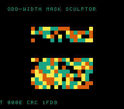

# #103 — SNES Odd-Width Mask Sculptor (`oddmask`): odd-width extend + s64 (un)merge (patch 0017)

<p align="center"></p>

**Status:** ✅ DONE (2026-07-02). Demo **#103** of the **compiler stress-test demo battery** (Round 6,
Cluster C). Clean positive — `host == default == +mos-a16 == +mos-xy16 == 0x1FD9` on MAME + bsnes-jg,
`-verify-machineinstrs` clean in a16 + xy16. **No compiler bug.** Published:
[/snes/oddmask/](https://biohack.net/snes/oddmask/).

## Context

Cluster C hardens **patch `0017`** (#61 dhmix). The dhmix crash was two conjoined legalization gaps:
`G_UNMERGE_VALUES s64→s16` (splitting an s64 into 16-bit lanes) and **`G_ANYEXT s24→s32`** (an odd source
width with no s16-lane decomposition). 0017 added the s64 (un)merge glue and routes odd-width extends
through zext. dhmix hit only the **s24** width; this demo re-stresses the odd-width path as a
**validation-widening regression guard** by forming **s20/s24/s28** intermediates and threading them
through an s64 multiply (also exercising the s64 (un)merge glue).

## Measured findings (measure, don't assume)

Building this demo taught two things worth recording:

1. **A `uint64 & mask` does NOT create an odd-width type** — it is an `i64 AND` with known-bits, no
   narrow `iN`. My first version (u64 masks) constant-folded and formed no odd widths.
2. **Odd widths form only from an i32-sourced `narrow-mask + op → zero-extend to u64` pattern**: e.g.
   `(uint64_t)((x ^ y) & 0x000FFFFF)` yields `G_TRUNC s32→s20`, an op at s20, then `G_ZEXT s20→s64`. This
   is why widths **> 32 (s40/s48) cannot form this way** — no i32 source can hold them, and a u64 mask
   stays s64. The plan's aspirational "s40/s48" are unreachable; the demo hits **s20/s24/s28** (the odd
   widths that genuinely form), each `G_ZEXT`ed to s64. The extend is `G_ZEXT` here, not `G_ANYEXT` (the
   exact dhmix opcode no longer reproduces on the post-0017 toolchain), but both route through the same
   "odd source width has no s16-lane decomposition" legalization 0017 fixed.
3. A **`volatile` seed + `noinline`** are required, or the whole pure-function gate constant-folds to a
   literal and emits no s64 codegen at all.

## Algorithm

```
om_mix(v, rot):                              # noinline; v from a volatile seed
    x = (u32)v * 2654435761 + rot            # u32 mul (large const)
    y = (u32)(v>>32) * 40503 + 777
    w20 = (u64)((x ^ y)      & 0x000FFFFF)    # 20-bit op → s20 → G_ZEXT s64
    w24 = (u64)((x + y)      & 0x00FFFFFF)    # 24-bit op → s24 → G_ZEXT s64
    w28 = (u64)((x ^ (y>>1)) & 0x0FFFFFFF)    # 28-bit op → s28 → G_ZEXT s64
    a   = w20 * w24                           # s64 multiply of the zext'd narrow ops
    return ((a ^ (w28<<20)) + (w24<<36) + (v>>17)) ^ (r>>29)
```

Codegen corners: `G_ZEXT s20/s24/s28 → s64` (odd-width extend, `= 3`), `__muldi3` (s64 (un)merge glue,
`= 1`), a16 `rep/sep` (`= 27`). Integer-exact → bit-exact differential.

## Screen layout / display architecture

A 16×16 field split into four horizontal bands; each band masks the running 64-bit state to a different
width and terraces the colour by the masked value's high bits, so band granularity tracks the mask.
`BitmapCanvas` (BG3 2bpp, banded) + `TextLayer` + `TitleLayer` ("ODDMASK / S20/S24/S28 ANYEXT S64").

## Files

| File | New/Mod | Purpose |
|---|---|---|
| `examples/65816/oddmask.h` | new | `om_mix` (odd-width intermediates) + gate |
| `examples/snes/corpus/oddmask_sim.c` | new | HAL-free corpus slice |
| `tools/oddmask-sim.c` | new | host oracle |
| `examples/snes/oddmask.c` | new | SNES ROM |
| `dev/oddmask.sh`, `dev/oddmask.lua` | new | gate (GMIR odd-width-extend probe) + MAME assert |
| `Taskfile.yml`, `TODO.md`, plan-index, ideas doc | mod | tracking |

## Differential gate

- `corpus_result = oddmask_gate_crc()`, GATE_N=40, `EXPECT = 0x1FD9`.
- **5-way bar** — no far pointers, bank-0 BSS.
- Probe (pre-legalizer GMIR): `G_ZEXT (s20|s24|s28)→s64 ≥ 3`, `__muldi3 ≥ 1`, a16 `rep/sep ≥ 1`, xy16 clean.

## Verification results

1. **Host oracle:** `oddmask gate_crc = 0x1FD9` — PASS.
2. **ROM builds + checksum:** `build/oddmask.sfc` (+mos-a16) + `build/oddmask-default.sfc` clean; VMAs
   match at 0x6b — PASS.
3. **Corpus slice host-compiles** — PASS.
4. **`dev/run.sh oddmask`** — PASS:
   ```
   ==> host oracle: oddmask gate hash = 0x1FD9
       PASS  odd-width-zext(s20/s24/s28)=3  __muldi3=1  rep/sep=27  xy16-compile=OK
   SMOKE: PASS off=0x6B len=2 got=0x1FD9 (ran 1500 frames, bsnes-jg)
       SHOT: PASS corpus=0x1FD9 (snapshot at frame 500)
   RESULT: PASS — Odd-Width Mask Sculptor on SNES; MAME + bsnes-jg + corpus hash 0x1FD9 host == +mos-a16
   ```
5. **`-verify-machineinstrs`:** clean under `+mos-a16` AND `+mos-xy16` (the modes dhmix crashed) — PASS.
6. **Title card + animation:** `build/oddmask-jg.png` shows the terraced field, HUD `CRC 1FD9` — PASS.

## Publication

`/snes-rom-page --rom build/oddmask.sfc --slug oddmask --site ~/SRC/biohack.net
--title "Odd-Width Mask Sculptor" --preview build/oddmask-jg.png
--selfcheck "0x6b 2 0x1FD9 500 oddmask"`.
