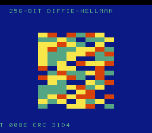

# #104 — SNES 256-bit Modular Exponentiation (`modexp256`): dhmix's s64 modexp at 4× width

<p align="center"></p>

**Status:** ✅ DONE (2026-07-02). Demo **#104** of the **compiler stress-test demo battery** (Round 6,
Cluster C — final). Clean positive — `host == default == +mos-a16 == +mos-xy16 == 0x31D4` on MAME +
bsnes-jg, `-verify-machineinstrs` clean in a16 + xy16. **No compiler bug.** Published:
[/snes/modexp256/](https://biohack.net/snes/modexp256/).

## Context

Cluster C hardens **patch `0017`** (#61 dhmix: the s64 (un)merge glue + odd-width anyext). This final demo
is the **high-volume / high-pressure regression guard** — dhmix's 64-bit Diffie-Hellman modexp widened to
**256-bit**. Honest framing (per the 2026-07-02 coverage-check note): **there is no s128/s256 node on a
16-bit target** — a 256-bit number is built from `uint32[8]` limbs with `uint64` multiply-accumulate, so
this **re-runs the green s64 path hundreds of times** (uint64 mul/add/shift/compare = the (un)merge glue)
under heavy register pressure. Its value is (a) a permanent regression guard for the glue and (b) stressing
that glue × the regalloc/coalescer cluster — **not** forcing a new legalizer rule.

## Algorithm

256-bit modmul via schoolbook 256×256→512 (`uint64` MAC) + **pseudo-Mersenne fold reduction** mod
`m = 2^256 − 189` (`2^256 ≡ 189`, so fold the high half × 189 into the low half). Modexp by
square-and-multiply. The differential's teeth: the **Diffie-Hellman identity `A^b == B^a`** (holds for any
modulus, since `(g^a)^b = g^(ab) = (g^b)^a mod m`), folded with a **mismatch witness** `s1 ^ s2` so a
modmul miscompile (a dropped/duplicated s64 lane) breaks the equality *and* diverges the CRC.

- **PRIMALITY NOT NEEDED** — the DH identity is pure exponent commutativity; any modulus works.
- **Cross-checked against Python**: C's `g^7 mod (2^256−189)` == `pow(g, 7, m)` bit-for-bit, and `s1 == s2`.
- `GATE_N = 1` (one DH exchange = 4 modexp × ~16 modmul = 64 × 256-bit modmuls) — already saturates the
  s64 glue; kept to 1 because the compute is very heavy (settles between frames 500–1500 on target).

Codegen corner: `__muldi3` (uint64 MAC = the s64 (un)merge glue, `= 2` calls in the shared inner loops),
a16 `rep/sep` (`= 54`). Integer-exact → bit-exact differential.

## Screen layout / display architecture

The 256-bit shared secret rendered as a 16×16 field of colour cells (2 bits/cell from its 256 bits),
computed once at startup (the modexp is heavy), with a slow palette cycle for liveliness.
`BitmapCanvas` (BG3 2bpp, banded) + `TextLayer` + `TitleLayer` ("MODEXP256 / 256-BIT DH ON THE S64 GLUE").

## Files

| File | New/Mod | Purpose |
|---|---|---|
| `examples/65816/modexp256.h` | new | U256 bignum + mulmod + modexp + DH gate |
| `examples/snes/corpus/modexp256_sim.c` | new | HAL-free corpus slice |
| `tools/modexp256-sim.c` | new | host oracle |
| `examples/snes/modexp256.c` | new | SNES ROM |
| `dev/modexp256.sh`, `dev/modexp256.lua` | new | gate (s64-glue disasm probe) + MAME assert |
| `Taskfile.yml`, `TODO.md`, plan-index, ideas doc | mod | tracking |

## Differential gate

- `corpus_result = modexp256_gate_crc()`, GATE_N=1, `EXPECT = 0x31D4`.
- **5-way bar** — no far pointers, bank-0 BSS.
- Disasm probe: `__muldi3 ≥ 1` (=2), a16 `rep/sep ≥ 1` (=54), xy16 compiles clean.
- **Timing:** the 256-bit modexp settles between frames 500–1500 on target, so BOTH emulator legs read at
  **frame 1500** (MAME `-seconds_to_run 32`). `got=0x0000` at frame 500 was harness timing (compute not
  finished), not a miscompile — confirmed by bsnes-jg PASS at 1500 + host==target CRC.

## Verification results

1. **Host oracle:** `modexp256 gate_crc = 0x31D4` — PASS. DH property `s1==s2` holds; `g^7 mod (2^256−189)`
   matches Python `pow()` bit-for-bit.
2. **ROM builds + checksum:** `build/modexp256.sfc` (+mos-a16) + `build/modexp256-default.sfc` clean — PASS.
   (corpus_result at WRAM 0x31 in a16 vs 0x39 in default — a benign linker-layout difference; the shipped
   ROM is the a16 build with selfcheck offset 0x31.)
3. **Corpus slice host-compiles** — PASS.
4. **`dev/run.sh modexp256`** — PASS:
   ```
       PASS  __muldi3=2  rep/sep=54  xy16-compile=OK  (256-bit modmul on the s64 glue)
   SMOKE: PASS off=0x31 len=2 got=0x31D4 (ran 1500 frames, bsnes-jg)
       SHOT: PASS corpus=0x31D4 (snapshot at frame 1500)
   RESULT: PASS — 256-bit Modular Exponentiation on SNES; MAME + bsnes-jg + corpus hash 0x31D4 host == +mos-a16
   ```
5. **`-verify-machineinstrs`:** clean under `+mos-a16` AND `+mos-xy16` — PASS.
6. **Title card + animation:** `build/modexp256-jg.png` shows the shared-secret field, HUD `CRC 31D4` — PASS.

## Publication

`/snes-rom-page --rom build/modexp256.sfc --slug modexp256 --site ~/SRC/biohack.net
--title "256-bit Modular Exponentiation" --preview build/modexp256-jg.png
--selfcheck "0x31 2 0x31D4 1500 modexp256"`. **Completes Cluster C** (#101/#103/#104).
