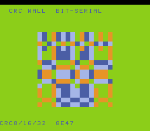

# #105 — SNES Bit-Serial CRC Wall: the default-8-bit coalesce-rotate-Ac fix

<p align="center"></p>

**Status:** ✅ **DONE + PUBLISHED** ([/snes/crcwall/](https://biohack.net/snes/crcwall/)), gate CRC `0x8E47`,
5-way green + `-verify` clean. Demo **#105** — **Round 6 (harden-the-fixes), Cluster D**, first-picks.
**Result: patch `0010` (coalesce-rotate-`Ac`, DEFAULT-8-bit) holds under three interleaved bit-serial CRC
shift registers — clean positive, no compiler bug.**

## Context

Re-stresses patch `0010` — a **DEFAULT-8-bit** (not accum-gated) register-coalescer miscompile: the coalescer
merged two shift/rotate-referenced values into the A-only `Ac` class, stranding a loop-carried CRC byte in Y
while the back-edge `ROL` read a stale `A`. Found by ONE inlined CRC16 bit loop under register pressure.
`MOSRegisterInfo::shouldCoalesce` now refuses that join.

**This is the only default-8-bit bug in Round 6** — a regression is **invisible to every +mos-a16/+mos-xy16
gate**, so a dedicated default-primary guard matters most.

**Escalation:** compute CRC-8, CRC-16 **and** CRC-32 **bit-serially** (not table-driven — #40 crctex used a
ROM table and never forms the shift-register rotate loop), all three interleaved in one inner bit loop so
three loop-carried shift registers + three poly constants are live at once → maximal register pressure,
exactly the condition that tempts the coalescer into the bad `Ac` join.

## Algorithm

`crcwall_gate_crc()` — hash `GATE_N=96` deterministic LCG bytes through `cw_byte` (all three bit-serial CRCs
interleaved, `crc<<1` + conditional poly-xor per bit), fold the three registers into a uint16. Maps to:
`asl`/`rol` shift-register loops (default 8-bit) — no table, no libcall.

## Files

`examples/65816/crcwall.h`, `examples/snes/corpus/crcwall_sim.c`, `tools/crcwall-sim.c`,
`examples/snes/crcwall.c` (flowing CRC-8 marble), `dev/crcwall.sh` + `dev/crcwall.lua`, `Taskfile.yml`.

## Differential gate

- `corpus_result = crcwall_gate_crc()`, `EXPECT = 0x8E47`.
- **5-way bar**; the **DEFAULT-8-bit leg is load-bearing** (`0010` is 8-bit-only).
- Disasm probe compiles the corpus slice **default-8-bit** and asserts the bit-serial rotate loop is present
  (`asl/rol/lsr/ror ≥ 3`) + the default build is clean.

## Verification results (2026-07-02) — PASS, clean positive

**`dev/run.sh crcwall`:**
```
==> host oracle: crcwall gate hash = 0x8E47
==> disasm gate (DEFAULT-8-bit bit-serial CRC: asl/rol shift-register loop)
    PASS  default-8bit-compile=OK  asl/rol/lsr/ror=13  (bit-serial shift-register present)
==> bsnes-jg: SMOKE: PASS off=0x68 got=0x8E47
==> MAME (Xvfb): SHOT: PASS corpus=0x8E47 (frame 500)
RESULT: PASS
```

**`dev/run.sh _demo5 crcwall`:**
```
== -verify-machineinstrs ==   +mos-a16: verify OK   +mos-xy16: verify OK
RESULT: PASS — host==default==a16==xy16==0x8E47 on bsnes-jg
```

**PASS.** The DEFAULT-8-bit build (where `0010` lives) is bit-exact with host, +mos-a16 and +mos-xy16;
`asl/rol/lsr/ror=13` confirms the bit-serial shift-register rotate loop the coalescer bug attacked is
present. No stranded loop-carried register.

## Compiler-correctness diagnosis — NO miscompile, fix holds

**No compiler bug.** Patch `0010` (`shouldCoalesce` refusing the rotate-value → `Ac` join) is **confirmed
correct** under three simultaneous loop-carried bit-serial CRC shift registers — the exact pressure shape
that found it, tripled. Bit-exact on the default 8-bit build (the mode the bug lived in), `-verify` clean.
Permanent default-8-bit regression guard for `0010`. Fast gate → preview at frame 500.

Published to [/snes/crcwall/](https://biohack.net/snes/crcwall/), selfcheck `0x68 2 0x8E47 500`, category
**Ciphers & Bit Tricks**.
