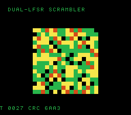

# #106 — SNES Dual-LFSR Scrambler (`lfsr2`): default-8-bit rotate coalescer (patch 0010)

<p align="center"></p>

**Status:** ✅ DONE (2026-07-02). Demo **#106** of the **compiler stress-test demo battery** (Round 6,
Cluster D). Clean positive — `host == default == +mos-a16 == +mos-xy16 == 0x6AA3` on MAME + bsnes-jg,
`-verify-machineinstrs` clean in default + a16 + xy16. **No compiler bug.** Published:
[/snes/lfsr2/](https://biohack.net/snes/lfsr2/).

## Context

Cluster D hardens **patch `0010`** (coalesce-rotate-Ac): a **DEFAULT-8-bit** (NOT accum-gated) register-
coalescer miscompile where two shift/rotate-referenced values were merged into the A-only `Ac` class,
stranding a loop-carried byte while the back-edge `ROL` read a stale A. **The DEFAULT build is the
load-bearing leg** — the bug is invisible to every `+mos-a16`/`+mos-xy16` gate. #105 crcwall re-stressed
it with three bit-serial CRCs; this uses **two different LFSR feedback structures live at once**:

- a maximal-length **Galois** LFSR (shift right + conditional tap-XOR gated by the shifted-out bit — a
  rotate-into-carry shape), and
- a **Fibonacci** LFSR (XOR-of-taps fed back into the top bit — a rotate-in shape),

each a loop-carried 8-bit register with a back-edge rotate, **stepped simultaneously** (both registers +
both feedbacks live at once) → extra coalescer pressure. A 16-bit Galois pair adds a wider strand.

## Algorithm

```
Galois-8 (tap 0xB8):   out = v & 1; v >>= 1; if (out) v ^= 0xB8;         // period 255
Fibonacci-8 (0,2,3,4): fb = (v^(v>>2)^(v>>3)^(v>>4)) & 1; v = (v>>1)|(fb<<7);  // period 255
Galois-16 (tap 0xB400): same structure at 16-bit
```

- Both 8-bit LFSRs verified **maximal-length** (period 255). Loop-carried; back-edge rotate.
- `lf_step` is `noinline`; all three stepped together. Integer-exact → bit-exact differential.

Codegen corner (DEFAULT 8-bit): `asl`/`lsr`/`rol`/`ror` shift-register loop (`= 15`), `eor` tap-XORs (`= 9`).

## Screen layout / display architecture

Two interleaved pseudo-noise fields on a 16×16 grid — Galois-driven cells on one diagonal parity,
Fibonacci on the other — colour-mapped from the LFSR outputs, scrolling as the live registers advance.
`BitmapCanvas` (BG3 2bpp, banded) + `TextLayer` + `TitleLayer` ("LFSR2 / GALOIS+FIBONACCI ROTATE").

## Files

| File | New/Mod | Purpose |
|---|---|---|
| `examples/65816/lfsr2.h` | new | Galois + Fibonacci LFSRs + gate |
| `examples/snes/corpus/lfsr2_sim.c` | new | HAL-free corpus slice |
| `tools/lfsr2-sim.c` | new | host oracle |
| `examples/snes/lfsr2.c` | new | SNES ROM |
| `dev/lfsr2.sh`, `dev/lfsr2.lua` | new | gate (default-8bit rotate probe) + MAME assert |
| `Taskfile.yml`, `TODO.md`, plan-index, ideas doc | mod | tracking |

## Differential gate

- `corpus_result = lfsr2_gate_crc()`, GATE_N=200, `EXPECT = 0x6AA3`.
- **5-way bar** — no far pointers; the **default-8-bit leg is load-bearing** (0010 lives there).
- Disasm probe (DEFAULT 8-bit): compiles clean + `asl/rol/lsr/ror ≥ 3` (=15) shift-register loop present.

## Verification results

1. **Host oracle:** `lfsr2 gate_crc = 0x6AA3` — PASS. Galois-8 + Fibonacci-8 periods = 255 (maximal).
2. **ROM builds + checksum:** `build/lfsr2.sfc` (+mos-a16) + `build/lfsr2-default.sfc` clean; VMAs match at
   0x67 — PASS.
3. **Corpus slice host-compiles** — PASS.
4. **`dev/run.sh lfsr2`** — PASS:
   ```
   ==> host oracle: lfsr2 gate hash = 0x6AA3
       PASS  default-8bit-compile=OK  asl/rol/lsr/ror=15  (bit-serial shift-register present)
   SMOKE: PASS off=0x67 len=2 got=0x6AA3 (ran 500 frames, bsnes-jg)
       SHOT: PASS corpus=0x6AA3 (snapshot at frame 500)
   RESULT: PASS — Dual-LFSR Scrambler on SNES; MAME + bsnes-jg + corpus hash 0x6AA3 host == +mos-a16
   ```
5. **`-verify-machineinstrs`:** clean under **default** AND `+mos-a16` AND `+mos-xy16` — PASS.
6. **Title card + animation:** `build/lfsr2-jg.png` shows the dual-LFSR noise field, HUD `CRC 6AA3` — PASS.

## Publication

`/snes-rom-page --rom build/lfsr2-default.sfc --slug lfsr2 --site ~/SRC/biohack.net
--title "Dual-LFSR Scrambler" --preview build/lfsr2-jg.png
--selfcheck "0x67 2 0x6AA3 500 lfsr2"` (default-8-bit ROM shipped — the load-bearing leg for 0010).
