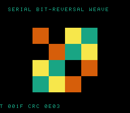

# #107 — SNES Serial Bit-Reversal Weave (`bitweave`): rotate-out/rotate-in carry loop (patch 0010)

<p align="center"></p>

**Status:** ✅ DONE (2026-07-02). Demo **#107** of the **compiler stress-test demo battery** (Round 6,
Cluster D). Clean positive — `host == default == +mos-a16 == +mos-xy16 == 0x0E03` on MAME + bsnes-jg,
`-verify-machineinstrs` clean in default + a16 + xy16. **No compiler bug.** Published:
[/snes/bitweave/](https://biohack.net/snes/bitweave/).

## Context

Cluster D hardens **patch `0010`** (coalesce-rotate-Ac): a **DEFAULT-8-bit** (NOT accum-gated) register-
coalescer miscompile that stranded a loop-carried byte while a back-edge rotate read a stale accumulator.
This does a bit reversal **the hard way** — a serial **rotate-out / rotate-in** carry loop: each iteration
shifts one bit OUT of the source (`v >>= 1`) and rotates it INTO the destination (`rev = (rev << 1) | bit`).
The `rev` register is loop-carried and rotated on the back edge — the exact 0010 shape. This is a deliberate
**contrast to #54 bitshuffle**, which used `__builtin_bitreverse32` → the `G_BITREVERSE` mask-swap cascade
(no loop, no loop-carried rotate). Two reversals (an 8-bit and a 16-bit) run interleaved in one loop so two
loop-carried `rev` registers are live at once (extra pressure). **DEFAULT build is the load-bearing leg.**

## Algorithm

```
rev8(v):  rev=0; for i in 0..8:  rev = (rev<<1) | (v&1); v >>= 1;   return rev   # loop-carried rotate
rev16(v): rev=0; for i in 0..16: rev = (rev<<1) | (v&1); v >>= 1;   return rev
bw_weave(a8,a16): reverse both in ONE interleaved loop (two rev registers live)  # noinline
```

- Bit reversal is a pure bit permutation → bit-identical host vs target, and an **involution**
  (`rev(rev(v)) == v`) — a built-in self-check the gate folds as a witness (0 when correct).
- Verified: `rev8(0x01)=0x80`, `rev8(0xB8)=0x1D`, `rev16(0x0001)=0x8000`, involution holds for all 256 bytes.

Codegen corner (DEFAULT 8-bit): `asl`/`lsr`/`rol`/`ror` rotate-out/rotate-in loop (`= 20`); no intrinsic.

## Screen layout / display architecture

A diagonal gradient displayed through its **bit-reversed permutation** — position `p` shows the gradient
sampled at `bw_rev8(p)`, the characteristic FFT-style bit-reversal weave — with the base gradient scrolling.
`BitmapCanvas` (BG3 2bpp, banded) + `TextLayer` + `TitleLayer` ("BITWEAVE / ROTATE-OUT ROTATE-IN LOOP").

## Files

| File | New/Mod | Purpose |
|---|---|---|
| `examples/65816/bitweave.h` | new | serial rev8/rev16 + interleaved weave + gate |
| `examples/snes/corpus/bitweave_sim.c` | new | HAL-free corpus slice |
| `tools/bitweave-sim.c` | new | host oracle |
| `examples/snes/bitweave.c` | new | SNES ROM |
| `dev/bitweave.sh`, `dev/bitweave.lua` | new | gate (default-8bit rotate probe) + MAME assert |
| `Taskfile.yml`, `TODO.md`, plan-index, ideas doc | mod | tracking |

## Differential gate

- `corpus_result = bitweave_gate_crc()`, GATE_N=128, `EXPECT = 0x0E03`.
- **5-way bar** — the **default-8-bit leg is load-bearing** (0010 lives there).
- Disasm probe (DEFAULT 8-bit): compiles clean + `asl/rol/lsr/ror ≥ 3` (=20) rotate loop present.

## Verification results

1. **Host oracle:** `bitweave gate_crc = 0x0E03` — PASS. Involution holds; sample reversals correct.
2. **ROM builds + checksum:** `build/bitweave.sfc` (+mos-a16) + `build/bitweave-default.sfc` clean; VMAs
   match at 0x6d — PASS.
3. **Corpus slice host-compiles** — PASS.
4. **`dev/run.sh bitweave`** — PASS:
   ```
       PASS  default-8bit-compile=OK  asl/rol/lsr/ror=20  (bit-serial shift-register present)
   SMOKE: PASS off=0x6D len=2 got=0x0E03 (ran 500 frames, bsnes-jg)
       SHOT: PASS corpus=0x0E03 (snapshot at frame 500)
   RESULT: PASS — Serial Bit-Reversal Weave on SNES; MAME + bsnes-jg + corpus hash 0x0E03 host == +mos-a16
   ```
5. **`-verify-machineinstrs`:** clean under **default** AND `+mos-a16` AND `+mos-xy16` — PASS.
6. **Title card + animation:** `build/bitweave-jg.png` shows the bit-reversal weave, HUD `CRC 0E03` — PASS.

## Publication

`/snes-rom-page --rom build/bitweave-default.sfc --slug bitweave --site ~/SRC/biohack.net
--title "Serial Bit-Reversal Weave" --preview build/bitweave-jg.png
--selfcheck "0x6d 2 0x0E03 500 bitweave"` (default-8-bit ROM — the load-bearing leg for 0010).
