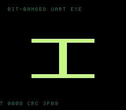

# #108 — SNES Bit-Banged UART Eye (`uarteye`): software-UART framing loop (patch 0010)

<p align="center"></p>

**Status:** ✅ DONE (2026-07-02). Demo **#108** of the **compiler stress-test demo battery** (Round 6,
Cluster D — final). Clean positive — `host == default == +mos-a16 == +mos-xy16 == 0x3F09` on MAME +
bsnes-jg, `-verify-machineinstrs` clean in default + a16 + xy16. **No compiler bug.** Published:
[/snes/uarteye/](https://biohack.net/snes/uarteye/).

## Context

Cluster D hardens **patch `0010`** (coalesce-rotate-Ac): a **DEFAULT-8-bit** (NOT accum-gated) register-
coalescer miscompile that stranded a loop-carried byte while a back-edge rotate read a stale accumulator.
This final Cluster-D demo models a **software UART**: a byte is framed (start bit 0 + 8 data LSB-first +
stop bit 1) and shifted **out** one bit at a time through a carry-rotated **transmit** register, while a
**receive** register rotates each sampled bit **in** — two loop-carried shift registers both rotated on
every back edge (the 0010 pressure), inside a framing loop. **DEFAULT build is the load-bearing leg.**

## Algorithm

```
uart_frame(b) = (1<<9) | (b<<1)          # bit0=start(0), bits1..8=data LSB-first, bit9=stop(1)
uart_roundtrip(b):                        # noinline; two loop-carried registers
    tx = frame(b);  rx = 0
    for i in 0..10:
        bit = tx & 1;  tx >>= 1;          # rotate TX out
        rx  = (rx >> 1) | (bit << 9)      # rotate the sampled bit into RX
    return (rx >> 1) & 0xFF               # deframe → recovered byte
```

- The TX→RX round-trip is the **identity** (verified: `roundtrip(b)==b` for all 256 bytes) — a built-in
  self-check the gate folds as a witness (`roundtrip(b) ^ b == 0` when correct).
- Bit-banging is pure shift/rotate → bit-exact host vs target.

Codegen corner (DEFAULT 8-bit): `asl`/`lsr`/`rol`/`ror` carry-rotate shift loop (`= 19`).

## Screen layout / display architecture

An oscilloscope **eye diagram**: many 2-bit serial windows overlaid into a persistence grid, so stable
0/1 levels form two bright horizontal rails and the transitions cross in the middle, leaving the open
"eye". `BitmapCanvas` (BG3 2bpp, banded) + `TextLayer` + `TitleLayer` ("UARTEYE / SOFTWARE-UART FRAMING
LOOP"). 4-colour persistence ramp CGRAM[0..3].

## Files

| File | New/Mod | Purpose |
|---|---|---|
| `examples/65816/uarteye.h` | new | frame + carry-rotate round-trip + gate |
| `examples/snes/corpus/uarteye_sim.c` | new | HAL-free corpus slice |
| `tools/uarteye-sim.c` | new | host oracle |
| `examples/snes/uarteye.c` | new | SNES ROM (eye-diagram persistence) |
| `dev/uarteye.sh`, `dev/uarteye.lua` | new | gate (default-8bit rotate probe) + MAME assert |
| `Taskfile.yml`, `TODO.md`, plan-index, ideas doc | mod | tracking |

## Differential gate

- `corpus_result = uarteye_gate_crc()`, GATE_N=128, `EXPECT = 0x3F09`.
- **5-way bar** — the **default-8-bit leg is load-bearing** (0010 lives there).
- Disasm probe (DEFAULT 8-bit): compiles clean + `asl/rol/lsr/ror ≥ 3` (=19) carry-rotate loop present.

## Verification results

1. **Host oracle:** `uarteye gate_crc = 0x3F09` — PASS. Round-trip identity holds for all 256 bytes;
   `frame(0x55)=0x2AA`.
2. **ROM builds + checksum:** `build/uarteye.sfc` (+mos-a16) + `build/uarteye-default.sfc` clean; VMAs
   match at 0x67 — PASS.
3. **Corpus slice host-compiles** — PASS.
4. **`dev/run.sh uarteye`** — PASS:
   ```
       PASS  default-8bit-compile=OK  asl/rol/lsr/ror=19  (bit-serial shift-register present)
   SMOKE: PASS off=0x67 len=2 got=0x3F09 (ran 500 frames, bsnes-jg)
       SHOT: PASS corpus=0x3F09 (snapshot at frame 500)
   RESULT: PASS — Bit-Banged UART Eye on SNES; MAME + bsnes-jg + corpus hash 0x3F09 host == +mos-a16
   ```
5. **`-verify-machineinstrs`:** clean under **default** AND `+mos-a16` AND `+mos-xy16` — PASS.
6. **Title card + animation:** `build/uarteye-jg.png` shows the eye diagram (two rails + crossings),
   HUD `CRC 3F09` — PASS.

## Publication

`/snes-rom-page --rom build/uarteye-default.sfc --slug uarteye --site ~/SRC/biohack.net
--title "Bit-Banged UART Eye" --preview build/uarteye-jg.png
--selfcheck "0x67 2 0x3F09 500 uarteye"` (default-8-bit ROM — the load-bearing leg for 0010).
**Completes Cluster D** (#105/#106/#107/#108).
