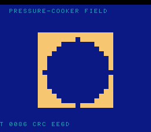

# #109 — SNES Pressure-Cooker Fixed-Point Evaluator (`pcooker`): compare live across calls (patch 0011)

<p align="center"></p>

**Status:** ✅ DONE (2026-07-02). Demo **#109** of the **compiler stress-test demo battery** (Round 6,
Cluster E). Clean positive — `host == default == +mos-a16 == +mos-xy16 == 0xEE6D` on MAME + bsnes-jg,
`-verify-machineinstrs` clean in default + a16 + xy16. **No compiler bug.** Published:
[/snes/pcooker/](https://biohack.net/snes/pcooker/).

## Context

Cluster E hardens the **a16/xy16 flag-liveness & register-pressure** cluster (`0011` scavenger-`$p`, `0012`
`LDCImm`-set, `0015` rc-undef, `0009` inc/dec). This demo targets **`0011`**: under maximal 16-bit-accumulator
pressure the scavenger routes a live `$p` (the processor-status/flags register) through a dead index
register into RC17 — a fix that only matters when a **compare's N/Z must stay live across a spill/call**.

The evaluator computes one giant straight-line 32-bit fixed-point expression per pixel: it forms a
comparison **early**, then makes **several `__mulsi3`/`__divsi3` libcalls** (which clobber the flags +
scratch), and only **then** consumes the comparison in a final `select` — so the compare's N/Z is forced
live across the call-clobbered region under a dozen simultaneously-live 32-bit temps. **a16/xy16 are the
load-bearing legs** (0011 is accum-gated); default 8-bit is the contrast.

## Algorithm

```
pc_eval(x,y,t):                                   # a dozen live int32 temps
    a=X*X; b=Y*Y; c=X*Y; r2=a+b                    # 3× __mulsi3
    cond = (r2 - 4000 > 0)                          # COMPARE — its N/Z consumed LATER
    d=(a*7)/(b+13); e=(c*5)/(a+17); f=(r2*3)/(T*T+101)   # 3× __mulsi3 + 3× __divsi3
    g=(d+e)*(f+1); h2=g/(c*c+29)                    # __mulsi3 + __divsi3
    base=d+e+f+g+h2
    return cond ? base+1000000 : base-1000000       # USE cond after all the libcalls
```

- The `cond` flag lives across ~6 `__mulsi3` + 4 `__divsi3` before its use — the 0011 scavenger-`$p` shape.
- All divisors kept strictly positive (`b+13`, `a+17`, `T*T+101`, `c*c+29`) → no divide-by-zero.
- Signed 32-bit integer arithmetic is exact → bit-exact differential.

Codegen corner (a16): `__mulsi3=6`, `__divsi3=4`, `rep/sep=38` — the compare's N/Z survives all of them.

## Screen layout / display architecture

A per-pixel evaluated implicit surface: each 16×16 cell coloured by the field's level set (the `cond`
threshold draws a circular boundary), with a slow palette cycle for liveness. The per-pixel eval is heavy,
so the field is recomputed occasionally at a new time step. `BitmapCanvas` (BG3 2bpp) + `TextLayer` +
`TitleLayer` ("PCOOKER / COMPARE LIVE ACROSS CALLS").

## Files

| File | New/Mod | Purpose |
|---|---|---|
| `examples/65816/pcooker.h` | new | `pc_eval` (compare-live-across-calls) + gate |
| `examples/snes/corpus/pcooker_sim.c` | new | HAL-free corpus slice |
| `tools/pcooker-sim.c` | new | host oracle |
| `examples/snes/pcooker.c` | new | SNES ROM |
| `dev/pcooker.sh`, `dev/pcooker.lua` | new | gate (a16 mul/div probe) + MAME assert |
| `Taskfile.yml`, `TODO.md`, plan-index, ideas doc | mod | tracking |

## Differential gate

- `corpus_result = pcooker_gate_crc()`, GATE_N=3 (× 12×12 grid), `EXPECT = 0xEE6D`.
- **5-way bar** — a16/xy16 load-bearing (0011 accum-gated); no far pointers.
- Disasm probe (a16): `__mulsi3 ≥ 1` (=6), `__divsi3 ≥ 1` (=4), `rep/sep ≥ 1` (=38).
- **Timing:** the per-pixel eval + gate + title dwell run past frame 500, so both emulator legs read at
  **frame 1500** (corpus_result is set at startup, so the assert holds; this is preview timing only).

## Verification results

1. **Host oracle:** `pcooker gate_crc = 0xEE6D` — PASS.
2. **ROM builds + checksum:** `build/pcooker.sfc` (+mos-a16) + `build/pcooker-default.sfc` clean; VMAs
   match at 0x71 — PASS.
3. **Corpus slice host-compiles** — PASS.
4. **`dev/run.sh pcooker`** — PASS:
   ```
       PASS  __mulsi3=6  __divsi3=4  rep/sep=38  (compare-live-across-calls pressure)
   SMOKE: PASS off=0x71 len=2 got=0xEE6D (ran 1500 frames, bsnes-jg)
       SHOT: PASS corpus=0xEE6D (snapshot at frame 1500)
   RESULT: PASS — Pressure-Cooker Fixed-Point Evaluator on SNES; MAME + bsnes-jg + corpus hash 0xEE6D host == +mos-a16
   ```
5. **`-verify-machineinstrs`:** clean under default AND `+mos-a16` AND `+mos-xy16` — PASS.
6. **Title card + animation:** `build/pcooker-jg.png` shows the implicit surface (circular level set),
   HUD `CRC EE6D` — PASS.

## Publication

`/snes-rom-page --rom build/pcooker.sfc --slug pcooker --site ~/SRC/biohack.net
--title "Pressure-Cooker Fixed-Point Evaluator" --preview build/pcooker-jg.png
--selfcheck "0x71 2 0xEE6D 1500 pcooker"` (a16 build — the load-bearing leg for 0011).
