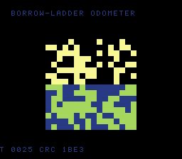

# #110 — SNES Borrow-Ladder Odometer (`borrowlad`): native-width borrow chains

<p align="center"></p>

**Status:** ✅ DONE (2026-07-02). Demo **#110** of the **compiler stress-test demo battery** (Round 6,
Cluster E). Clean positive — `host == default == +mos-a16 == +mos-xy16 == 0x1BE3` on MAME + bsnes-jg,
`-verify-machineinstrs` clean in default + a16 + xy16. **No compiler bug.** Published:
[/snes/borrowlad/](https://biohack.net/snes/borrowlad/).

## Context

Cluster E hardens the **a16/xy16 flag-liveness and register-pressure** cluster. This demo exercises a
wide multi-precision subtractor built from chained 16-bit subtracts-with-borrow: the borrow ripples limb
to limb, and every limb consumes the preceding borrow. A **128-bit descending odometer** ticks down
through zero by subtracting a decrement each step. The a16/xy16 legs exercise native-width SBC codegen;
default 8-bit is the differential oracle.

This ROM previously claimed to be the regression for patch `0012`. That was too broad: the ROM's
`LDCImm 1` path is produced by the in-flight A16 selector. The backend defect itself is baseline MOS and
is now tested directly with `LDCImm 1` in the ordinary `mos65c02` asm-printer MIR test.

## Algorithm

```
bl_sub(a, b):                                    # a -= b, 16-bit borrow chain (noinline)
    borrow = 0
    for i in 0..8:
        t = (int32)a[i] - (int32)b[i] - borrow    # 16-bit sub with borrow-in (set/clear i1)
        a[i] = (uint16)t
        borrow = (t < 0) ? 1 : 0                   # borrow-out (a set i1)
```

- The initial carry-in is `SEC` (no borrow) before the SBC chain (measured: `sbc=4`, `sec=1`).
- Multi-precision subtraction is exact → bit-exact differential; a dropped/duplicated borrow diverges the CRC.

Codegen corner (a16): `sec` (the set-i1 carry-in), `sbc` chain, `rep/sep=14`.

## Screen layout / display architecture

The 128 bits of the odometer drawn as a 16×16 bit-grid (bright = 1), top and bottom halves mirroring the
bits with different palette so the ripple reads clearly. Each frame subtracts the decrement → bits flip and
borrows ripple. `BitmapCanvas` (BG3 2bpp) + `TextLayer` + `TitleLayer` ("BORROWLAD / 128-BIT BORROW CHAIN SBC").

## Files

| File | New/Mod | Purpose |
|---|---|---|
| `examples/65816/borrowlad.h` | new | U128 + `bl_sub` borrow chain + gate |
| `examples/snes/corpus/borrowlad_sim.c` | new | HAL-free corpus slice |
| `tools/borrowlad-sim.c` | new | host oracle |
| `examples/snes/borrowlad.c` | new | SNES ROM |
| `dev/borrowlad.sh`, `dev/borrowlad.lua` | new | gate (sbc/sec probe) + MAME assert |
| `Taskfile.yml`, `TODO.md`, plan-index, ideas doc | mod | tracking |

## Differential gate

- `corpus_result = borrowlad_gate_crc()`, GATE_N=160, `EXPECT = 0x1BE3`.
- **5-way bar** — a16/xy16 exercise native-width subtraction; no far pointers.
- Disasm probe (a16): `sbc ≥ 1` (=4), `sec ≥ 1` (=1), `rep/sep ≥ 1` (=14).

## Verification results

1. **Host oracle:** `borrowlad gate_crc = 0x1BE3` — PASS.
2. **ROM builds + checksum:** `build/borrowlad.sfc` (+mos-a16) + `build/borrowlad-default.sfc` clean; VMAs
   match at 0x6a — PASS.
3. **Corpus slice host-compiles** — PASS.
4. **`dev/run.sh borrowlad`** — PASS:
   ```
       PASS  sbc=4  sec=1  rep/sep=14  (128-bit borrow chain with the set-i1 carry-in)
   SMOKE: PASS off=0x6A len=2 got=0x1BE3 (ran 500 frames, bsnes-jg)
       SHOT: PASS corpus=0x1BE3 (snapshot at frame 500)
   RESULT: PASS — Borrow-Ladder Odometer on SNES; MAME + bsnes-jg + corpus hash 0x1BE3 host == +mos-a16
   ```
5. **`-verify-machineinstrs`:** clean under default AND `+mos-a16` AND `+mos-xy16` — PASS.
6. **Title card + animation:** `build/borrowlad-jg.png` shows the 128-bit odometer bit-grid, HUD `CRC 1BE3` — PASS.

## Publication

`/snes-rom-page --rom build/borrowlad.sfc --slug borrowlad --site ~/SRC/biohack.net
--title "Borrow-Ladder Odometer" --preview build/borrowlad-jg.png
--selfcheck "0x6a 2 0x1BE3 500 borrowlad"` (a16 build).
